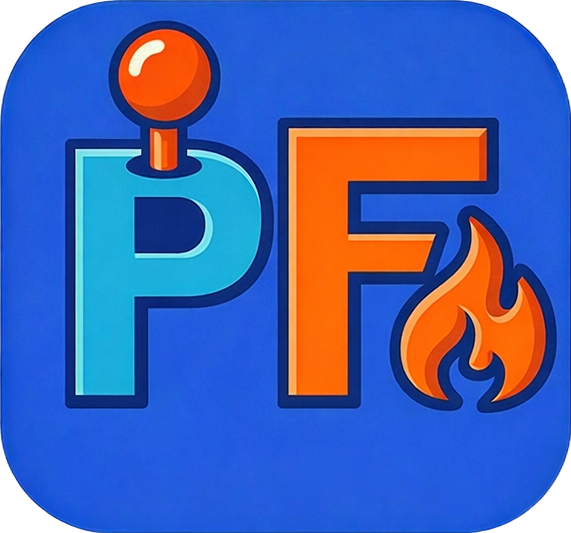

<p align="center">
  
</p>

<h1 align="center">PadForge</h1>

*"And we talk of Christ, we rejoice in Christ, we preach of Christ, we prophesy of Christ, and we write according to our prophecies, that our children may know to what source they may look for a remission of their sins."* — 2 Nephi 25:26

*Glory, honor, and praise to the Lord Jesus Christ, the source of all truth, forever and ever.*

<p align="center">
  <strong>Turn any input device into any virtual controller.</strong><br>
  Gamepads, joysticks, keyboards, mice, and touchscreens — mapped to Xbox 360, DualShock 4, DirectInput, MIDI, or Keyboard+Mouse output that games treat as real hardware.
</p>

<p align="center">
  Modern fork of <a href="https://github.com/x360ce/x360ce">x360ce</a> — built with SDL3, ViGEmBus, vJoy, Windows MIDI Services, HelixToolkit, .NET 10 WPF, and Fluent Design.
</p>

---

## Features

### Input & Output

- **Route any input to any virtual controller** — Joysticks, gamepads, keyboards, and mice feed into Xbox 360, DualShock 4, custom DirectInput (up to 8 axes, 128 buttons, 4 POV hats), virtual MIDI devices, or keyboard+mouse output
- **Stack up to 16 virtual controllers** — Mix Xbox 360, DualShock 4, DirectInput, MIDI, and Keyboard+Mouse across 16 slots, each merging input from multiple physical devices
- **Emit keyboard and mouse output** — Translate controller buttons to key presses and sticks or triggers to mouse movement or scroll — no driver required
- **Broadcast motion data** — Stream gyro and accelerometer over UDP port 26760 via DSU/Cemuhook for emulators like Cemu and Dolphin

### Visualization

- **Inspect controllers in 3D** — Rotate, zoom, and pan an interactive HelixToolkit model while buttons, sticks, and triggers highlight live
- **Monitor input on a 2D schematic** — Flat overlay showing the same live state as the 3D view in a compact layout
- **Preview Keyboard+Mouse output** — Live keyboard and mouse display highlighting every mapped key and button
- **Serve a web controller** — Turn any touchscreen into a wireless controller via a built-in WebSocket server with Xbox 360 and DS4 layouts, dual analog sticks, 8-way D-pad, triggers, and rumble feedback

### Mapping & Tuning

- **Record mappings interactively** — Press a button on your device to bind it, pick from a dropdown of every available input (including raw buttons beyond the standard 11), or run "Map All" for one-pass setup; auto-mapping handles recognized gamepads, and force-raw mode bypasses incorrect SDL3 remapping; dropdowns persist when devices are offline
- **Shape sensitivity curves** — Per-axis editors for sticks (independent X and Y) and triggers with 6 presets (Linear, Smooth, Aggressive, Instant, S-Curve, Delay) or custom multi-point drag-and-drop curves; a live indicator tracks real-time position
- **Dial in deadzones** — 6 algorithms (Scaled Radial, Radial, Axial, Hybrid, Sloped Scaled Axial, Sloped Axial) with per-axis deadzone, anti-deadzone, and linear response for sticks and triggers, live preview, stick center offset calibration, max range, and per-mapping axis-to-button activation thresholds with half-axis support for centered joysticks

### Force Feedback & Rumble

- **Pass through rumble** — Per-motor strength, overall gain, and motor swap; haptic fallback for devices without native rumble
- **Synthesize bass rumble from audio** — Capture system audio and convert bass frequencies to vibration per-device (48 dB/octave filter, configurable sensitivity and cutoff)
- **Relay DirectInput force feedback** — Full FFB pipeline for custom vJoy controllers

### Macros & Automation

- **Build combo triggers** — Combine up to 8 buttons, axes (with configurable threshold), and POV hat directions from either the output controller or a physical input device
- **Execute action sequences** — Button presses, key presses, mouse actions (move, click, scroll), delays, system/per-app volume, and axis manipulation across 4 fire modes (on press, on release, while held, "Always"); supports 128 buttons for custom DirectInput controllers and repeat modes

### System Integration

- **Activate profiles per application** — Switch controller configurations automatically when specific apps gain focus; a Win11-style flyout shows the profile name, initialization progress, and offline controller warnings
- **Switch profiles by controller shortcut** — Assign button combos (cross-device, with axis direction support) to cycle Next/Previous, jump to a specific profile, or toggle the PadForge window — all without touching the keyboard
- **Hide physical controllers** — HidHide driver-level hiding prevents double input; low-level hooks consume only mapped keyboard and mouse inputs without a driver; per-device toggles auto-enable for gamepads with safety warnings for mice and keyboards
- **Manage drivers in one click** — Install or remove ViGEmBus, HidHide, vJoy, and Windows MIDI Services from inside PadForge with built-in device blacklisting and app whitelisting

### MIDI Output

- **Output virtual MIDI** — Axes send Control Change, buttons send Note On/Off, with configurable channel (1–16), CC mapping, note mapping, and velocity; PadForge creates its own system-wide endpoint — no loopMIDI needed (requires Windows MIDI Services, installable from Settings)

### Polish

- **Poll at 1000 Hz** — Sub-millisecond jitter via high-resolution waitable timers, bit-perfect axis passthrough at default settings, double-precision deadzone math, and 15-bit (32768-position) vJoy axis output exceeding physical ADC resolution
- **Localize on the fly** — Change language from Settings without restarting; community-contributed translations via .resx resource files
- **Minimize to tray** — System tray icon, start minimized, or launch at login
- **Deploy as a single file** — Portable self-contained executable, no installer

---

## Screenshots

### Dashboard

Polling rate, device count, virtual controller slots with type badges, DSU motion server status, and driver health on a single screen.

### 3D Controller Visualization

Interactive 3D model — rotate, zoom, and pan to inspect from any angle while buttons, sticks, and triggers highlight live.

### 2D Controller Visualization

Flat schematic reflecting the same live button, stick, and trigger state as the 3D view.

### Button and Axis Mappings

Full mapping grid with record-by-press, dropdown selection, inversion, and half-axis options — output labels adapt to controller type (DS4 shown).

### Stick Deadzones

Per-axis deadzone, anti-deadzone, and linear response with live circular previews, 6 shape algorithms, and per-axis sensitivity curve editors.

### Trigger Deadzones

Range sliders, anti-deadzone, and live value bars for each trigger alongside per-trigger sensitivity curves.

### Force Feedback / Rumble

Overall gain, per-motor strength, motor swap, audio bass rumble with configurable sensitivity and cutoff, test button, and live motor activity meters.

### Macro Editor

Combo triggers from buttons, axes, and POV hats fire action sequences of key presses, mouse actions, delays, volume control, and axis manipulation across 4 fire modes.

### Keyboard+Mouse Virtual Controller

Keyboard and mouse preview highlighting every mapped key and button in real time.

### vJoy Custom DirectInput Controller

Configure thumbsticks, triggers (up to 8 axes shared between them), buttons (1–128), and POV hats (0–4) with a live schematic of the custom layout.

### MIDI Virtual Controller

Channel selection (1–16), velocity control, CC and note mapping — axes as Control Change, buttons as Note On/Off.

### Add Controller

Create Xbox 360, DualShock 4, vJoy, Keyboard+Mouse, or MIDI virtual controllers — type buttons dim at their per-type limit.

### Profiles

Named profiles that automatically activate when specific applications gain focus, each storing its own mappings and settings.

### Device List

Card-based list of all detected gamepads, joysticks, keyboards, and mice with status, type, VID/PID, slot assignment, and per-device input hiding toggles — select a device to see raw axes, buttons, POV compass, and gyro/accelerometer values.

### Settings

Language selector, appearance theme, input engine options (auto-start, background polling, configurable polling interval, master input hiding toggle), and window behavior.

### Settings — Input Hiding

HidHide driver-level configuration with app whitelisting, per-device toggles, and low-level keyboard/mouse hook options.

### Settings — Drivers and Diagnostics

One-click driver management for ViGEmBus, HidHide, vJoy, and Windows MIDI Services with version info, settings file controls, and diagnostics.

### About

Application info, technology stack, and license details.

### Web Controller


Built-in web server turns any touchscreen into a virtual controller with dual analog sticks, 8-way D-pad, triggers, and real-time visual feedback.

---

## Requirements

| Requirement | Details |
|---|---|
| **OS** | Windows 10 or 11 (x64) |
| **Runtime** | [.NET 10 Desktop Runtime](https://dotnet.microsoft.com/download/dotnet/10.0) (included in the single-file publish) |

### Optional Drivers

PadForge installs all of these for you from Settings:

| Driver | Purpose |
|---|---|
| [ViGEmBus](https://github.com/nefarius/ViGEmBus) | Virtual Xbox 360 and DualShock 4 output |
| [vJoy](https://github.com/BrunnerInnovation/vJoy) | Custom DirectInput output with configurable axes, buttons, POVs, and force feedback |
| [HidHide](https://github.com/nefarius/HidHide) | Hide physical controllers from games to prevent double input |
| [Windows MIDI Services](https://github.com/microsoft/MIDI) | Virtual MIDI device output |

---

## Build

```bash
dotnet publish PadForge.App/PadForge.App.csproj -c Release
```

Output: `PadForge.App/bin/Release/net10.0-windows10.0.26100.0/win-x64/publish/PadForge.exe`

See [BUILD.md](BUILD.md) for full project structure, architecture details, and developer reference.

---

## Upstream Projects and Acknowledgments

PadForge stands on the shoulders of these projects. Please consider supporting them:

| Project | Role in PadForge | License |
|---|---|---|
| [x360ce](https://github.com/x360ce/x360ce) | Original codebase this project was forked from | MIT |
| [SDL3](https://github.com/libsdl-org/SDL) | Controller input — joystick, gamepad, and sensor enumeration and reading | zlib |
| [ViGEmBus](https://github.com/nefarius/ViGEmBus) | Virtual Xbox 360 and DualShock 4 controller driver | MIT |
| [Nefarius.ViGEm.Client](https://github.com/nefarius/ViGEm.NET) | .NET client library for ViGEmBus | MIT |
| [vJoy](https://github.com/BrunnerInnovation/vJoy) | Custom DirectInput joystick/gamepad driver with configurable HID descriptors and force feedback | MIT |
| [Handheld Companion](https://github.com/Valkirie/HandheldCompanion) | 3D controller models (Xbox 360, DualShock 4 OBJ meshes) | CC BY-NC-SA 4.0 |
| [Gamepad-Asset-Pack](https://github.com/AL2009man/Gamepad-Asset-Pack) | 2D controller schematic overlays (Xbox 360, DS4 PNG assets) | MIT |
| [HelixToolkit](https://github.com/helix-toolkit/helix-toolkit) | 3D viewport rendering for WPF | MIT |
| [ModernWpf](https://github.com/Kinnara/ModernWpf) | Fluent Design theme for WPF | MIT |
| [CommunityToolkit.Mvvm](https://github.com/CommunityToolkit/dotnet) | MVVM data binding framework | MIT |
| [HidHide](https://github.com/nefarius/HidHide) | Device hiding driver to prevent double input | MIT |
| [Windows MIDI Services](https://github.com/microsoft/MIDI) | Virtual MIDI device SDK for MIDI controller output | MIT |

---

## Donations

Knowing PadForge is useful is reward enough. If you truly insist on donating, please donate to your charity of choice and bless humanity. If you can't think of one, consider [Humanitarian Services of The Church of Jesus Christ of Latter-day Saints](https://philanthropies.churchofjesuschrist.org/humanitarian-services). Also consider donating directly to the upstream projects listed above — they made all of this possible.

**My promise:** PadForge will never become paid, freemium, or Patreon early-access paywalled. Free means free.

---

## License

This project is licensed under **CC BY-NC-SA 4.0** (Creative Commons Attribution-NonCommercial-ShareAlike 4.0 International).

- **3D controller models** adapted from [Handheld Companion](https://github.com/Valkirie/HandheldCompanion) (CC BY-NC-SA 4.0) — Copyright (c) CasperH2O, Lesueur Benjamin, trippyone
- **2D controller assets** from [Gamepad-Asset-Pack](https://github.com/AL2009man/Gamepad-Asset-Pack) (MIT) — by AL2009man
- **Original codebase** forked from [x360ce](https://github.com/x360ce/x360ce) (MIT)
- **SDL3** is licensed under the [zlib License](https://github.com/libsdl-org/SDL/blob/main/LICENSE.txt)
- **ViGEmBus** and **Nefarius.ViGEm.Client** are licensed under the MIT License
- **vJoy** is licensed under the MIT License
- **Windows MIDI Services** is licensed under the MIT License
- **HidHide** is licensed under the MIT License

See [LICENSE](LICENSE) for the full license text.
