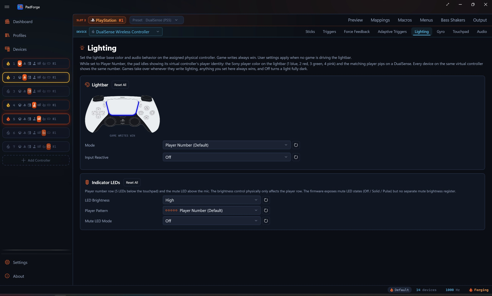

<p align="center">
  
</p>

<h1 align="center">PadForge</h1>

*"And we talk of Christ, we rejoice in Christ, we preach of Christ, we prophesy of Christ, and we write according to our prophecies, that our children may know to what source they may look for a remission of their sins."* — 2 Nephi 25:26

*Glory, honor, and praise to the Lord Jesus Christ, the source of all truth, forever and ever.*

---

**PadForge makes any input look like any controller.** Plug in a steering wheel. The game sees a PlayStation pad. Use a DualSense. The game sees an Xbox 360. Map your keyboard. The game sees a flight stick. Open a tab on your phone. That tab becomes a gamepad your PC games can use.

Free Windows app. No subscription. No paywall. No nag screens. Built on SDL3, [HIDMaestro](https://github.com/hifihedgehog/HIDMaestro), [OpenXInput](https://github.com/hifihedgehog/OpenXinput), HidHide, Windows MIDI Services, HelixToolkit, WPF UI, and .NET 10.

PadForge is for sim racers running wheels in games that only understand Xbox controllers. For DualSense owners who want adaptive triggers and lightbar effects in Steam games that ignore them. For accessibility users mapping whatever hardware they can use. For anyone whose controller doesn't match what their game expects.

> **New in 3.2.** Rebuilt mapping engine: one virtual output can read from any number of physical sources, with shift layers, cross-device chords, and a chip-based formula editor on top. Gyro overhaul at Steam Input parity (Local / Player / World, real-world calibration, cross-device Aim Engage). Dedicated Impulse Triggers tab for Xbox and DualSense pads (game passthrough, constant force, audio-bass trigger rumble). Custom Expression macro triggers. Lightbar Strobe and Battery modes. Bulk virtual-controller toggle. [Full release notes](https://github.com/hifihedgehog/PadForge/releases/tag/v3.2.0) · [Wiki](https://github.com/hifihedgehog/PadForge/wiki).

<p align="center">
  <a href="https://github.com/hifihedgehog/HIDMaestro">
    <picture>
      <source media="(prefers-color-scheme: dark)" srcset="screenshots/hidmaestro-logo-dark.png">
      
    </picture>
  </a>
  <br>
  <em>Powered by HIDMaestro &mdash; one driver, 225+ device profiles.</em>
</p>

---

## What you can do with PadForge

- **Use any controller in any game.** Plug a PS5 DualSense into a Steam game that only accepts Xbox pads. Plug a Logitech G29 wheel into a racing game that ignores wheels. Plug a Saitek HOTAS into a flight game that wants gamepads.
- **Combine inputs from many devices into one virtual controller.** Pedal set + wheel + HOTAS throttle as one virtual stick. Left hand on a pad, right hand on a flight stick, both feeding the same virtual controller. Strongest / Combined / Average / Either / Both / Custom-formula combine modes. Cross-device chords.
- **Layer your mappings with Shift keys.** Each slot can carry extra mapping tables that activate while a button, chord, or axis is held. Five activation modes (Hold, Toggle, Sticky, Cycle, Custom jump-to). Per-layer color and emoji icon. Win11-style flyout confirms the active layer.
- **Aim with gyro at Steam Input parity.** Reference frames (Local, Player, World), dual-threshold smoothing, real-world calibration, cross-device Aim Engage button. Per-(device, slot) tuning persistence. Bind Gyro Pitch / Yaw / Roll like any other source.
- **Drive trigger motors from games, audio, or constant force.** Xbox Impulse Trigger passthrough (Forza, Gears, Halo). The same trigger data routes to DualSense as Adaptive Trigger Vibration. Audio-bass-driven trigger rumble. Constant trigger force with override-and-resume.
- **Keep what's special about your controller.** Adaptive triggers in racing games. DualSense lightbar that reacts to game audio. Touchpad finger contacts forwarded to the game. Lightbar Battery and Strobe modes.
- **Play with whatever's in front of you.** Phone in the room? Open a browser tab. The tab becomes a controller with sticks, D-pad, and rumble feedback. Keyboard handy? Map WASD plus mouse to a virtual Xbox pad.
- **Run up to 16 controllers at once.** Local co-op with mixed gamepad types. Two sim racers on two wheels. A flight stick + throttle + rudder pedals all together as one virtual HOTAS. One combo press toggles every virtual controller on or off.
- **Map motion to emulators.** Stream gyroscope and accelerometer to Cemu, Dolphin, Yuzu, and Ryujinx over the DSU / Cemuhook protocol on UDP port 26760.
- **Make MIDI from a gamepad.** Map sticks to Control Change, buttons to notes. Play music with whatever's in your hand.

---

## PadForge vs other controller mappers

| | PadForge | x360ce | XOutput | reWASD | DS4Windows | Steam Input |
|---|:---:|:---:|:---:|:---:|:---:|:---:|
| Free | ✅ | ✅ | ✅ | ❌ paid | ✅ | ✅ Steam-only |
| Open source | ✅ | ✅ | ✅ | ❌ | ✅ | ❌ |
| Works outside Steam | ✅ | ✅ | ✅ | ✅ | ✅ | ❌ |
| Xbox 360 / One / Series virtual output | ✅ | ✅ | ✅ | ✅ | ✅ | ✅ |
| PlayStation DS4 / DualSense virtual output | ✅ | ❌ | ❌ | ✅ | ⚠️ basic | ❌ |
| Flight stick / wheel / HOTAS virtual output | ✅ 225+ profiles | ❌ | ❌ | ❌ | ❌ | ❌ |
| MIDI virtual output | ✅ | ❌ | ❌ | ❌ | ❌ | ❌ |
| Keyboard + Mouse virtual output | ✅ | ❌ | ⚠️ basic | ✅ | ❌ | ✅ |
| Multi-source per row (one output, many inputs) | ✅ 6 combine modes + custom formula | ❌ | ❌ | ⚠️ basic | ❌ | ✅ |
| Shift layers (Hold / Toggle / Sticky / Cycle / Custom) | ✅ + chord + axis activators | ❌ | ❌ | ✅ | ❌ | ⚠️ basic |
| Cross-device chords (button on pad A + button on pad B) | ✅ | ❌ | ❌ | ❌ | ❌ | ❌ |
| Formula editor with chips (arithmetic, logic, if-then-else) | ✅ | ❌ | ❌ | ❌ | ❌ | ⚠️ basic |
| Gyro Steam Input parity (Local / Player / World, RWC) | ✅ | ❌ | ❌ | ⚠️ basic | ⚠️ basic | ✅ |
| Xbox Impulse Triggers passthrough | ✅ + DualSense auto-route | ❌ | ❌ | ❌ | ❌ | ⚠️ Xbox-only |
| Constant trigger force + audio-driven trigger rumble | ✅ | ❌ | ❌ | ❌ | ❌ | ❌ |
| DualSense Adaptive Triggers | ✅ 7 modes + GameCube preset | ❌ | ❌ | ✅ | ⚠️ basic | ✅ |
| DualSense lightbar | ✅ 13 modes + audio-reactive | ❌ | ❌ | ⚠️ basic | ⚠️ basic | ❌ |
| Force feedback for wheels & joysticks | ✅ HID PID 1.0 | ❌ | ❌ | ❌ | ❌ | ❌ |
| DSU motion server | ✅ | ❌ | ❌ | ❌ | ✅ | ❌ |
| Phone-as-controller (browser, Wi-Fi) | ✅ | ❌ | ❌ | ❌ | ❌ | ❌ |
| Per-app profile switching | ✅ | ⚠️ basic | ❌ | ✅ | ❌ | ✅ |
| Up to 16 simultaneous virtual controllers | ✅ | ≤4 | ≤4 | ≤4 | ≤4 | ≤4 |
| 1000 Hz polling | ✅ | ❌ | ❌ | ⚠️ | ⚠️ | ⚠️ |
| 3D + 2D controller visualization | ✅ | ❌ | ⚠️ basic | ⚠️ basic | ❌ | ⚠️ basic |
| Sensitivity curve editor with custom points | ✅ | ⚠️ basic | ⚠️ basic | ✅ | ⚠️ basic | ✅ |

Cells marked ⚠️ basic mean the feature exists but is limited compared to PadForge's implementation. ❌ means the feature is absent. Comparison reflects each tool's shipping release as of May 2026.

---

## Quick start

1. Download `PadForge.exe` from the [latest release](https://github.com/hifihedgehog/PadForge/releases/latest).
2. Run it. PadForge installs HIDMaestro on first launch (admin prompt once).
3. Click **Add Controller** on the Dashboard. Pick Xbox, PlayStation, Extended, MIDI, or Keyboard+Mouse.
4. On the new slot, drag a physical device onto it from the sidebar.
5. Click **Map All** to record every button in one pass, or open the **Mappings** tab and bind one at a time.
6. Launch your game. The game sees the virtual controller as real hardware.

Most games "just work" after step 5. If a game sees both your physical and virtual controller at once, install HidHide from **Settings → Drivers** to hide the physical one.

---

## Screenshots

### Dashboard

Polling rate, device count, every virtual controller slot, DSU motion server, web controller server, and driver health on one screen.

### 3D controller visualization

Interactive 3D model per profile. Rotate, zoom, pan. Buttons, sticks, and triggers highlight while you press them. Xbox Series profiles add a clickable Share button.

### 2D controller visualization

Flat schematic of the same controller, same live state. Useful on small monitors or for streaming overlays.

### Button and axis mappings

Record a binding by pressing a button. Pick from a dropdown of every available input (including raw HID buttons past the standard 11). Set Invert, Half-axis, or a per-mapping threshold for axis-to-button activation.

### Stick deadzones

Six deadzone shapes (Scaled Radial, Radial, Axial, Hybrid, Sloped Scaled Axial, Sloped Axial). Per-axis deadzone, anti-deadzone, linear response, center calibration, and a custom sensitivity-curve editor with draggable points.

### Trigger deadzones

Floor and ceiling per trigger. Anti-deadzone. Sensitivity curves. Live value bars at 0.1% precision.

### Force feedback and rumble

Per-motor strength, overall gain, motor swap. Live motor activity bars. Audio bass rumble: PadForge captures system audio, isolates bass frequencies through a 48 dB/octave filter, and routes that to controller rumble.

### DualSense Adaptive Triggers

Seven trigger effect modes. Off, Feedback, Weapon, Vibration, Multi-Position Feedback, Slope, Multi-Position Vibration. A live preview draws the resistance and amplitude curve while you drag Range, Strength, and Frequency. One-click GameCube preset loads parameters that mimic the click of a real GameCube trigger.

### DualSense lightbar

Thirteen lightbar modes including three Audio Pulse variants and three Audio Bands variants that react to system audio in real time. Two Input Reactive modes flash on button presses. Plus the indicator-LED card for player pattern, mute LED, and brightness.

### Macros

Combo triggers from buttons, axes, and POV directions. Action sequences with key presses, mouse moves, scroll, delays, system volume, app volume, lightbar overrides, and rumble overrides. Four fire modes (on press, on release, while held, always).

### Per-app profiles

Each profile holds its own mappings, deadzones, force feedback, lighting, and macros. PadForge watches the foreground window and switches profiles automatically when a matching app gains focus. Controller-shortcut combos cycle profiles without touching the keyboard.

### Keyboard + Mouse virtual controller

Map a controller stick to mouse movement. Map face buttons to WASD. The preview lights up every mapped key and mouse button in real time.

### Extended virtual controller

Flight sticks, racing wheels, HOTAS, third-party gamepads. 225+ HIDMaestro profiles plus a Custom mode that builds a HID descriptor from scratch. Up to 8 axes, 128 buttons, 4 POV hats. Configurable VID, PID, and product string.

### PlayStation virtual controller

DualShock 4, DualSense, and DualSense Edge through HIDMaestro. Source gyro, accelerometer, touchpad, and battery passed through to the game.

### MIDI virtual controller

Channel 1-16. Configurable CC mapping, note mapping, and velocity. Axes send Control Change. Buttons send Note On / Off. No loopMIDI required — PadForge creates its own system endpoint via Windows MIDI Services.

### Add controller

Pick the virtual controller type. Buttons dim when you hit the per-type limit.

### Devices

Every detected gamepad, joystick, keyboard, and mouse as a card. Live raw axes, buttons, POV compass, and gyro/accelerometer values for the selected device. Per-device HidHide toggle and Force Raw Joystick mode for when SDL3 guesses the gamepad layout wrong.

### Web controller

Connect a phone or tablet over Wi-Fi. Browser shows an Xbox 360 or DualShock 4 layout with virtual sticks, D-pad, triggers, and rumble. Touch the sticks to push them; tap to click.

### Settings

Language (10 locales, live-switch — no restart). Theme (System / Light / Dark). Polling interval (1-16 ms). Auto-start at login, minimize to tray, master input-hiding toggle.

---

## Known limits

- PadForge runs elevated so it can install and manage the HIDMaestro driver. Non-elevated games still read the virtual controllers normally.
- HidHide's device hiding is global per user account, not per-game.
- Some games poll `xinput1_4.dll` directly instead of going through Windows' standard XInput slot enumeration. Behavior in those games depends on the game.
- The MIDI virtual controller needs Windows MIDI Services (Windows 11 24H2 / build 26100 or later). On older systems the MIDI type is hidden.

---

## Requirements

| | |
|---|---|
| OS | Windows 10 or 11 (x64) |
| Runtime | [.NET 10 Desktop Runtime](https://dotnet.microsoft.com/download/dotnet/10.0) — bundled in the single-file release |

### Drivers

PadForge installs **HIDMaestro** on first run. HIDMaestro is the engine that creates virtual controllers — when you add a slot, HIDMaestro spins up a HID device matching the controller "shape" you picked.

Two more drivers are optional. PadForge offers to install each one only when you need its feature:

| Driver | Install when |
|---|---|
| [HidHide](https://github.com/nefarius/HidHide) | A game sees both your physical and virtual controller at once |
| [Windows MIDI Services](https://github.com/microsoft/MIDI) | You want the MIDI virtual controller type |

**OpenXInput** is bundled inside `PadForge.exe`. No separate install. It filters PadForge's own virtual controllers out of its own XInput view so device enumeration stays clean.

---

## Build from source

```bash
dotnet publish PadForge.App/PadForge.App.csproj -c Release
```

Output: `PadForge.App/bin/Release/net10.0-windows10.0.26100.0/win-x64/publish/PadForge.exe`

See [BUILD.md](BUILD.md) for project structure, architecture notes, and developer reference. See the [wiki](https://github.com/hifihedgehog/PadForge/wiki) for deeper dives into the input pipeline, virtual controller backends, settings file format, and visualization renderer.

---

## Don't see your controller in the picker?

PadForge's controller picker is the set of HIDMaestro profiles that ship with a captured HID descriptor. A few controllers are missing their captures, so they don't appear yet. If you own one of those controllers, you can capture it yourself from inside PadForge — no extra tools, no admin.

To capture and use a profile locally:

1. Create or open any **Extended**-type slot.
2. On the Controller page, click **Imported profiles…** on the Extended config bar.
3. Under **Connected devices available to import**, pick your plugged-in device and click **Import**.
4. The new profile appears in the slot's dropdown with a "(User Generated)" suffix and stays available across every Extended slot from then on.

Profiles live inside `PadForge.xml` and travel with your settings.

To share a captured profile upstream:

1. In the same dialog, select your imported profile under **Your imported profiles**.
2. Click **Export…** and save the JSON.
3. Open a [profile contribution issue on HIDMaestro](https://github.com/hifihedgehog/HIDMaestro/issues/new?template=profile-contribution.yml) and attach the file. Once merged, the profile ships in the next HIDMaestro release for everyone.

To import a profile someone else captured:

1. Click **Import from file…** in the same dialog and pick the `.json` they sent you.

PadForge reads only the HID descriptor during capture. It does not record or forward your controller's input.

---

## Built on the work of these projects

PadForge stands on these projects. Please consider supporting them directly.

| Project | Role | License |
|---|---|---|
| [x360ce](https://github.com/x360ce/x360ce) | Original codebase this fork started from | MIT |
| [SDL3](https://github.com/libsdl-org/SDL) | Controller input: joystick, gamepad, and sensor enumeration | zlib |
| [HIDMaestro](https://github.com/hifihedgehog/HIDMaestro) | User-mode UMDF2 virtual HID controller engine with 225+ device profiles | MIT |
| [OpenXInput](https://github.com/hifihedgehog/OpenXinput) | Drop-in `xinput1_4.dll` / `devobj.dll` replacement that filters PadForge's own virtual controllers from its own XInput view | upstream trademark disclaimer |
| [Handheld Companion](https://github.com/Valkirie/HandheldCompanion) | 3D controller OBJ meshes (Xbox 360, DualShock 4) | CC BY-NC-SA 4.0 |
| [Gamepad-Asset-Pack](https://github.com/AL2009man/Gamepad-Asset-Pack) | 2D controller PNG schematics | MIT |
| [HelixToolkit](https://github.com/helix-toolkit/helix-toolkit) | 3D viewport rendering for WPF | MIT |
| [WPF UI](https://github.com/lepoco/wpfui) | Fluent 2 design system for WPF | MIT |
| [CommunityToolkit.Mvvm](https://github.com/CommunityToolkit/dotnet) | MVVM data binding framework | MIT |
| [HidHide](https://github.com/nefarius/HidHide) | Per-device hiding driver to prevent double input | MIT |
| [Windows MIDI Services](https://github.com/microsoft/MIDI) | Virtual MIDI device SDK | MIT |

---

## Donations

Knowing PadForge is useful is reward enough. If you truly insist on donating, please donate to your charity of choice and bless humanity. If you can't think of one, consider [Humanitarian Services of The Church of Jesus Christ of Latter-day Saints](https://philanthropies.churchofjesuschrist.org/humanitarian-services). Also consider donating directly to the upstream projects above. They made all of this possible.

**My promise:** PadForge will never become paid, freemium, or Patreon early-access paywalled. Free means free.

---

## License

This project is licensed under **CC BY-NC-SA 4.0** (Creative Commons Attribution-NonCommercial-ShareAlike 4.0 International).

- **3D controller models** adapted from [Handheld Companion](https://github.com/Valkirie/HandheldCompanion) (CC BY-NC-SA 4.0). Copyright (c) CasperH2O, Lesueur Benjamin, trippyone.
- **2D controller assets** from [Gamepad-Asset-Pack](https://github.com/AL2009man/Gamepad-Asset-Pack) (MIT), by AL2009man.
- **Original codebase** forked from [x360ce](https://github.com/x360ce/x360ce) (MIT).
- **SDL3** is licensed under the [zlib License](https://github.com/libsdl-org/SDL/blob/main/LICENSE.txt).
- **HIDMaestro** is licensed under the MIT License.
- **WPF UI** is licensed under the MIT License.
- **Windows MIDI Services** is licensed under the MIT License.
- **HidHide** is licensed under the MIT License.
- **OpenXInput** ships only an upstream Microsoft-trademark disclaimer (no OSS license grant); redistributed as-is under the same terms.

See [LICENSE](LICENSE) for the full license text.
