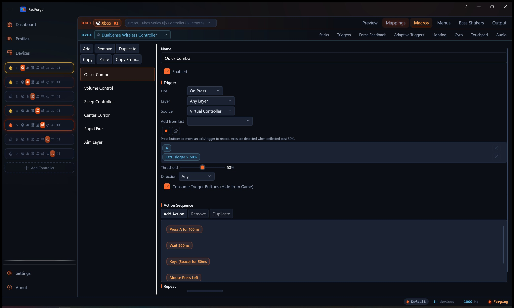
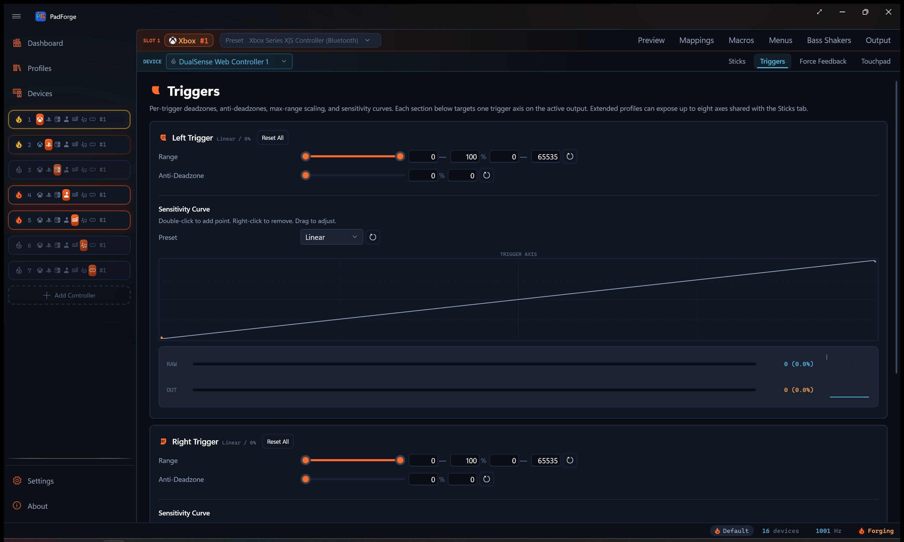
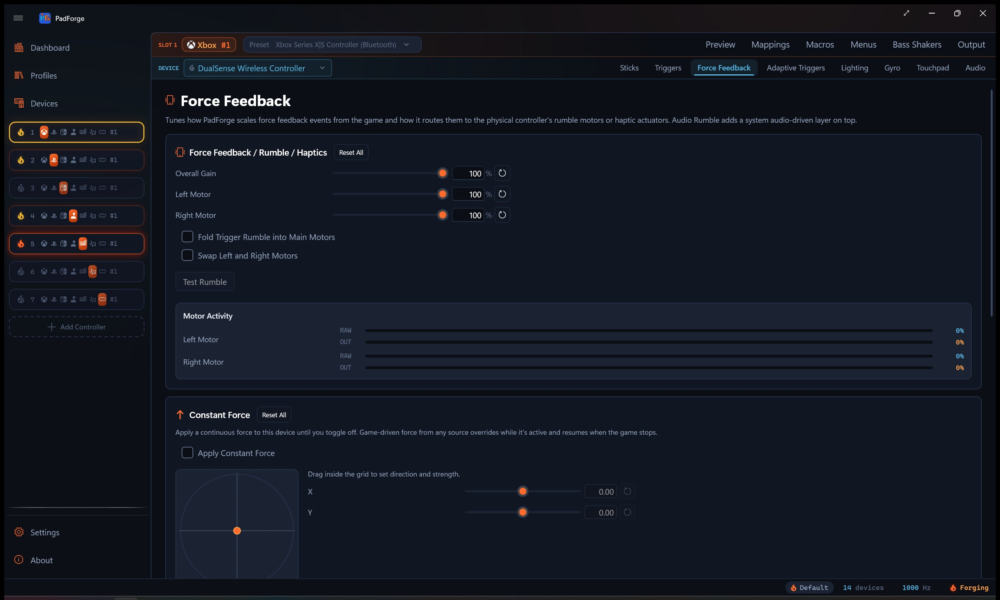
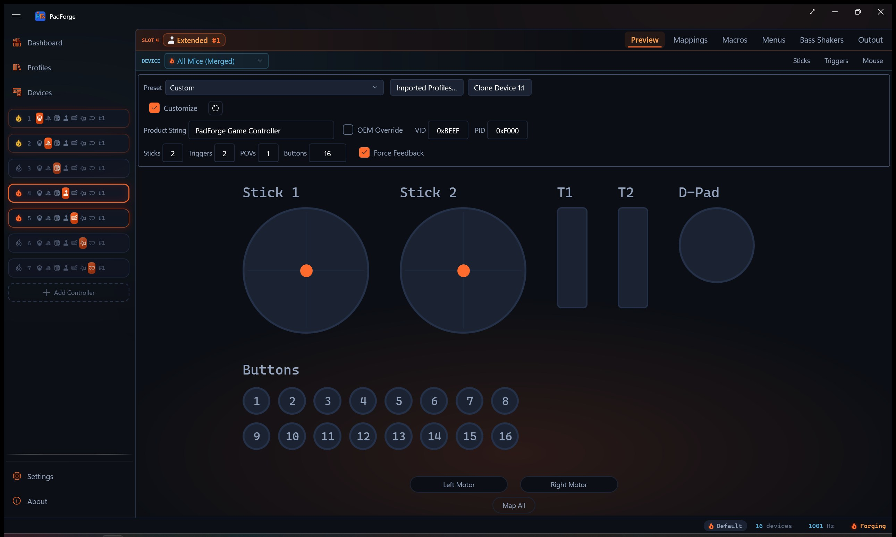
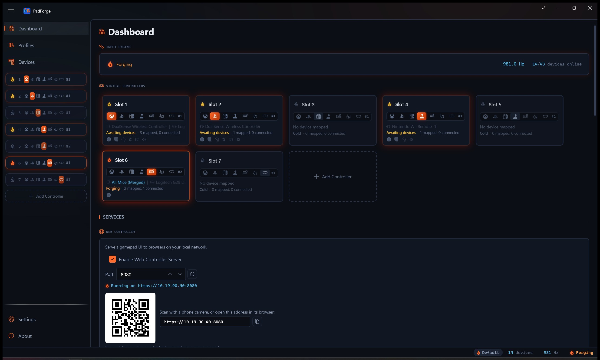
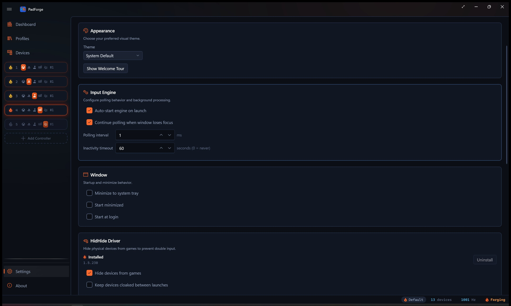
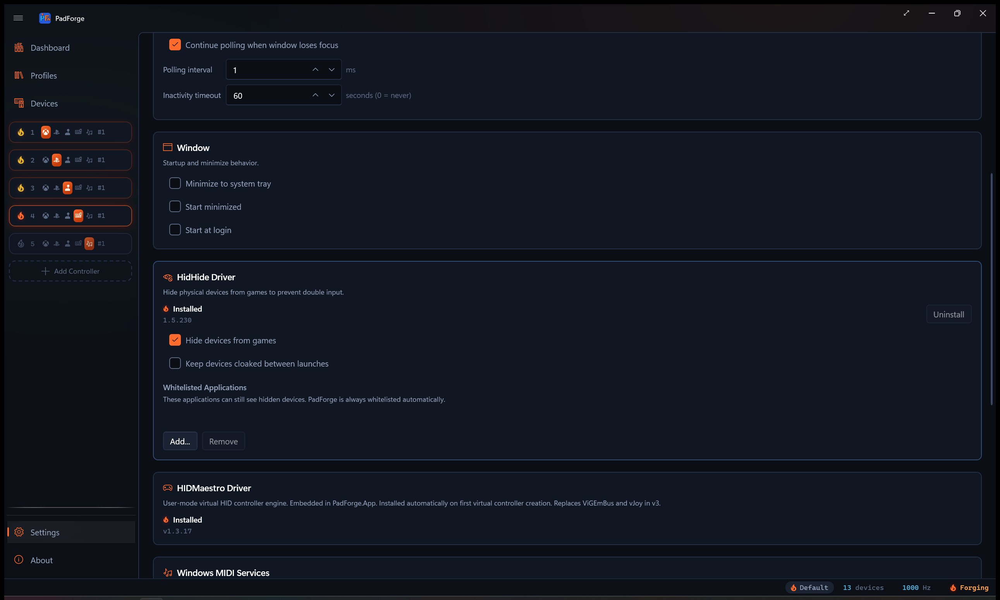
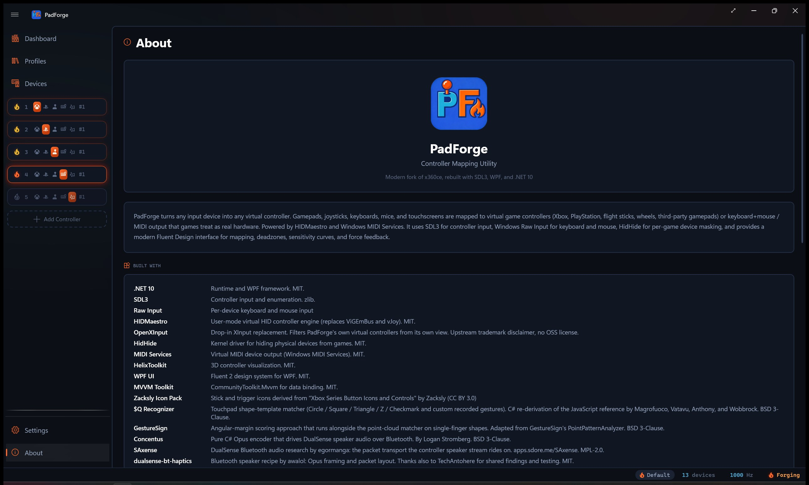
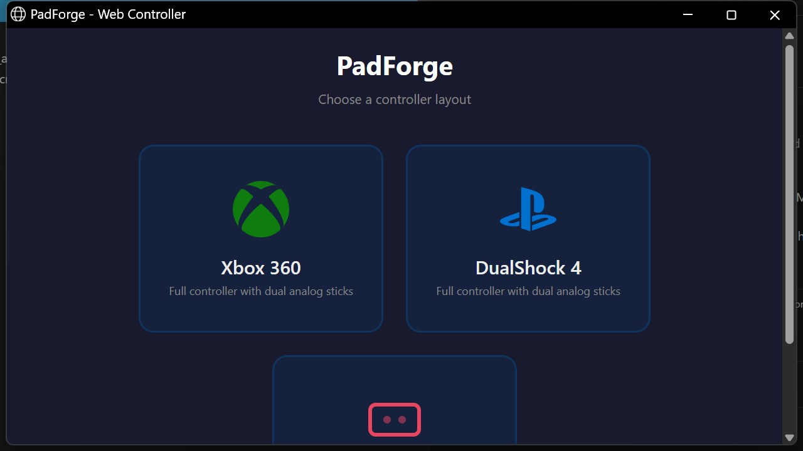
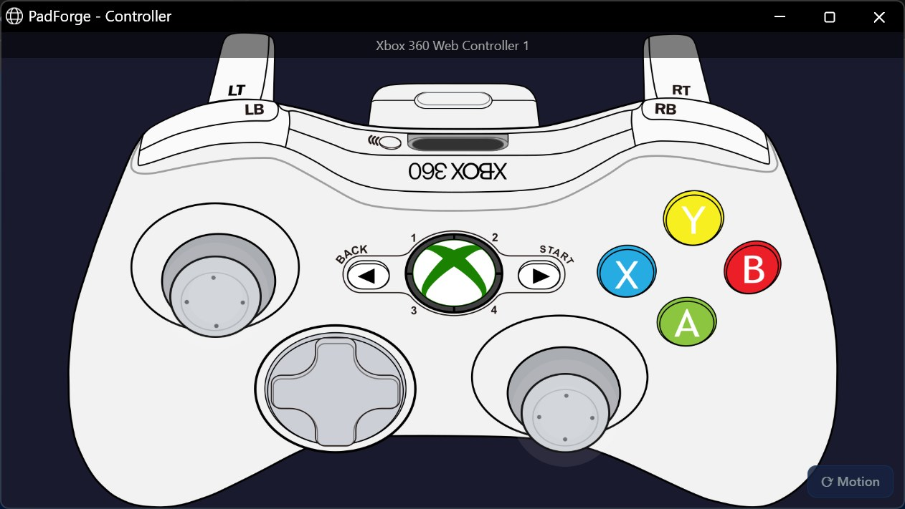

<p align="center">
  
</p>

<h1 align="center">PadForge</h1>

*"And we talk of Christ, we rejoice in Christ, we preach of Christ, we prophesy of Christ, and we write according to our prophecies, that our children may know to what source they may look for a remission of their sins."* — 2 Nephi 25:26

*Glory, honor, and praise to the Lord Jesus Christ, the source of all truth, forever and ever.*

---

PadForge is a Windows controller remapper. It takes input from whatever physical device you have (gamepads, joysticks, keyboards, mice, touchscreens) and feeds it into virtual controllers that games see as real hardware: Xbox, PlayStation, flight sticks, wheels, third-party gamepads, MIDI, or keyboard and mouse.

Fork of [x360ce](https://github.com/x360ce/x360ce), rewritten on SDL3, [HIDMaestro](https://github.com/hifihedgehog/HIDMaestro), HidHide, Windows MIDI Services, HelixToolkit, WPF UI, and .NET 10.

<p align="center">
  <a href="https://github.com/hifihedgehog/HIDMaestro">
    <picture>
      <source media="(prefers-color-scheme: dark)" srcset="screenshots/hidmaestro-logo-dark.png">
      
    </picture>
  </a>
  <br>
  <em>Powered by HIDMaestro &mdash; one driver, 225+ device profiles.</em>
</p>

---

## Features

### Input and output

- Any physical input into any virtual controller. Joysticks, gamepads, keyboards, mice, and touchscreens feed 225+ HIDMaestro profiles spanning Xbox (360, One, Series, Elite, Adaptive), PlayStation (DualShock 3/4, DualSense, DualSense Edge), flight sticks, wheels, HOTAS, and generic gamepads, plus virtual MIDI or keyboard and mouse output. Extended profiles support up to 8 axes, 128 buttons, and 4 POV hats with customizable VID:PID, product string, and HID descriptor.
- Up to 16 virtual controllers at once, mixing types. Each slot can merge input from multiple physical devices. Drag-reorder slots within a type group on the Dashboard; the order persists per group.
- DualShock 4 and DualSense outputs pass the source device's gyro, accelerometer, touchpad, and battery through to the game when the physical controller exposes them.
- Keyboard and mouse output without a driver: map buttons to key presses, sticks or triggers to mouse movement or scroll.
- DSU / Cemuhook gyro and accelerometer broadcast over UDP port 26760 for Cemu, Dolphin, and similar emulators.

### Mapping

- Record a binding by pressing a button, pick from a dropdown (which includes raw buttons beyond the standard 11), or run "Map All" for a one-pass setup. On PlayStation outputs, Map All ends with TouchpadClick.
- Auto-mapping for recognized gamepads. Force-raw mode bypasses SDL3's remapping when it guesses wrong.
- Dropdowns persist while devices are offline so you don't lose state on disconnect.
- Per-axis sensitivity curves for sticks (independent X and Y) and triggers. Six presets (Linear, Smooth, Aggressive, Instant, S-Curve, Delay) or custom multi-point curves with a drag-and-drop editor and a live position indicator.
- Six deadzone algorithms (Scaled Radial, Radial, Axial, Hybrid, Sloped Scaled Axial, Sloped Axial) with per-axis deadzone, anti-deadzone, linear response, stick-center calibration, max range, and per-mapping axis-to-button activation thresholds with half-axis support for centered joysticks.

### Rumble and force feedback

- Rumble passthrough with per-motor strength, overall gain, and motor swap. Haptic fallback for devices without native rumble.
- HID PID 1.0 force feedback on Extended controllers: constant, ramp, periodic (sine, square, triangle, sawtooth), and condition effects (spring, damper, friction, inertia) decoded and routed to physical wheels and joysticks with directional pass-through.
- Audio bass rumble: captures system audio and converts bass frequencies to per-device vibration through a 48 dB/octave filter with configurable sensitivity and cutoff.

### Visualization

- 3D HelixToolkit controller model. Rotate, zoom, pan. Buttons, sticks, and triggers highlight in real time.
- 2D schematic showing the same live state in a compact layout.
- PlayStation 3D and 2D views render a live touchpad surface with finger contact spheres. The touchpad surface itself is a click target for recording the TouchpadClick mapping.
- Dynamic Extended schematic that auto-sizes to any HIDMaestro profile's sticks, triggers, POVs, and buttons.
- Keyboard and mouse preview for the KBM output type, showing every mapped key and button.
- Built-in WebSocket server turns any touchscreen into a wireless controller. Xbox and DS4 layouts, dual analog sticks, 8-way D-pad, triggers, rumble feedback. The DS4 layout collapses TouchpadClick to button 11 so games see no gaps in the button numbering.

### Macros

- Combo triggers built from up to 8 buttons, axes (with configurable threshold), and POV directions, sourced from the virtual output or a physical input device.
- Action sequences: button presses, key presses, mouse move / click / scroll, delays, system and per-app volume, and axis manipulation. Four fire modes (on press, on release, while held, always). Supports 128 buttons on Extended controllers and repeat modes.

### Profiles

- Per-application profiles. Switch automatically when a given app gains focus. A Win11-style flyout shows the active profile, initialization progress, and warnings for offline controllers.
- Controller shortcuts: assign button combos (cross-device, axis direction supported) to cycle Next / Previous, jump to a specific profile, or toggle the PadForge window without touching the keyboard.

### System integration

- HidHide driver-level hiding of physical controllers so games don't see double input. Low-level hooks consume only mapped keyboard and mouse input. Per-device toggles auto-enable for gamepads, with warnings for mice and keyboards.
- Built-in installer for HIDMaestro, HidHide, and Windows MIDI Services. Status, version info, and device blacklist / app whitelist controls live in Settings.

### MIDI output

- Virtual MIDI endpoint output. Axes send Control Change, buttons send Note On / Off. Channel 1 to 16, configurable CC mapping, note mapping, and velocity. PadForge creates its own system-wide endpoint, so loopMIDI is not required. Needs Windows MIDI Services (installable from Settings).

### Performance

- 1000 Hz polling with sub-millisecond jitter via high-resolution waitable timers.
- Bit-perfect axis passthrough at default settings. Double-precision deadzone math. Up to 16-bit axis output on profiles that declare it, exceeding the resolution of most physical ADCs.
- Live language switching in Settings, no restart required. Community translations via .resx resource files.
- Minimize to tray, start minimized, or launch at login.
- Single-file self-contained executable. No installer.

---

## Screenshots

### Dashboard

Polling rate, device count, virtual controller slots with type badges, DSU motion server status, and driver health on one screen.

### 3D controller visualization

Interactive 3D model. Rotate, zoom, and pan to inspect from any angle while buttons, sticks, and triggers highlight live.

### 2D controller visualization

Flat schematic reflecting the same live state as the 3D view.

### Button and axis mappings

Full mapping grid with record-by-press, dropdown selection, inversion, and half-axis options. Output labels adapt to controller type (DS4 shown).

### Stick deadzones

Per-axis deadzone, anti-deadzone, and linear response with live circular previews, six shape algorithms, and per-axis sensitivity curve editors.

### Trigger deadzones

Range sliders, anti-deadzone, and live value bars for each trigger alongside per-trigger sensitivity curves.

### Force feedback and rumble

Overall gain, per-motor strength, motor swap, audio bass rumble with configurable sensitivity and cutoff, test button, and live motor activity meters.

### Macro editor

Combo triggers from buttons, axes, and POV hats fire action sequences of key presses, mouse actions, delays, volume control, and axis manipulation across four fire modes.

### Keyboard and mouse virtual controller

Preview highlighting every mapped key and button in real time.

### Extended virtual controller

225+ HIDMaestro profiles (Xbox, PlayStation, flight sticks, wheels, generic gamepads) plus a synthetic "Custom" entry for building a HID descriptor from scratch. Configure thumbsticks, triggers (up to 8 axes shared between them), buttons (1 to 128), POV hats (0 to 4), VID, PID, product string, and OEM override for the DirectInput name table.

### PlayStation virtual controller

DualShock 4 / DualSense / DualSense Edge output through HIDMaestro with a 3D model that rotates and highlights live state.

### MIDI virtual controller

Channel selection (1 to 16), velocity control, CC and note mapping. Axes as Control Change, buttons as Note On / Off.

### Add controller

Create Xbox, PlayStation, Extended (flight sticks, wheels, third-party gamepads), Keyboard+Mouse, or MIDI virtual controllers. Type buttons dim at their per-type limit.

### Profiles

Named profiles that activate automatically when specific applications gain focus, each with its own mappings and settings.

### Device list

Card-based list of all detected gamepads, joysticks, keyboards, and mice with status, type, VID/PID, slot assignment, and per-device input hiding toggles. Select a device to see raw axes, buttons, POV compass, and gyro / accelerometer values.

### Settings

Language, appearance theme, input engine options (auto-start, background polling, configurable polling interval, master input hiding toggle), and window behavior.

### Settings, input hiding

HidHide driver-level configuration with app whitelisting, per-device toggles, and low-level keyboard/mouse hook options.

### Settings, drivers and diagnostics

Driver management for HIDMaestro, HidHide, and Windows MIDI Services with version info, settings file controls, and diagnostics.

### About

Application info, technology stack, and license details.

### Web controller


Built-in web server turns any touchscreen into a virtual controller with dual analog sticks, 8-way D-pad, triggers, and live visual feedback.

---

## Known limitations

- PadForge runs elevated so it can install and manage drivers. Non-elevated apps still read the virtual controllers normally, but driver operations need admin.
- HidHide's device hiding is global per machine account, not per-process.
- Some games poll directly via xinput1_4 rather than going through the standard XInput slot assignments; behavior there depends on the game.
- Windows MIDI Services requires Windows 10 or Windows 11. The MIDI output type is hidden on systems without it.

---

## Requirements

| Requirement | Details |
|---|---|
| **OS** | Windows 10 or 11 (x64) |
| **Runtime** | [.NET 10 Desktop Runtime](https://dotnet.microsoft.com/download/dotnet/10.0) (included in the single-file publish) |

### What's required vs. optional

PadForge ships with the [HIDMaestro](https://github.com/hifihedgehog/HIDMaestro) runtime built in. HIDMaestro is what creates virtual controllers &mdash; when you add a slot to the Dashboard, HIDMaestro instantiates a HID device matching the controller "shape" you picked (Xbox Series, DualSense, Logitech wheel, etc.). The HM driver itself is installed once from Settings on first run; per-slot device creation is automatic after that. Required for any output other than Keyboard+Mouse.

The [OpenXInput](https://github.com/hifihedgehog/OpenXinput) shim is bundled inside the PadForge EXE (no install) and filters PadForge's own virtual controllers from its own XInput enumeration.

Two genuinely optional drivers install from Settings only if you need their features:

| Optional driver | Install when |
|---|---|
| [HidHide](https://github.com/nefarius/HidHide) | Games detect both your physical and virtual controller and you see double input |
| [Windows MIDI Services](https://github.com/microsoft/MIDI) | You need the MIDI virtual controller type. Requires Windows 11 24H2 (build 26100) or later |

---

## Build

```bash
dotnet publish PadForge.App/PadForge.App.csproj -c Release
```

Output: `PadForge.App/bin/Release/net10.0-windows10.0.26100.0/win-x64/publish/PadForge.exe`

See [BUILD.md](BUILD.md) for project structure, architecture, and developer reference.

---

## Missing an emulation target?

PadForge's controller picker is the set of HIDMaestro profiles with a captured HID descriptor. A few known controllers are still missing their captures, so they don't appear in the picker. If you own one of those controllers, you can capture it yourself using PadForge's built-in **Imported Profiles** dialog — no extra downloads, no standalone tool.

To capture and use a profile locally:

- Create or open any Extended-type slot
- On the slot's Controller page, click **Imported profiles…** on the Extended config bar
- Under **Connected devices available to import**, pick your plugged-in device and click **Import**
- Your new profile appears in the slot's dropdown with a "(User Generated)" suffix and is selectable on every Extended slot going forward

Profiles live inside `PadForge.xml`, so they travel with your settings.

To share or contribute upstream:

- In the same dialog, select your imported profile under **Your imported profiles**
- Click **Export…** and save the JSON
- Open a [profile contribution issue on HIDMaestro](https://github.com/hifihedgehog/HIDMaestro/issues/new?template=profile-contribution.yml) and attach the file — once merged, the profile ships in the next HIDMaestro release for everyone

To use a profile someone else captured:

- Click **Import from file…** in the same dialog and select the `.json` they sent you

PadForge reads only the cached HID descriptor (metadata). It does not read, record, or forward your controller's input during capture. No admin required.

---

## Upstream projects and acknowledgments

PadForge stands on these projects. Please consider supporting them directly.

| Project | Role in PadForge | License |
|---|---|---|
| [x360ce](https://github.com/x360ce/x360ce) | Original codebase this project was forked from | MIT |
| [SDL3](https://github.com/libsdl-org/SDL) | Controller input: joystick, gamepad, and sensor enumeration and reading | zlib |
| HIDMaestro | Virtual HID controller engine (user-mode UMDF2 driver) with 225+ device profiles covering Xbox, PlayStation, flight sticks, wheels, and generic gamepads | MIT |
| OpenXInput | Drop-in `xinput1_4.dll` / `devobj.dll` replacement that filters PadForge's own virtual controllers from its own XInput view | upstream trademark disclaimer |
| [Handheld Companion](https://github.com/Valkirie/HandheldCompanion) | 3D controller models (Xbox 360, DualShock 4 OBJ meshes) | CC BY-NC-SA 4.0 |
| [Gamepad-Asset-Pack](https://github.com/AL2009man/Gamepad-Asset-Pack) | 2D controller schematic overlays (Xbox 360, DS4 PNG assets) | MIT |
| [HelixToolkit](https://github.com/helix-toolkit/helix-toolkit) | 3D viewport rendering for WPF | MIT |
| [WPF UI](https://github.com/lepoco/wpfui) | Fluent 2 design system for WPF | MIT |
| [CommunityToolkit.Mvvm](https://github.com/CommunityToolkit/dotnet) | MVVM data binding framework | MIT |
| [HidHide](https://github.com/nefarius/HidHide) | Device hiding driver to prevent double input | MIT |
| [Windows MIDI Services](https://github.com/microsoft/MIDI) | Virtual MIDI device SDK for MIDI controller output | MIT |

---

## Donations

Knowing PadForge is useful is reward enough. If you truly insist on donating, please donate to your charity of choice and bless humanity. If you can't think of one, consider [Humanitarian Services of The Church of Jesus Christ of Latter-day Saints](https://philanthropies.churchofjesuschrist.org/humanitarian-services). Also consider donating directly to the upstream projects listed above. They made all of this possible.

**My promise:** PadForge will never become paid, freemium, or Patreon early-access paywalled. Free means free.

---

## License

This project is licensed under **CC BY-NC-SA 4.0** (Creative Commons Attribution-NonCommercial-ShareAlike 4.0 International).

- **3D controller models** adapted from [Handheld Companion](https://github.com/Valkirie/HandheldCompanion) (CC BY-NC-SA 4.0). Copyright (c) CasperH2O, Lesueur Benjamin, trippyone.
- **2D controller assets** from [Gamepad-Asset-Pack](https://github.com/AL2009man/Gamepad-Asset-Pack) (MIT), by AL2009man.
- **Original codebase** forked from [x360ce](https://github.com/x360ce/x360ce) (MIT).
- **SDL3** is licensed under the [zlib License](https://github.com/libsdl-org/SDL/blob/main/LICENSE.txt).
- **HIDMaestro** is licensed under the MIT License.
- **WPF UI** is licensed under the MIT License.
- **Windows MIDI Services** is licensed under the MIT License.
- **HidHide** is licensed under the MIT License.
- **OpenXInput** ships only an upstream Microsoft-trademark disclaimer (no OSS license grant); redistributed as-is under the same terms.

See [LICENSE](LICENSE) for the full license text.
