<p align="center">
  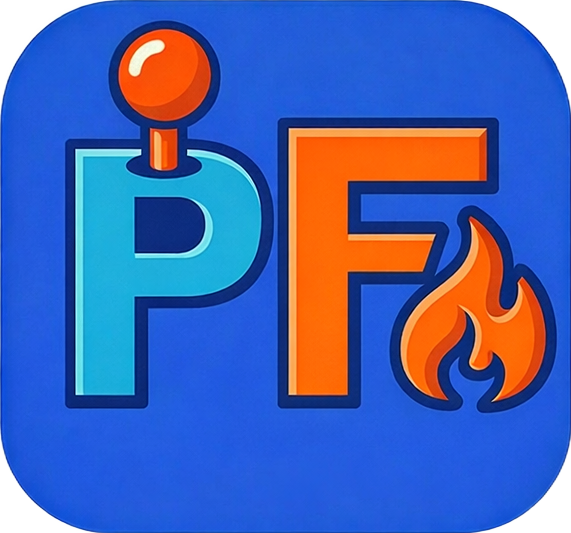
</p>

<h1 align="center">PadForge</h1>

*"And we talk of Christ, we rejoice in Christ, we preach of Christ, we prophesy of Christ, and we write according to our prophecies, that our children may know to what source they may look for a remission of their sins."* — 2 Nephi 25:26

*Glory, honor, and praise to the Lord Jesus Christ, the source of all truth and salvation, forever and ever.*

*You are warmly invited to visit [ComeUntoChrist.org](https://www.comeuntochrist.org) and learn more about The Church of Jesus Christ of Latter-day Saints.*

---

<p align="center">
  <a href="https://github.com/hifihedgehog/PadForge/actions/workflows/build.yml"></a>
  <a href="https://somsubhra.github.io/github-release-stats/?username=hifihedgehog&repository=PadForge"></a>
  <a href="https://discord.gg/qawTZHVhNH"></a>
  <a href="https://padforge.org/"></a>
  <a href="https://padforge.org/docs/"></a>
  <a href="https://github.com/hifihedgehog"></a>
  <a href="https://x.com/hifihedgehog"></a>
</p>

**PadForge makes any input look like any controller.** Plug in a steering wheel. The game sees a PlayStation pad. Use a DualSense. The game sees an Xbox 360. Map your keyboard. The game sees a flight stick. Open a tab on your phone. That tab becomes a gamepad your PC games can use.

Free Windows app. No subscription. No paywall. No nag screens. Built on HelixToolkit, HidHide, [HIDMaestro](https://github.com/hifihedgehog/HIDMaestro), .NET 10, [OpenXInput](https://github.com/hifihedgehog/OpenXinput), SDL3, Windows MIDI Services, and WPF UI.

PadForge is for sim racers running wheels in games that only understand Xbox controllers. For DualSense owners who want adaptive triggers and lightbar effects in Steam games that ignore them. For accessibility users mapping whatever hardware they can use. For anyone whose controller doesn't match what their game expects.

<p align="center"><b>16</b> virtual controllers at once · <b>758</b> devices known by USB identity · <b>231</b> device profiles · <b>1000 Hz</b> polling · <b>$0</b> forever</p>

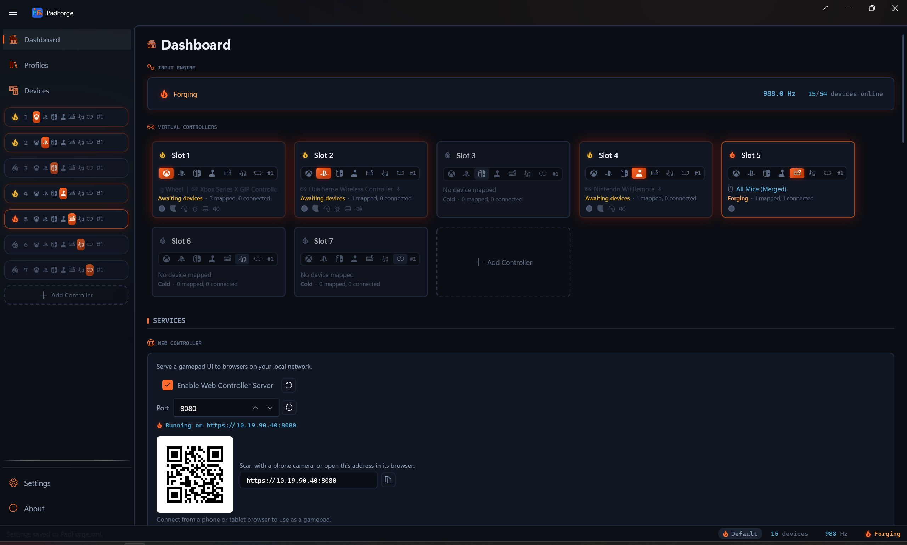

<p align="center">
  <a href="https://www.softpedia.com/get/Gaming-Related/PadForge.shtml">
    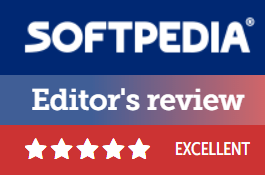
  </a>
</p>

<p align="center"><b>Softpedia Editor's Pick: rated 5/5, Excellent.</b><br>
<i>"PadForge shines best in its incredibly vast range of supported controller types."</i> (<a href="https://www.softpedia.com/get/Gaming-Related/PadForge.shtml">Softpedia's editor review</a>)</p>

<p align="center">
  <a href="https://github.com/hifihedgehog/HIDMaestro">
    <picture>
      <source media="(prefers-color-scheme: dark)" srcset="screenshots/hidmaestro-logo-dark.png">
      
    </picture>
  </a>
  <br>
  <em>Powered by HIDMaestro. One driver, 231 device profiles.</em>
</p>

<details>
<summary><b>New in 4.5.3:</b> updates from inside PadForge, motion that survives an early save or a copy, and 2D labels on the first click</summary>

- **PadForge updates itself.** Settings has a new Updates card. It checks GitHub 20 seconds after launch and every 12 hours, downloads the build for your processor, checks it against the SHA-256 checksum GitHub publishes, and installs it when you click Install and Restart, or at the next launch with Install Updates Automatically on. Include Pre-Releases adds the latest dev build. Diagnostics now shows the build beside the version. 4.5.2 and older have no updater, so reaching 4.5.3 takes this one manual download.
- **Motion stays on after an early save or a copy.** A PlayStation slot saved before its DualSense arrived, or a slot filled by Copy and Paste or Copy From from a slot whose pad it lacks, came up with Motion Gyro and Motion Accelerometer empty. An empty motion row switches motion off, so the virtual DS4 had no gyro. Both paths now leave those rows for the auto-map to fill. A slot made before this fix keeps its empty rows: map them by hand, or delete the slot and add it again.
- **The 2D annotation labels draw when you turn them on.** They used to appear only after the window was resized.

</details>

<details>
<summary><b>New in 4.5.2:</b> HidHide, Vosk voice recognition and Xbox Elite paddles on Windows on ARM, and USB Elite paddles that stay on across Windows updates</summary>

- **Windows on ARM gains HidHide, Vosk voice recognition and Xbox Elite paddles.** They work there as they do on x64. 4.5.1 said HidHide had no ARM64 driver. It has one.
- **Elite paddles over USB and the Xbox Wireless Adapter stay on across Windows updates.** That route reads an undocumented Windows format, so the input library checks the Windows files behind it before switching it on. The check was five exact file hashes, which a Windows update broke. It now accepts a family of versions: Windows 11 24H2 or 25H2 at build 26100.8973 or 26200.8973 (July 28, 2026) or later, with version 3 of the GameInput redistributable, or with none. On Windows 10 and older Windows 11 that route stays off, and paddles are read over Bluetooth only.
- **A voice macro no longer crashes PadForge after a temp cleanup.** A cleaner that removed the cached speech model's files and left its folders made the speech engine hand back an empty model, and the first recognizer built on it took the app down. PadForge now checks the model and unpacks it again.

None of the ARM64 work has run on ARM64 hardware yet. [Requirements](#windows-on-arm-preliminary) lists what the ARM64 build still lacks.

</details>

<details>
<summary><b>New in 4.5.0:</b> a VR headset and its controllers as input, Logitech G-keys, a phone's controller through the browser, and an install 30% smaller</summary>

- **A VR headset drives a flat game.** Enable OpenXR Headset Input on the Dashboard and the headset's pose arrives on the Head Tracker device as the same six axes OpenTrack uses. PadForge talks to the runtime directly instead of through the Khronos loader, so it can pick a runtime for itself without touching the machine's default and no other program's API layers enter its process. The session draws nothing, so no VR game has to be running.
- **Your VR controllers become gamepads.** Each hand is its own device row: six pose axes in the same order as the head's, named Controller rather than Head, plus the thumbstick, trigger, grip, and four buttons. Oculus Touch, Valve Index, and the Khronos simple profile are all suggested and the runtime picks the match. Left and right are separate devices, and a controller that goes to sleep returns its axes to rest after a second.
- **Per-axis head tracking ranges.** Any one of the six axes can pin its own range while the rest follow the shared pair, for when neck rotation and leaning cover very different distances.
- **Logitech G-keys, without burning a keycode.** Tick Read Logitech G-Keys in Settings and the G-keys arrive through Logitech's own SDK as their own device row: 29 keys in each of M1, M2 and M3, plus a Logitech mouse's buttons 6 through 20. No programming a G-key to type some real key that then fires in every other program.
- **A controller paired to your phone, through the browser.** The Browser Gamepad page forwards a pad the phone or handheld can see over the Gamepad API, with rumble where the browser offers it. iPhone Safari offers none. Controls past a slot's shape are dropped, and the page says how many.
- **Pens and drawing tablets are input devices.** A Windows pen reports its barrel buttons, its eraser, inversion and in-range as named buttons, and its contact rides the touchpad lane. There is no tilt or twist, and the row is excluded from (Any Device) sources, so bind it by name.
- **Keyboard and mouse surfaces.** A Preset chip, a preview that follows it, and a per-slot surface mode that persists.
- **Menus gained a Layer picker, a stay-open mode, and per-cell icon size.**
- **The install is 30% smaller and starts faster.** 412.3 MB down to 289.2 MB, and startup from 6.26 s to 5.58 s. Each controller atlas now ships in the format that suits it, opaque ones as JPEG, and 352 duplicate meshes were dropped for a shared geometry table. The transparent atlases and the speech model are stored uncompressed inside a Brotli stream instead of being deflated and then compressed again, and the meshes are Brotli-packed rather than deflated.
- **Eight new Xbox Series skins**: Sonic the Hedgehog, Razer, Captain America, Boba Fett, The Mandalorian, Stormtrooper, Darth Vader, and Star Wars: Squadrons.
- **Always Show in System Tray** is its own setting, so the tray icon no longer depends on Close to System Tray.
- **A virtual pad reports a real battery level.** Two off-by-one defects, one in the DualShock 4 packer and one in HIDMaestro's XInput reply, had every virtual pad reading flat.
- **A game's DualSense trigger feedback reaches the pad.** The virtual pad carries the physical DualSense's trigger feedback bytes instead of zeroing them, so a game that reads them back sees the truth.
- **Rumble on Padix PlayStation converters**, written directly as the 9-byte motor report.
- **Proportional steering-angle rumble** on wheels.
- **Signed BthPS3 2.12.0** is bundled, and an older install is upgraded in place.
- **Elite paddles heal themselves** across every transport and focus change.

</details>

<details>
<summary><b>New in 4.4.0:</b> Valve hardware from an Extended slot, head tracking from OpenTrack, your desk lighting up with the pad, and the buttons a handheld PC hides</summary>

- **Valve hardware from an Extended slot.** A Steam Deck Controller, a Steam Controller (Wired), a Steam Controller (2026), and Composite variants of the first two, each with Valve's own vendor and product IDs. The Composite and 2026 profiles pack Valve's native input frame with both trackpads and the rear buttons, and a one-to-one automap lands a real Valve pad's controls straight across. The two Steam Controller bodies in the 3D preview are meshed from Valve's published CAD.
- **Handheld PCs give up their hidden buttons.** Rear paddles, menu keys, wheels, and vendor hotkeys on the Legion Go, ROG Ally, GPD Win, OneXPlayer, AYANEO, AYN, Zotac Zone, and MSI Claw become named buttons by watching you press each one, through a typed key combination, a vendor HID report bit, or a vendor WMI event. No per-model table ships. The machine's own gyroscope joins as a System Motion device.
- **Head tracking from OpenTrack.** OpenTrack's UDP output, port 4242 by default, and the FreeTrack 2.0 shared memory both arrive as one Head Tracker device with six axes: yaw, pitch, roll, and the three translations. Turn it on in the Dashboard's Head Tracking section.
- **The desk lights up with the pad.** Razer Chroma and Logitech LIGHTSYNC devices take the virtual pad's lightbar color, and Razer Sensa HD hardware plays its rumble. Three Dashboard toggles, each one a profile can carry. Chroma and Sensa need Razer Synapse installed and LIGHTSYNC needs G HUB, since each runs on the vendor's own engine.
- **The Steam Controller 2026 plays a DualSense persona's haptics as PCM.** Wired or on the dongle, the persona's authored haptic track streams to the pad's own actuators instead of collapsing to a tone, with sound macros, the system-audio mirror, and swipe ticks riding the same stream. Over Bluetooth the pad stays on the tone lane.
- **A macro can change the shift layer.** A Switch Layer action jumps the slot to Base or to any layer you authored, and it holds until another switch, a Latch or Cycle activator, or a profile change. A shift activator can carry an Only While in Layer condition, checked when the input goes down and held for the whole press, so one button can mean something different on every layer.
- **Menu cells fire macros, and the icons are yours.** A radial or grid cell can run a macro instead of pressing a button. An icon package is one zip of images with a .pficons extension, added from the Menus tab and read straight from the file without unpacking.
- **Launchers and scripts switch profiles.** Turn on Allow External Control by Launchers and Scripts and PadForge serves a local named pipe that Playnite, LaunchBox, or a one-line script can activate a profile through. The profile is held until the script releases it or you switch one yourself.
- **A profile can carry its own polling rate**, 1000 Hz down to 62.5 Hz, overriding the Settings interval while that profile is active.
- **Quick Charge drops the Bluetooth link when the pad plugs in.** A controller that reports it is charging over USB has its radio link dropped, so it charges without powering the radio. Any USB power source counts, wall chargers included.
- **The Wii Remote learns how it is held.** A Grip card on the Gyro tab rotates the gyro, the accelerometer, gravity, and the D-pad into the game's frame for Pointing, Sideways (Face Up), Wii Wheel (Face Toward You), or Upright.
- **Motion Shake is a mapping source**, and on a Wii Remote the aux entry names itself Nunchuk Shake.
- **Assignment prompts.** When a device connects while a virtual controller's page is open, PadForge offers to assign it there, with two opt-outs in Settings. Keyboards, mice, touchpads, and media keys are never offered.
- **Hide from Games reaches an XInput interface buried inside a composite pad**, the shape a handheld's built-in controller and a pad on an Xbox 360 wireless receiver both have. A device row you deliberately left visible keeps its own nodes.
- **The Dashboard and Settings pages run in the order they mean**, and the driver status strip left the Dashboard for Settings, where the drivers are installed.
- **Fixes:** pressure-scaled turbo takes its direction from the trigger instead of reading a stick's lower half backward, a dual-connected Sony pad drops its stale radio link when the wired audio sink builds, switching an Extended slot's profile carries the bindings across and maps the new ones, phantom adaptive triggers no longer appear on Virtual Xbox 360 slots, and unassigning a device drops its per-slot config instead of leaving it behind.

</details>

<details>
<summary><b>New in 4.3.2:</b> crossfeed, a graphic EQ, and a limiter for the DualSense headset jack, and Copy / Paste that really carries the whole slot</summary>

- **A processing chain for the DualSense headset jack.** Under Output Path on the Audio tab, three stages run on everything the slot plays before the pad encodes it. **Crossfeed** mixes a little of each channel into the other the way a room does, with bs2b's six classic presets, Jan Meier, the bs2b default, and a Custom level with its own cutoff and feed sliders. A **graphic parametric EQ**: a log-frequency curve with one draggable handle per band, drag for frequency and gain, wheel for width, with typed rows underneath and six band types. A **limiter**, on by default, so a boosted band never clips the pad's encoder.
- **AutoEq import.** Download the Custom Parametric Eq for your headphones from autoeq.app and click Import from File. The bands, the preamp, and the enable all land, and a status line says what it did. The clipboard import stays for profiles that arrive as text.
- **Follow Headphone Jack works without a virtual DualSense.** The jack was only ever read by the virtual-pad lane, so with none on the slot it never switched and Mirror System Audio played into a muted path. PadForge reads the jack from the pad itself now, USB or Bluetooth.
- **Slot Copy and Paste carry everything.** The Bass Shakers, SOCD, and Keep Awake settings and the slot's macros ride the clipboard along with the mappings, shift layers, menus, and per-device tuning they already did. Paste replaces the target's macros rather than adding to them.
- **The band-type picker is localized**, and the EQ editor's frequency ceiling matches the engine's.
- **The DualShock 3 shows its pressure axes** without Raw Joystick Mode again, after the 4.3.1 sparse-axis change computed the list too early.
- **Fixes from the audits:** a Move Navigation hand-mapped "Axis 15" no longer reads as foreign and strips the slot, the EQ grid rebuilds on every device-config swap rather than only on a device switch, an engine restart no longer leaves the firmware speaker path unasserted, a failed headphone-jack open no longer respawns a reader every five seconds, and the Mappings-tab paste stops the slot's macro sounds before replacing its macros.

</details>

<details>
<summary><b>New in 4.3.1:</b> the Navigation controller over Bluetooth, idle disconnect for the DualShock 3 family, and only the inputs a pad actually has</summary>

- **The PlayStation Move Navigation controller works over Bluetooth.** It pairs over WinUSB, takes its address from its own device node, pairs itself on the dock like the Move, and follows DsHidMini's connect-time order exactly: output report first, then the input stream, then one enable packet and never a repeat.
- **Idle Disconnect for the DualShock 3, PlayStation Move, and Navigation controller**, off by default, set in minutes on the device's Power section.
- **Only the inputs a pad actually has.** A Navigation controller listed every DualShock 3 button and axis it shares a report layout with. PadForge asks the pad which standardized buttons and axes it declares and shows only those, numbering preserved. The PlayStation Move and the VR controllers had the same defect and the same fix.
- **Button numbering stays SDL's positional numbering while a device is offline**, so a button keeps one number either side of the boundary (discussion #344).
- **A Switch 2 Pro Controller entry survives a restart**, and PadForge stops rewriting its settings file while idle.
- **Full Screen works from a maximized window** (discussion #342), and the sidebar keeps one active bar (discussion #340).
- **The DualSense sends its connect-time LED release over Bluetooth**, so the lightbar comes up under PadForge's control on a fresh connection.
- **The offline voice model ships inside the executable**, repacked with spec-correct separators.

</details>

<details>
<summary><b>New in 4.3.0:</b> a rebuilt web controller, voice macros, PlayStation Move, VR devices as sources, and Remote Link over the internet</summary>

- **The web controller, rebuilt.** Ten controller layouts instead of two: Xbox 360, Xbox One, Xbox Series X|S, DualShock 4, DualSense, DualSense Edge, Switch Pro, Switch 2 Pro, Steam Deck, and Steam Controller. The DualShock 4, DualSense, and Xbox Series cards carry color finishes you pick before opening them. The DualShock 4 and DualSense layouts draw the slot's LED color on the pad's own lightbar, and the DualSense adds its player indicator row, both configurable from the Lighting tab like the physical pads. Triggers get analog sliders, and the Steam layouts carry both trackpads and the rear buttons.
- **Your phone's motion, as a source.** The page reads the handset's gyroscope and accelerometer and streams them to the slot. Browsers only hand out sensor data over a secure connection, so PadForge binds a self-signed certificate and serves over HTTPS, with a QR code on the Dashboard to get the phone there.
- **Build your own pad.** A builder that starts from a blank surface and lets you drag sticks, buttons, triggers and touch areas to where your thumbs actually are, saved with your settings.
- **Voice macros.** Registered phrases spoken into a microphone fire macros, recognized offline by Vosk with no account and no cloud. The model ships inside PadForge, so it works on a machine that has never been online.
- **PlayStation Move and Navigation controllers** over USB and Bluetooth, including the Move's sphere and motion.
- **Real VR devices as input sources.** A headset's pose and its motion controllers become mapping sources, so what you are holding in VR can drive a flat game.
- **3Dconnexion SpaceMouse.** The 6DoF puck reports as a mapping source, all six axes.
- **Remote Link over the internet.** Dial another PadForge PC by code with no VPN and no port forwarding.
- **Pressure-sensitive turbo.** The repeat rate follows how hard the button or trigger is pressed.
- **Trackball momentum** on sticks, plus clamp and gain knobs for the touchpad's existing momentum.
- **Gyro Tilt.** A degree-ranged tilt mode alongside the existing rate mode, with Gyro Lean documented and its Sensitivity dial fixed, plus a Recenter action and independent yaw and roll inversion.
- **Low-battery notifications**, plus an identify buzz that rumbles any device so you can tell which one it is.
- **A Diagnostics section in Settings.** Versions to paste into a report, a log you can switch on without a launch flag, and a Save Snapshot button that writes out the last few minutes of engine events even when logging was off.
- **Mapping picker** gains find-as-you-type and device filtering, and the search filters the table.
- **Moza wheels** recognized, and **DualSense effect passthrough** for games that drive the triggers themselves.
- **Anti-deadzone floors the stick pair** rather than each axis, which closes the gaps that showed at the cardinals.
- **Mirror System Audio** no longer cracks over Bluetooth when the loopback ring runs dry under bursty capture.

</details>

<details>
<summary><b>New in 4.2.0:</b> VR controllers, headset head tracking, controller audio and microphone, and starter profiles</summary>

- **Virtual VR controllers.** A VR slot presents a full SteamVR left and right hand pair, driven by any controller, keyboard, or motion source you map to it. One slot serves both hands, every stick, trigger, grip and button is a mapping target, and the game's haptics come back out through the device you are actually holding. PadForge installs the SteamVR runtime itself if you do not have it, with no Steam account and no Steam client, to a folder you choose.
- **Headset head tracking.** Sony headphones that carry a head tracker, confirmed on the WH-1000XM5 family, become a motion source. Turn your head to aim, lean, or drive anything that takes gyro. Discovery is by capability rather than a model list, so any headset exposing the same sensor collection works.
- **Controller audio and microphone.** An opt-in virtual USB persona carries the DualSense's voice-coil haptics, its speaker, and its microphone, so authored haptics and controller audio reach the pad the way a PS5 does it.
- **Bundled starter profiles.** Thirteen general-purpose archetypes, from twin-stick to racing to space sim, ready to apply to any controller instead of starting from an empty grid.
- **Keep Controller Awake.** Holds a small idle deflection so games stop cutting vibration the moment you touch the mouse or keyboard.
- **Sony calibration reports.** Virtual DualSense and DS4 controllers now answer the calibration feature report that games with native PlayStation support demand, so those titles stop rejecting them.
- **DualShock 3 first-run pairing.** Seven stacked defects in the driver install are fixed, so a clean machine pairs instead of flashing forever.
- **Steam Controller 2015 rumble** emulated on the touchpad haptics, plus a fix for the Bluetooth swipe-haptic stall that made the touchpad mouse teleport.
- **Left Joy-Con gyro** gains the Horizontal (Yaw + Roll) blend, and **IR Brightness** works on a combined Joy-Con pair.
- **Controller finishes in the preview.** Ten DualSense colorways including Spider-Man 2 and Final Fantasy XVI, thirteen Xbox Series finishes, and the DualSense Edge as its own model family.

</details>

<details>
<summary><b>New in 4.1.0:</b> Steam Workshop config import, DualShock 3, Wii pointer modes, and a new look</summary>

- **Steam Workshop config import.** Browse the community controller configs on the Steam Workshop and translate the one you pick into a PadForge profile, over an anonymous Steam connection with no account.
- **DualShock 3 controllers.** Plug one in over USB and PadForge binds it with WinUSB on the spot, or pair it over Bluetooth from the Devices page, which installs a signed BthPS3 driver on demand. Sixaxis motion, ten pressure axes, rumble, the player LED, and battery all report.
- **Wii pointer modes.** The Wii Remote's IR camera becomes an on-screen pointer, with an FPS-mouse mode, aspect-corrected border modes, and a freeze that holds position when the sensor bar leaves view instead of snapping to a corner.
- **Mouse gestures.** Hold a mouse button and flick up, down, left, or right to fire an action.
- **Stick Trim.** A stick ramps a held digital trigger into a smooth analog press.
- **SOCD cleaning.** Opposite key presses on the Keyboard & Mouse controller resolve with last-wins (Snap Tap), first-wins, or neutral.
- **Guide button LED brightness.** Dim the Xbox button on Xbox One, Elite, and Series pads over USB, and the 2015 Steam Controller's home LED, fixed or following the battery.
- **Shift layers** gain a long-press activation delay and an inactivity auto-cancel.
- **Text Block macro action** types text a character at a time.
- **Clone Device 1:1** copies a device's controls onto an Extended slot in one click.
- **Raw Axis N sources** up to 24 axes.
- **Nintendo virtual controller.** A virtual Switch Pro Controller through HIDMaestro, with gyro passthrough and HOME LED control.
- **Bass Shakers.** Game rumble and force feedback route to any audio output as low-frequency tones, four voices with per-voice frequency and gain.
- **Flick Stick.** Flick sources on either stick or a touchpad, with a rotation offset card.
- **Twelve macro fire modes.** On Single / Double / Triple Press, On Long Press, On Short Press, Toggle, and Turbo join the original five.
- **Axis macro actions.** Latch a virtual axis to a value, release it, or scale it from a macro.
- **Macro layer scope.** A macro can limit itself to chosen shift layers.
- **SOCD on controller buttons.** Opposing-pair cleaning beyond the Keyboard & Mouse controller, per slot.
- **Pressure-sensitive touchpads.** Per-finger pressure as mapping sources.
- **Touchpad swipe haptics** tick the pad as a finger travels, and a **custom activation button** arms mouse gestures from any recorded input.
- **HOME LED on Switch controllers.** Fifteen brightness steps on Switch Pro and right Joy-Con, joining the Xbox Guide LED control.
- **Joy-Con pair audio follows the motor.** Haptic tones play through the coil the game drives.
- **Left Joy-Con aux motion.** A paired Joy-Con exposes the left half's gyro and accelerometer as separate sources.
- **Per-source Acceleration, Invert Output, and Fire on Release.** New per-row tuning, plus activators that fire when released.
- **Trackpad pointer response.** A libinput-derived acceleration curve makes touchpad-as-mouse feel like a laptop trackpad.
- **Trackball momentum.** Flick the touchpad or the mouse stick and the cursor coasts to a stop on real constant-friction physics (a port of the Steam Controller driver's own trackball), with glide, fling boost, threshold, speed cap, and a stacking mode that builds speed across swipes.
- **Time-based cursor rates.** Keyboard + Mouse cursor and scroll speeds are real rates, independent of polling rate.
- **Clear All clears everything.** The Mappings tab's Clear All resets sources, options, and tuning in one confirmed step.
- Carrying forward from 3.5 and 3.6: Wii Bluetooth pairing, Remote Link across PCs, native wheel force feedback, MIDI in and out, and controller-speaker audio.

Full documentation at [padforge.org/docs](https://padforge.org/docs/). Every device PadForge recognizes by USB identity is on the [supported devices list](https://padforge.org/docs/devices/supported/).

</details>

---

## Quick start

1. Download the `win-x64` zip from the [latest release](https://github.com/hifihedgehog/PadForge/releases/latest) and extract `PadForge.exe`. On Windows on ARM, take the `win-arm64` zip.
2. Run it. PadForge always runs elevated, so Windows shows the UAC prompt at startup. The first Xbox, PlayStation, Nintendo, or Extended virtual controller it starts installs HIDMaestro inside that same elevated session.
3. Click **Add Controller** on the Dashboard. Pick Xbox, PlayStation, Nintendo, Extended, Keyboard + Mouse, MIDI, or VR.
4. Open the Devices page and drag a physical device's card onto the new slot's card in the sidebar.
5. Most controllers auto-map on assign. For the rest, click **Map All** to walk every button in one pass, or use the **Mappings** tab to bind one at a time.
6. Launch your game. The game sees the virtual controller as real hardware.

Most games "just work" after step 5. If a game sees both your physical and virtual controller at once, install HidHide from **Settings → HidHide Driver** to hide the physical one.

From 4.5.3 on, **Settings → Updates** keeps PadForge current. It checks GitHub on its own and installs a new version in place, settings untouched.

---

## Remap: that game that won't read your wheel? It will now.

PadForge translates a PS5 DualSense into the Xbox pad a Steam game expects. A Logitech G29 wheel into the gamepad a racing game accepts. A Saitek HOTAS into the gamepad a flight game stubbornly insists on. The game never knows the difference.

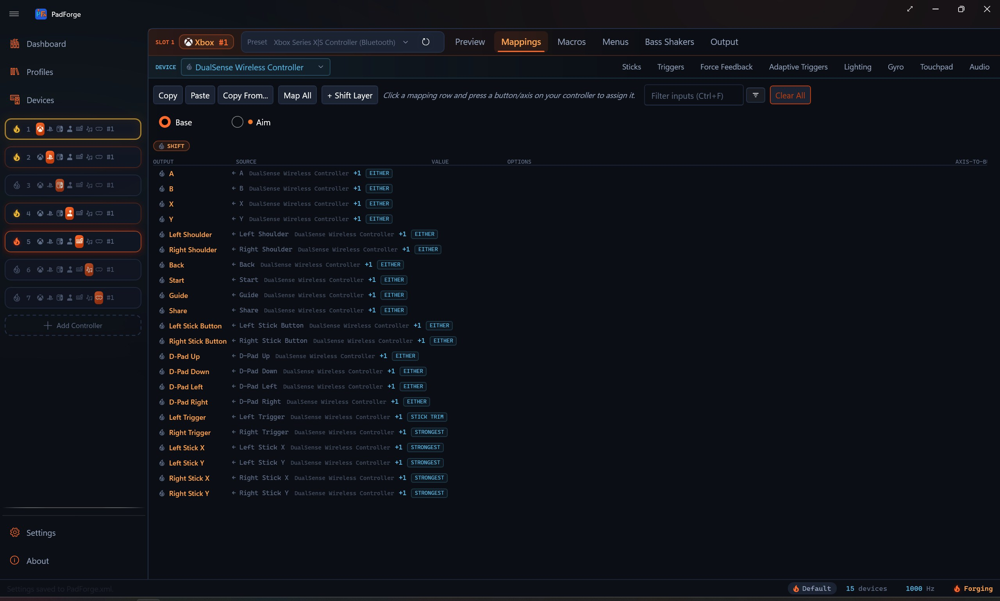

### Pedals, wheel, and HOTAS throttle. One virtual stick.

One mapping row can read from any number of physical inputs across any number of physical devices. Six combine modes (Strongest, Combined, Average, Either, Both, Only One) plus a drag-and-drop custom formula editor. Cross-device chords so a button on the wheel and a button on the shifter trigger one virtual press. A Primary Mode dropdown sets how the main source reads: Direct, Incremental, Invert On Hold, or Ramp. Ramp builds a stick axis from two keyboard keys. The Up key drives toward +1 and the Down key toward -1, each over an Attack time. Release ramps back to center over a Release time when Autocenter is on, or holds where you left it when off. A Reverse multiplier sets how fast it returns when you press the opposite key.

### Squeeze a digital trigger like it's analog.

Stick Trim is a combine mode on the mapping row. Hold a digital trigger to arm it, then a stick sets how hard it presses, from a feather to full. Each row gets its own deadzone and ramp rate, and you choose whether that level snaps back to full the moment you let go. A keyboard bumper becomes a trigger you can modulate.

### Copy a controller onto a slot, one to one.

Assign a device to an Extended slot and click Clone Device 1:1. Every button and axis lands on the matching virtual output, straight through, with no per-input mapping. It works even when the device is assigned but unplugged, so you can set the profile up before the controller is plugged in.

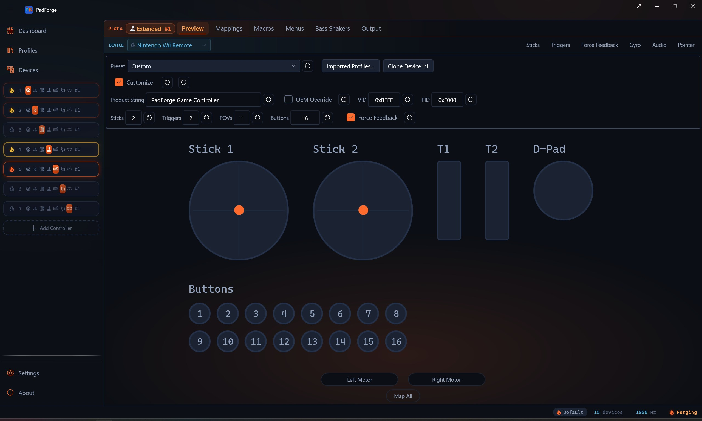

### A virtual Switch Pro Controller.

The Nintendo slot type creates a virtual Switch Pro Controller through HIDMaestro. Games and emulators that speak Switch see the real thing: sticks, triggers, the full button set, gyro passed through from your physical pad, and the HOME button LED under your control. It sits in the Add Controller popup between PlayStation and Extended.

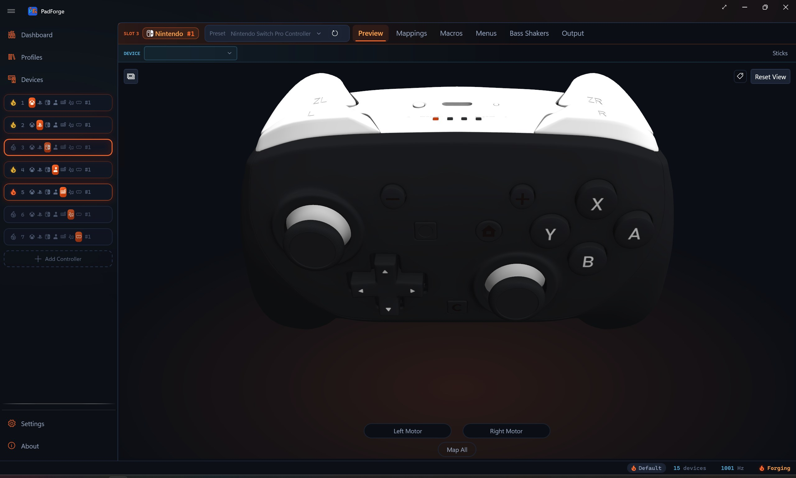

### A Steam Deck, or a Steam Controller from either year.

An Extended slot can present a Steam Deck Controller, a Steam Controller (Wired), which is the 2015 pad, or a Steam Controller (2026), plus Composite variants of the first two. Each carries Valve's own vendor and product IDs rather than a stand-in. The Composite and 2026 profiles pack Valve's native input frame, both trackpads and the rear buttons included, and a one-to-one automap lands a real Valve pad's controls straight across. The plain Steam Deck Controller profile carries the identity with a standard gamepad frame. In the 3D preview, the two Steam Controller bodies are meshed from Valve's own published CAD. The Deck's body comes from Handheld Companion.

### A SteamVR hand pair, driven by whatever you already own.

The VR slot type presents a left and a right hand to SteamVR, so a gamepad, a flight stick, a keyboard, or a phone over Wi-Fi can drive them. One slot serves both hands, so there is no left slot and right slot to keep in sync. Every stick, trigger, grip and button is a mapping target, and triggers and grips stay genuinely analog rather than collapsing to on and off. When a game buzzes a hand, that pulse comes back out through the physical device driving the slot.

PadForge installs the SteamVR runtime itself if you do not have it, with no Steam account and no Steam client, to a folder you pick.

Stated plainly, because it decides whether this is useful to you: PadForge does not fabricate positional tracking. The driver parks both hands a fixed distance in front of the headset, so they follow where you look. What you get is the controls. One VR slot is the ceiling, and SteamVR's own Test Controller is not a reliable way to check one.

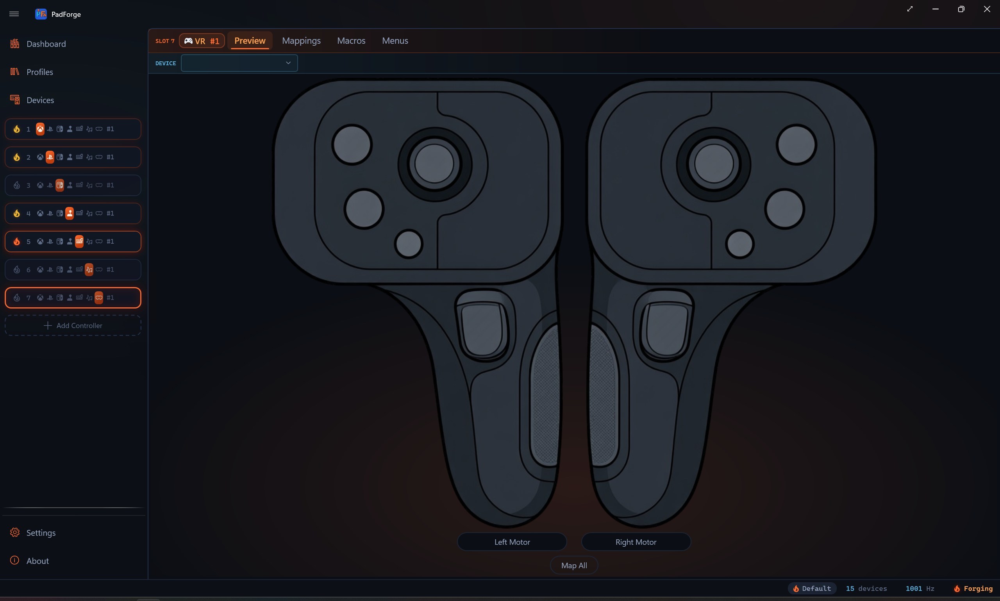

### Thirteen profiles that work on whatever pad you plug in.

Pick a starter profile, assign any controller, and play. They cover a kind of game rather than a single title: Desktop, WASD and Mouse, Point and Click, Strategy, Isometric RPG, Twin-Stick, Media Remote, Hotbar, Fighting Games, Emulation, Racing, Space Sim, and Gyro Aim. Nothing is locked, so saving one adds an ordinary profile you can edit.

They never name hardware, which is why one profile drives a DualSense, an Xbox pad, and a Switch Pro Controller the same way. Every profile that moves a cursor offers the touchpad and the stick at once: the stick moves it as a rate, and the moment a finger lands on the pad the cursor goes where the finger is. Hotbar puts thirty-two abilities behind two triggers, eight per trigger with sixteen more on a double tap. Fighting Games ships SOCD cleaning set to Neutral on both axes and binds exactly one directional surface, which is what tournament rules require. Emulation puts save states, rewind, and fast-forward behind a held Back, the way RetroArch's own hotkey modifier works, and mirrors the left stick onto the D-pad for cores that have no analog sticks at all.

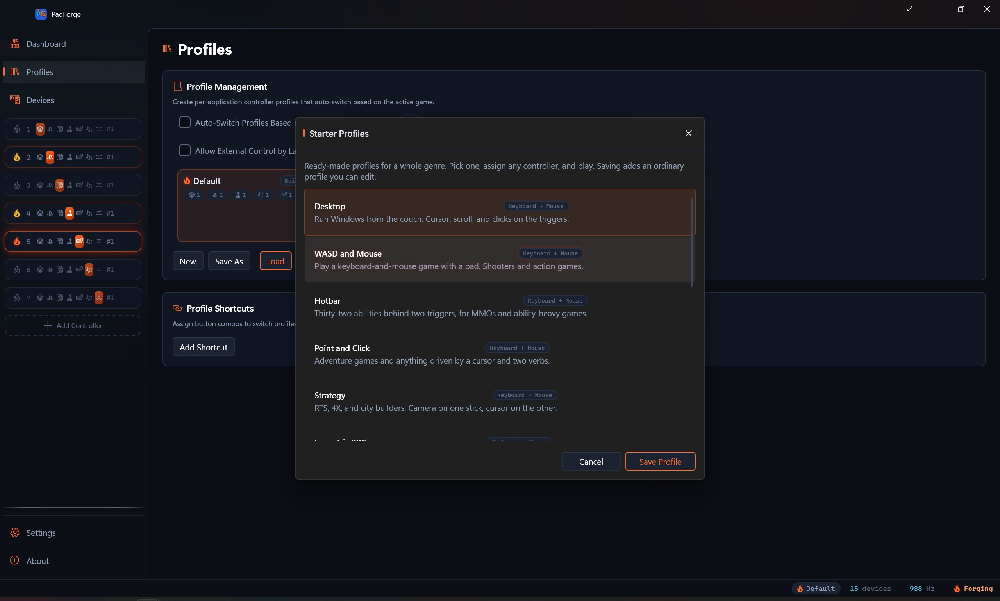

### Borrow a controller layout from the Steam Workshop.

Point PadForge at a game and it browses the community controller configs published on the Steam Workshop, then translates the one you pick into a PadForge profile: buttons, sticks, triggers, keyboard and mouse bindings, shift layers, and macros. The connection to Steam is anonymous, so no account and no login. It stays off until you enable community config lookup in Settings, and an import report shows what came across cleanly and what needed a substitute.

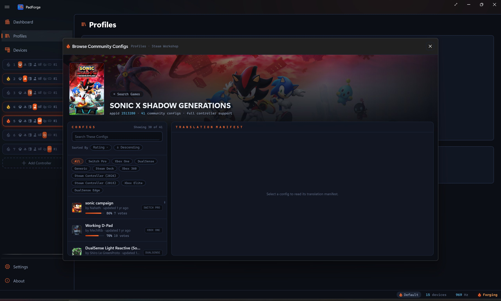

### Caps Lock for your controller.

Each slot can carry extra mapping tables that turn on while a button, chord, or axis fires. Six activation modes: Hold, Toggle, Latch, Cycle, Sticky, and No Button. Latch presses a layer on and leaves it on. Press it again for Base, or press a different Latch button to switch. Cycle puts a queue of layers under one control. The activator steps forward, a second Previous button steps back through the same list, and that Previous button can sit on another device. Wrap Around loops past the last layer to the first. Include Base folds the resting layer into the rotation or leaves it out. A No Button layer has no activator of its own and exists only to ride a Cycle queue. Each layer carries its own color and emoji icon, and a Win11-style flyout confirms the active layer the moment it engages.

### Tap for one thing, hold for another.

A shift-layer button can wait for a long press. Set a hold-to-fire delay on a Toggle, Latch, or Sticky activator, and a quick tap does its normal job while a hold flips the layer. An activator can also fire on release instead of on press, so the layer flips when you let go. A Toggle layer can also cancel itself: leave it untouched for the time you set and it drops back to Base on its own, so you never get stranded on the wrong layer.

### A macro that changes the layer.

A Switch Layer action jumps the slot to Base or to any layer you have authored, and the layer holds until another switch, a Latch or Cycle activator, or a profile change. A shift activator can carry an Only While in Layer condition of its own, so the input counts only while the layer you name is engaged. The check happens when the input goes down and holds for the whole press, so an activator that changes the layer cannot cut its own press short. Scope a Switch Layer macro to a layer and the same button jumps somewhere different from each one.

### Move the mouse, move the stick.

Two new mapping sources, Mouse Position X and Mouse Position Y, read where the desktop cursor sits on screen. Center reads zero, and distance from center pushes the stick toward its edge. (That differs from the Mouse Speed X/Y sources, which read how fast the mouse moves.) Each row using a Mouse Position source gets its own Sensitivity, from 0.1 to 5.0. At 1.0 the stick reaches full deflection when the cursor sits 10% of the screen width from center. Raise it for less cursor travel, lower it for more. A Mouse Position source can drive a stick axis, a trigger, or a button. Primary monitor only.

### Flick the mouse. Fire an action.

Hold any mouse button and flick. Up, down, left, and right each fire their own action, and a click while you hold fires a fifth. Bind a flick to a button press, a macro, or a shift layer. A three-button mouse turns into a small command pad. A recorded Custom button can arm the gestures too, so a keyboard key or a pad button holds the gesture state instead of a mouse button.

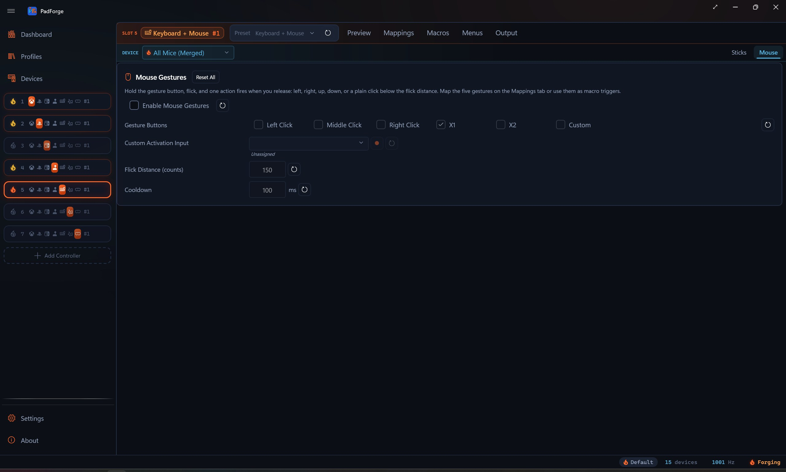

### Left and right at once? Pick a winner.

Press two opposite keys together and SOCD cleaning decides what the Keyboard & Mouse controller reports. Last-wins (Snap Tap) takes the key you pressed most recently, first-wins holds the one you pressed first, and neutral cancels both. It runs across every key you've mapped, so left/right and up/down both stay clean. The same cleaning also runs on virtual controller buttons: any slot can define opposing button pairs and resolve them with the same three rules.

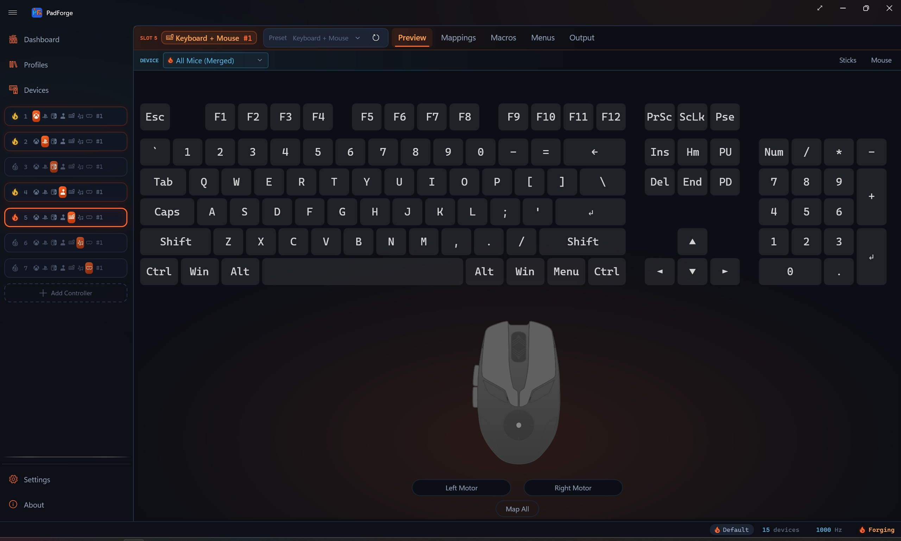

### Turn the DualSense pad into a mouse, a stick, or a D-pad.

A Touchpad tab on every slot whose source carries a touchpad surface (DualSense, DualSense Edge, DS4, Steam Controller, Steam Deck, Steam Controller 2026, Web Controller, on-screen Touchpad Overlay, Windows Precision Touchpad). Map a finger to mouse X/Y with per-axis sensitivity and invert, and pick a Pointer Response: Simple, or a Trackpad curve that moves the cursor the way a laptop touchpad does. Anchor a virtual analog stick where your finger lands. Drop a wedge-thresholded D-pad on top. The gesture stack covers 4-way and 8-way swipes, taps, longpress, pinch, rotate, two- to five-finger gestures, and shape templates (Square, Triangle, Z, Checkmark, and Circle in either direction). Pressure-sensitive pads expose per-finger pressure as mapping sources, and swipe haptics tick the pad as your finger travels. Every toggle saves per pad per slot.

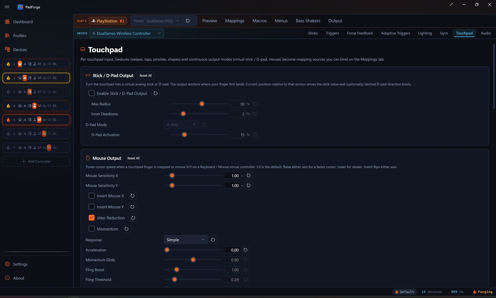

### A macro that types for you.

Drop a Text Block into a macro's action sequence and it types out plain text, one character at a time, at a delay you set. Bind it to a button and a chat line, a spawn command, or a wall of config drops in without touching the keyboard.

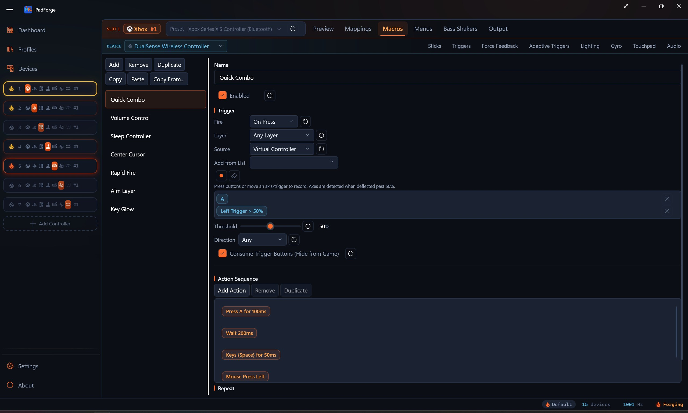

### A menu cell that runs a macro, drawn with your icons.

A slot's radial and grid menus put a page of actions under one button, and a cell can run a macro instead of pressing a button. The icons are yours to supply: an icon package is one zip of PNG, JPG, BMP, or GIF images with a `.pficons` extension, added from the Icon Packages card on the Menus tab. PadForge reads straight from the file and never unpacks it, so keeping a package next to `PadForge.exe` keeps the setup portable. SVG is not read.

---

## Feel: your wheel fights back.

Plug a Logitech, Fanatec, or Thrustmaster wheel into a slot and PadForge drives its force feedback in the wheel's own native protocol: constant force plus spring, damper, and friction straight from the game. A dedicated Wheel tab sets rotation range in degrees, auto-center strength, and the RPM shift LEDs. A racing game that only knows how to talk to an Xbox pad now loads your wheel up with real road feel.

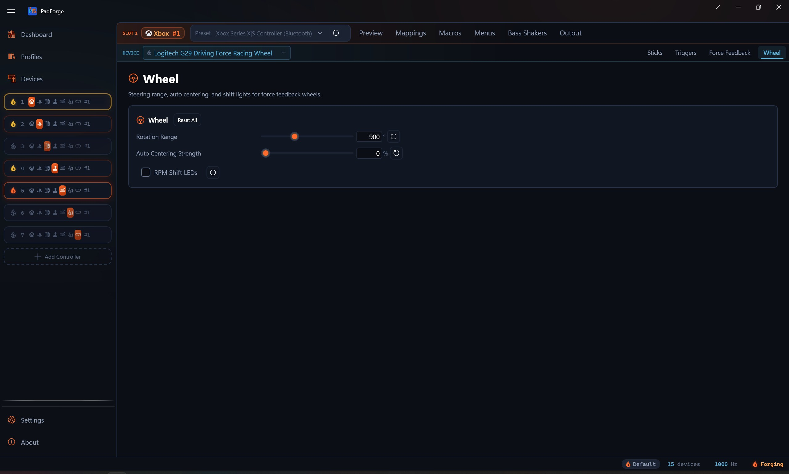

### Forza, Gears, and Halo on your real Xbox pad.

PadForge passes Xbox impulse trigger data straight to the assigned physical Xbox One, Elite, or Series pad. The same data routes to DualSense as Adaptive Trigger Vibration so a DualSense playing Forza buzzes the triggers in step with an Xbox One pad doing the same. Plus audio-bass-driven trigger rumble and a constant trigger force that resumes when the game stops.

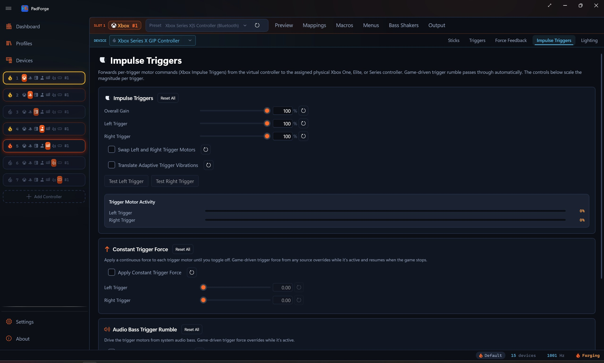

### Rumble you can sit on.

The Bass Shakers tab routes the game rumble and force feedback a virtual controller receives to any audio output as low-frequency tones, for bass shakers and subwoofers. Four voices (low motor, high motor, left and right trigger) each carry their own frequency from 20 to 120 Hz and gain, with a mono or controller-stereo channel split and a frequency sweep to find where your shaker responds strongest. Game feedback and test rumble play through the shaker. Macro rumble stays on the controller.

### Adaptive triggers and lightbar that don't need the game's blessing.

Seven adaptive trigger modes with a live preview that draws the resistance curve as you drag. Fourteen lightbar modes, six of them tied to your system audio (three Audio Pulse variants, three Audio Bands variants). The DualSense lights and triggers light up in games that have never heard of a DualSense.

| 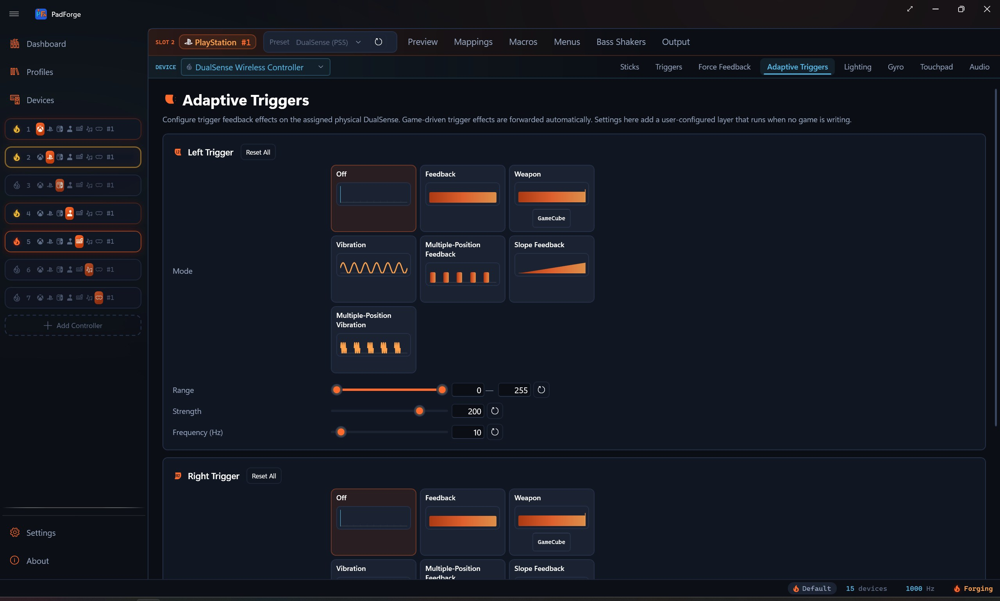 | 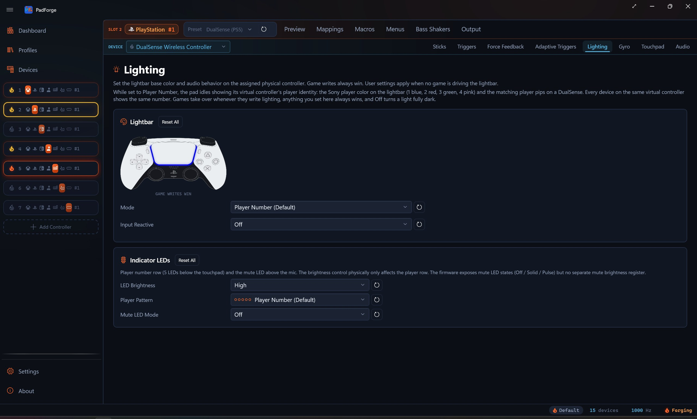 |
|:---:|:---:|

### Turn the glowing Xbox button up or down.

PadForge sets the Guide button LED brightness on an Xbox One, Elite, or Series pad over USB, the home LED on the 2015 Steam Controller, and the HOME button LED on a Switch Pro Controller or right Joy-Con on any connection. Pick a fixed level or let it track the battery, so the button dims as the charge drops. A macro action changes it mid-game.

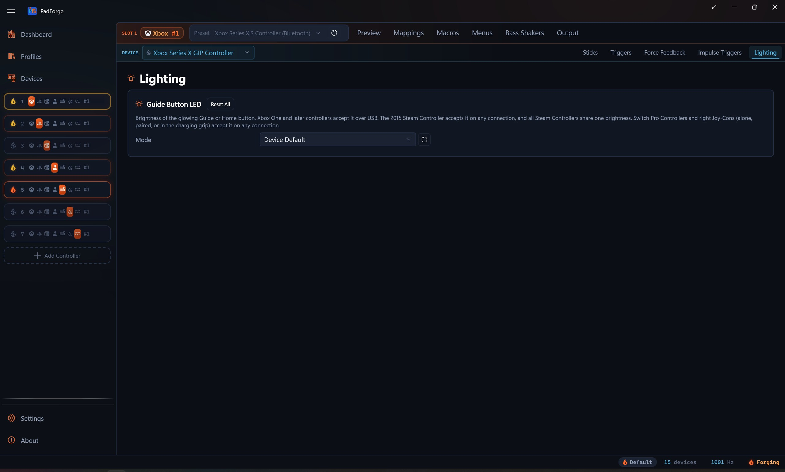

### The desk lights up with the pad.

Razer Chroma keyboards, mice, headsets, mousepads, keypads, and Chroma Link devices take the virtual pad's lightbar color, Logitech LIGHTSYNC devices take it too, and Razer Sensa HD hardware plays the pad's rumble as a haptic effect. Three toggles on the Dashboard, and a profile can carry each one or leave it alone. PadForge reaches Chroma through the REST server Razer Synapse hosts, loads G HUB's own LED engine for LIGHTSYNC rather than shipping a Logitech binary, and drives Sensa through the Interhaptics engine bundled inside the executable. Each path needs the vendor's own software installed: Synapse for the two Razer features, G HUB for the Logitech one.

### Sound from the speaker in your hands.

The DualSense and DualShock 4 have a speaker built into the pad, and PadForge can drive it. Mirror a Windows audio output to the pad, or send a slot's macro sounds straight to it. The DualSense plays over USB or Bluetooth. The DualShock 4 plays over Bluetooth. Each speaker-capable pad gets its own per-slot Audio tab, with a source picker and a master volume. Controllers with haptic actuators instead of a speaker (Joy-Con, Switch Pro, the Steam Controller, the Steam Deck, and the Steam Controller 2026) play the same macro sounds as a vibrating tone, so beeps and short cues come through the grip. On a combined Joy-Con pair the tone follows the motor the game drives, left motor through the left coil and right through the right. A Wii Remote plays them through its own speaker.

The DualSense headset jack gets a processing chain of its own: bs2b crossfeed with the classic presets, Jan Meier, and a custom cutoff and feed, a graphic parametric EQ you drag into shape or load from an AutoEq profile for your exact headphones, and a limiter so a boosted band never clips the pad's encoder. Follow Headphone Jack switches the pad's output the moment you plug in, with or without a virtual DualSense on the slot.

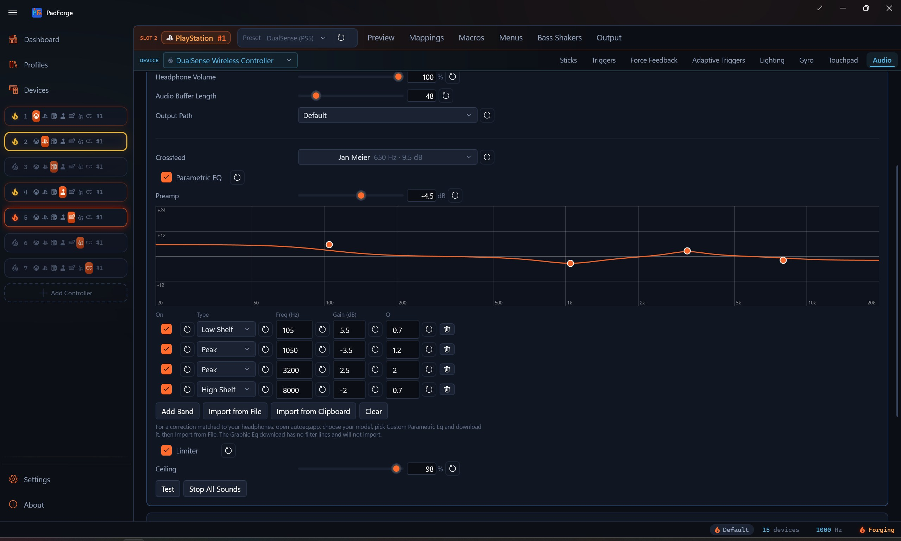

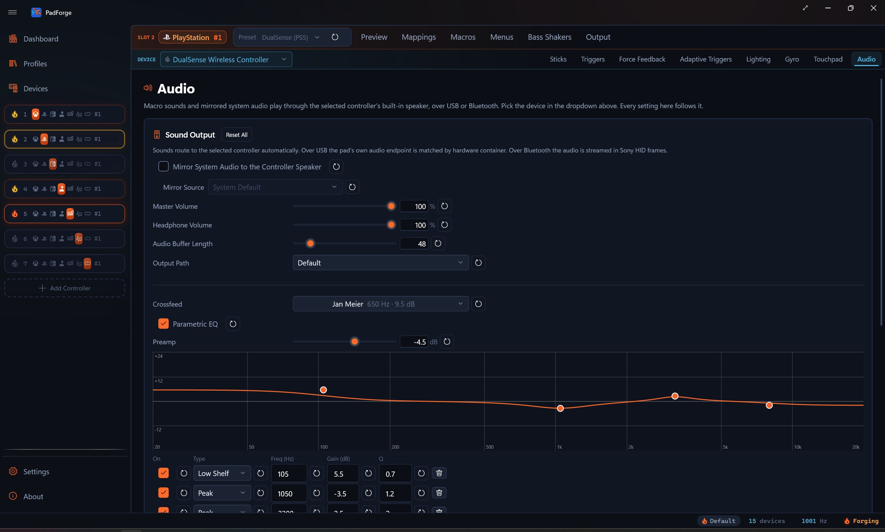

### Native haptics on the 2026 Steam Controller.

With a DualSense persona on the slot, a Steam Controller 2026 on USB or its dongle plays the persona's authored haptic track as PCM on its own actuators, instead of reducing it to a single tone. Sound macros, the system-audio mirror, and touchpad swipe ticks ride the same stream. An actuator low-pass cutoff, 250 Hz by default, keeps the pads vibrating rather than audibly playing the sound. Over Bluetooth the pad stays on the tone lane.

---

## Motion: aim with the controller, not the stick.

Reference frames (Local, Player, World). Dual-threshold smoothing. Real-world calibration. A cross-device Aim Engage button, plus a stick gate that wakes the gyro from any stick and any direction, read before the stick's own deadzone so a nudge the game ignores still arms it. Tuning saves per pad per slot, so the same pad on two slots can feel two different ways. Gyro Pitch / Yaw / Roll bind as first-class sources in the mapping table, and a paired Joy-Con exposes the LEFT Joy-Con's motion as separate aux sources beside the pair's own. Motion Shake binds like any other source on anything with an accelerometer, and on a Wii Remote the aux entry names itself Nunchuk Shake.

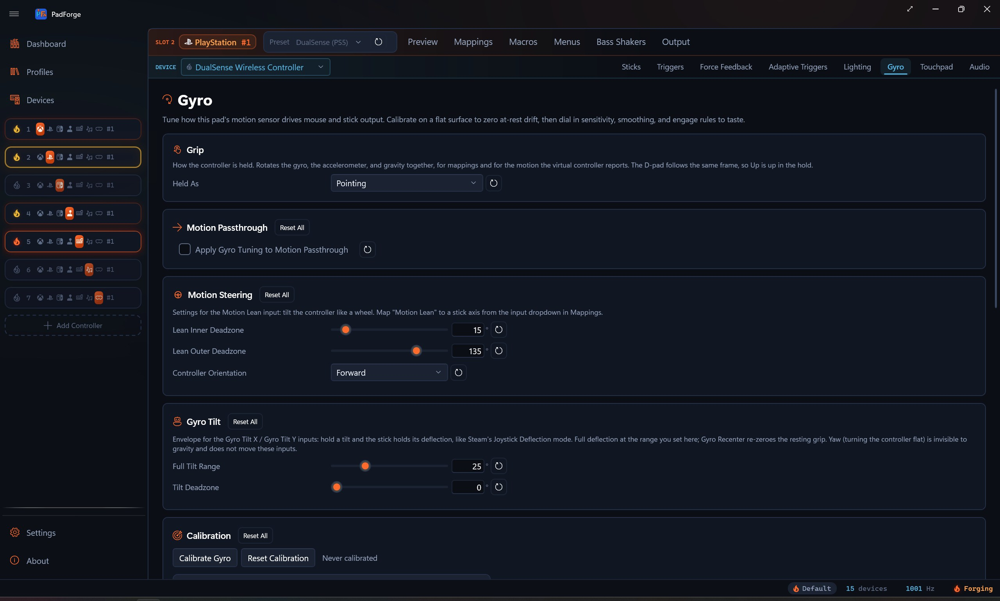

### Flick Stick, for aiming with a twist.

Flick the right stick to its edge and the camera snaps to that direction, then rotates as you sweep the stick around the rim, while the gyro handles fine aim. PadForge reads flick sources from the right stick, the left stick, or a touchpad, and a Dots per 360° setting corrects games whose camera turns more or less than the flick angle.

### Point at the screen like a Wii menu.

The Wii Remote's IR camera drives an on-screen pointer, mapped to the mouse or a stick. FPS Mouse mode turns it into relative mouse-look for shooters. Border modes correct for your screen's aspect ratio so the edges line up. When the sensor bar leaves the camera's view the pointer freezes where it was instead of snapping to a corner, and you can cycle modes on the fly or bind Set Pointer Mode to a macro.

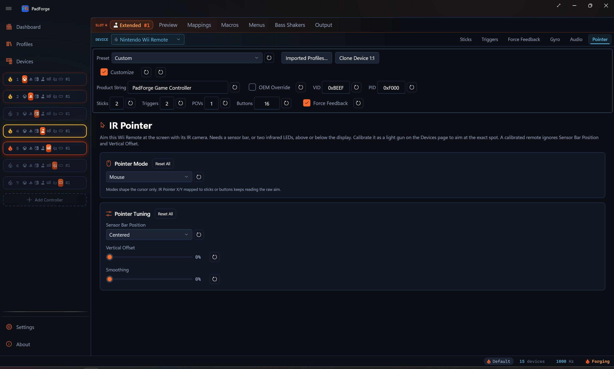

### Hold the Wii Remote any way you like.

A Grip card on the Gyro tab says how the controller is held: Pointing, Sideways (Face Up), Wii Wheel (Face Toward You), or Upright. The gyro, the accelerometer, and gravity rotate into the game's frame together, for mappings and for the motion the virtual controller reports, and the D-pad follows the same frame, so Up is up in the hold you are using. Mario Kart in an emulator gets a wheel.

### Turn your head to aim.

Sony headphones that carry a head tracker become a motion source, confirmed on the WH-1000XM5 family. The whole gyro pipeline takes it: gyro-to-stick, gyro-to-mouse, aim engage, calibration, and the DSU motion server. Discovery is by capability rather than a model list, so any headset exposing the same sensor collection is a candidate, whatever its name.

Worth knowing because it explains the behavior: on these headsets the raw gyro channel streams zeros while the rotation vector carries the real motion, so PadForge synthesizes an ordinary gyro rate from consecutive rotation samples. It reports rotation, never position, so leaning closer to the screen changes nothing. Pair it with Aim Engage, because head tracking that is always live is disorienting in most games.

### Or let OpenTrack turn it.

PadForge reads OpenTrack's UDP output, on port 4242 by default, and the FreeTrack 2.0 shared memory at the same time. Either one arrives as a single Head Tracker device with six axes, yaw, pitch and roll plus the three translations, which bind in the mapping table like any other axis. Turn it on in the Dashboard's Head Tracking section, where the port, the rotation range in degrees, and the translation range in centimeters are set.

### Gyro into Cemu, Dolphin, Yuzu, and Ryujinx.

The built-in DSU / Cemuhook server broadcasts gyroscope and accelerometer on UDP port 26760 so emulators can use real motion for Splatoon, Wii titles, 3DS games, and anything else that asks for it. DualSense, DualShock 4, Switch Pro, and 2026 Steam Controller sources all work out of the box.

DSU serves slots 1 through 4 independently of their virtual output type. A sensor-equipped controller assigned to an Xbox slot can provide Xbox buttons and sticks alongside DSU motion, with no motion mapping required.

All sources on a motion row participate in its combine mode, using the same axis combiner as other mappings: Strongest by default, or Combined, Average, or Custom. Gyroscope and accelerometer channels are reconciled independently after each source's calibration, grip, and optional tuning. Native motion output and DSU receive the same reconciled result.

When neither motion row exists, DSU applies the default Strongest combine to every enabled, assigned device with the relevant sensor. For example, a Steam Controller and DualSense assigned to the same virtual Xbox controller can both contribute motion. Each virtual controller still has one DSU stream. An explicit Gyro or Accelerometer motion row remains authoritative, including empty or offline sources. Virtual HID motion continues to follow its mappings.

### The Joy-Con 2 is a mouse. So use it like one.

A Nintendo Switch 2 Joy-Con has an optical sensor on its face. Set it on a desk and slide it. Two new sources, Mouse Motion X and Mouse Motion Y, drive a stick for mouse-look, a button, or the scroll wheel, each with its own Sensitivity from 0.1 to 5.0. The first-generation right Joy-Con's IR camera reports a brightness value you can map, so covering the sensor works like a button.

---

## Anywhere: open a browser. Press buttons.

PadForge runs a tiny web server. Any device with a browser on your Wi-Fi can load it, pick a layout, and play. Ten controller layouts (Xbox 360, Xbox One, Xbox Series X|S, DualShock 4, DualSense, DualSense Edge, Switch Pro, Switch 2 Pro, Steam Deck, Steam Controller), a multi-touch touchpad, and a builder that starts from a blank surface. Up to 16 phones at once, each a separate virtual pad. Touch buttons, dual analog sticks, an 8-way D-pad, analog trigger sliders. Rumble feedback through the Vibration API, and on the DualShock 4 and DualSense layouts the slot's LED color lights the pad's own lightbar, with the DualSense's player indicator row beneath it. The server also binds a self-signed certificate and serves over HTTPS, which is what lets the browser hand over the handset's gyroscope and accelerometer. Scan the QR code on the Dashboard to get there. No app to install on the phone.

No phone handy? Turn on **Touchpad Overlay** from the Dashboard. A transparent on-screen touch surface pins to any monitor and drives the DS4 or DualSense touchpad directly.

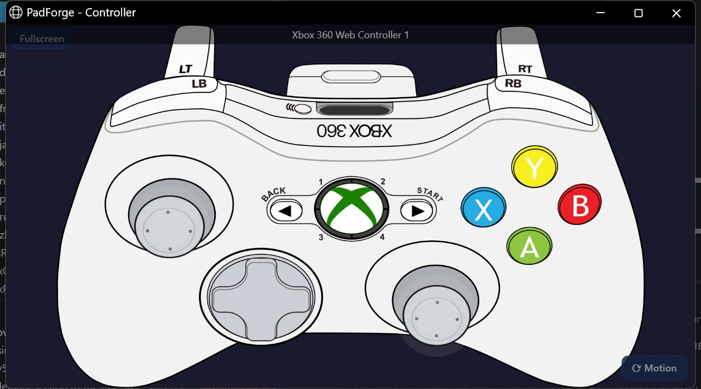

### The controller is on the other PC. The game doesn't care.

Remote Link shares devices across the PadForge PCs on your network. A controller, wheel, or HOTAS plugged into one PC shows up in another's PadForge as an ordinary mapping source, takes a slot, and drives a virtual controller the game reads as real hardware. Connect as many PCs as you like, and one shared controller can drive games on several of them at once. It runs both directions at once, and the feedback comes home: rumble, force feedback, adaptive triggers, lightbar, player LEDs, and the controller speaker all play on the physical device wherever it lives. Pair once by matching a six-digit code on both screens, then trusted PCs reconnect on their own the moment they see each other. A gamepad-only switch keeps a paired PC from ever reaching your keyboard, mouse, or macros. It finds PCs on your home network on its own, and reaches across the internet on an eight-character single-use code: one PC shows the code, the other types it, and the two meet through a relay. No VPN, no port forwarding.

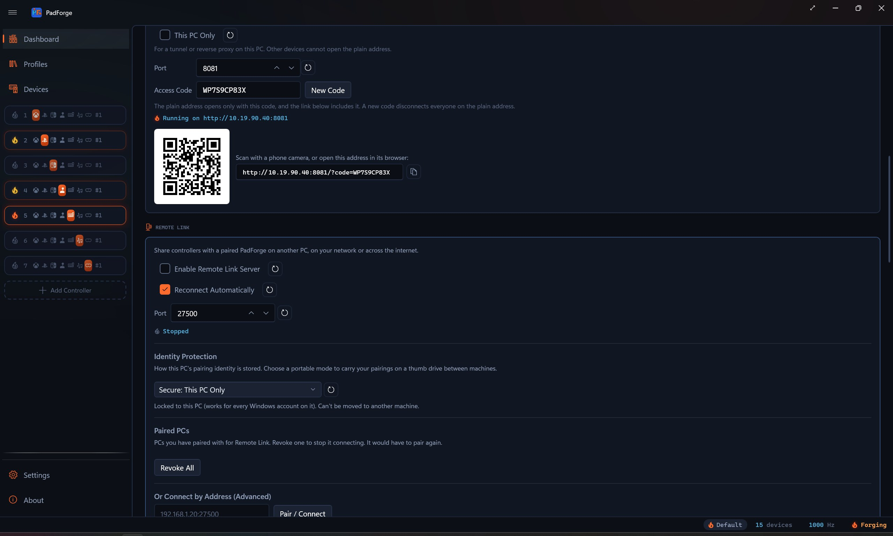

### A 16-channel MIDI controller, no extra hardware.

Map sticks to Control Change messages. Map buttons to Note On / Note Off. Set velocity per slot. PadForge creates a real Windows MIDI endpoint through Windows MIDI Services that DAWs (Ableton Live, FL Studio, Reaper), VJ tools, and stage lighting apps can subscribe to. No loopMIDI bridge.

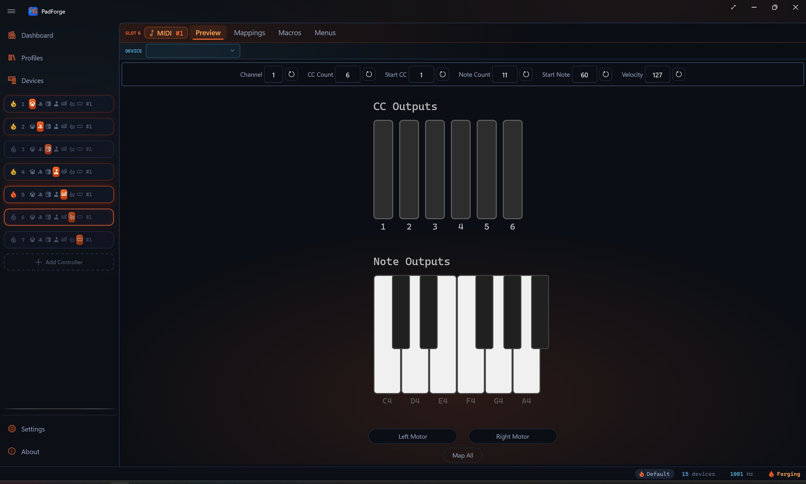

### A MIDI keyboard as a controller.

PadForge reads MIDI input devices as mapping sources too. Notes, Control Change knobs, pitch bend, and encoder dials from a MIDI keyboard or pad controller bind in the mapping table like any button or axis, so a piano key can press A and a mod wheel can pull a trigger. It rides the same Windows MIDI Services stack the virtual output uses. No bridge software.

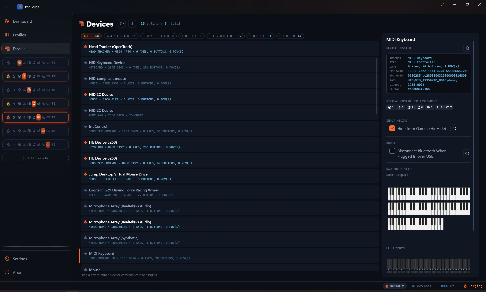

### Tap a tag. Fire a macro.

Plug in an NFC reader (any PC/SC contactless reader, like an ACR122U) and a tag tap runs a macro. Register a tag from the Devices page: hold it on the reader, give it a name, and it is saved for good. Each tag becomes its own trigger, next to an Any NFC Tag trigger that any tag fires. Map an amiibo, a sticker, or a card to a button combo, a profile switch, or a whole action sequence.

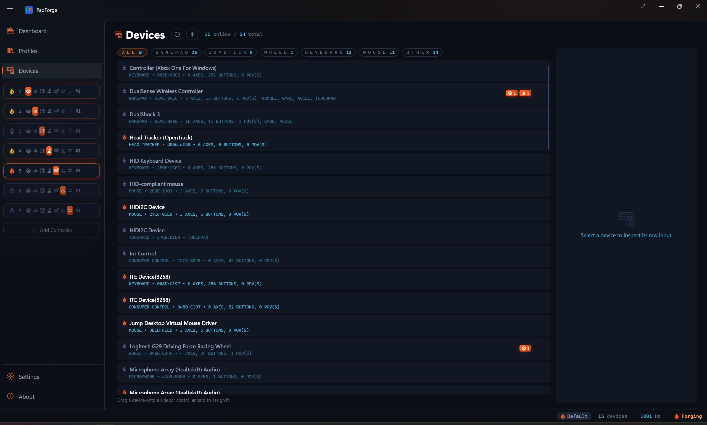

### The buttons your handheld hides.

Handheld gaming PCs (Legion Go, ROG Ally, GPD Win, OneXPlayer, AYANEO, AYN, Zotac Zone, MSI Claw) and gaming laptops carry rear paddles, menu keys, wheels, and vendor hotkeys that never show up as part of a controller. The firmware types a key combination for each one, sets a bit in a vendor HID report, or raises a vendor WMI event (a Legion laptop's Vantage key). Turn on Handheld PC Buttons in Settings, press each button once in Learn / Manage Hidden Buttons, and it becomes a named button on a Hidden Buttons device row: mappings, macros, shift layers, everything. Learned combinations are swallowed before the shell sees them, so Win+D stops minimizing your desktop. No per-model table ships in the app, so a handheld released tomorrow learns the same way. The machine's own gyroscope joins as a System Motion device for handhelds whose sensor sits in the tablet.

### The launcher picks the profile.

Turn on Allow External Control by Launchers and Scripts on the Profiles page and PadForge serves a local named pipe. Playnite, LaunchBox, or a one-line script activates a profile by name, and that profile is held, so the foreground-window watcher stands down until the script releases it or you switch profiles yourself. Local machine only, and the pipe stays closed until you open it. A profile can also carry its own polling rate, from 1000 Hz down to 62.5 Hz, overriding the Settings interval while it is active.

---

## Every device: local co-op without limits.

Two sim racers on two wheels at once. A flight stick plus throttle plus rudder pedals as one virtual HOTAS. Mixed gamepad types in one session. Up to 16 controllers. One combo press toggles every virtual controller on or off when you need to step away.


### The PlayStation 3 pad, wired or wireless.

Plug a DualShock 3 in over USB and PadForge binds it with WinUSB on the spot, no manual driver dance. To go wireless, open the Devices page and pair it over Bluetooth. PadForge installs a signed BthPS3 driver on demand, and the radio keeps working for everything else. Sixaxis motion runs through the gyro pipeline, and the ten pressure axes, rumble, the player LED, and battery all report. Remove the pad from the Devices page and PadForge tears the pairing down behind it.


### Pair a Wii Remote over Bluetooth, in-app.

A Wii controller's Bluetooth PIN is six raw bytes, not a string, and it changes with which sync button you press. The Windows pairing prompt can't supply that, so PadForge runs the pairing itself. Open the Devices page, click **Pair**, and press the red SYNC button under the battery cover. The controller bonds, so it reconnects on any button press from then on. (Hold 1 and 2 instead for a temporary pairing that lasts the session.) The Wii Remote, Remote plus Nunchuk, Classic Controller, and Wii U Pro Controller all map as normal pads through SDL. Accelerometer and Wii Motion Plus gyro run through the gyro pipeline, so gyro-to-mouse, gyro-to-stick, and motion mapping work. Swap a Nunchuk on or off mid-session and PadForge re-identifies it without a restart. Needs a Bluetooth radio on the PC. A Wii Balance Board reports total weight and left-right / front-back lean as mapping sources.

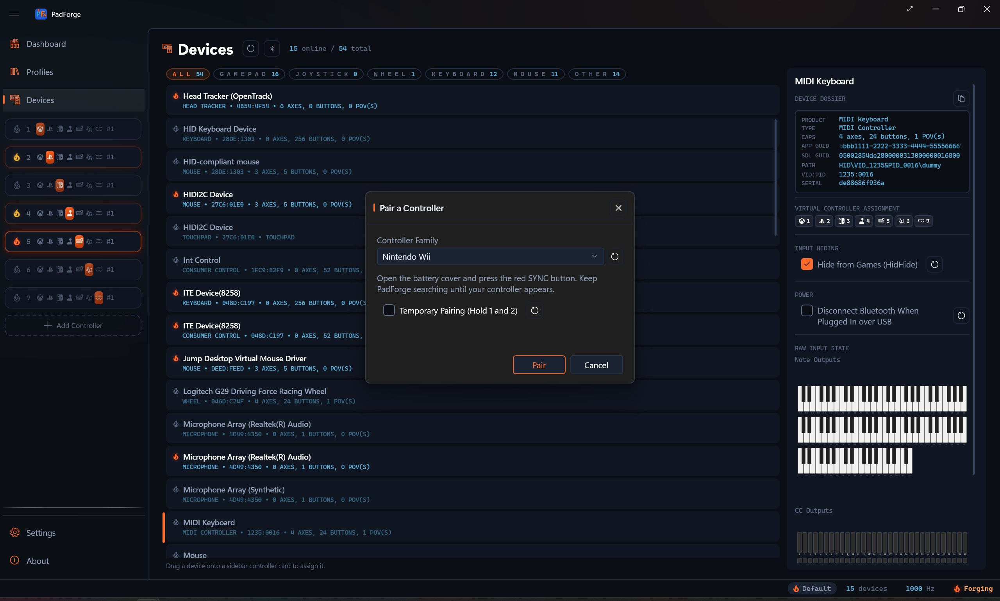

### Your keyboard's media keys, mapped.

The media row on a keyboard, a media remote, a headset's transport buttons: PadForge reads them as their own device with named button chips. Map Play/Pause, Mute, Volume, or Next and Previous Track to a virtual button or a macro trigger, same as any other input.

### See the charge. Sleep it when idle.

Every wireless pad that reports a battery shows its charge on the Devices page, with a charging glyph while it tops up. Set an Idle Disconnect timer and a Bluetooth controller drops its link after a few quiet minutes, so it sleeps instead of draining on the coffee table. A Disconnect Controller macro turns one off on command, from a chord or a button.


### Plug it in, and the radio lets go.

Turn on Disconnect Bluetooth When Plugged In over USB and a controller that reports it is charging drops its Bluetooth link, so it charges without powering the radio. It reads the pad's own charging report rather than a vendor table, so any controller that reports its radio address as its serial on both transports qualifies. Any USB power source counts, wall chargers included. It fires once per plug cycle, and if you turn Bluetooth back on with the cable still in, PadForge leaves it alone until the next unplug.

---

## PadForge vs other controller mappers

Comparison reflects each tool's shipping release as of July 2026, with the rows added for 4.4.0 re-checked in September 2026. Verified against each project's own docs and source: x360ce v4.17.15.0 (last release Nov 2020), XOutput v3.32 (archived and deprecated Dec 2024), reWASD v9.4.0 (May 2026), ds4windowsapp/DS4Windows v3.5 (Feb 2026), and Steamworks Documentation (Action Set Layers / Activators / Mode Shifting / Input Source Modes). ⚠ means the feature exists but is limited or unverified at the level of detail PadForge implements it.

<details>
<summary><b>Feature by feature</b></summary>

| | PadForge | x360ce | XOutput | reWASD | DS4Windows | Steam Input |
|---|:---:|:---:|:---:|:---:|:---:|:---:|
| Free | ✅ | ✅ | ✅ | $9.99+ | ✅ | ✅ |
| Source available | ✅ CC BY-NC-SA | ✅ | ✅ archived | ❌ | ✅ | ❌ |
| Works outside Steam | ✅ | ✅ | ✅ | ✅ | ✅ | only via Add Non-Steam Game |
| Actively developed | ✅ 2026 | no release since Nov 2020 | deprecated 2024 | ✅ v9.4 (2026) | ✅ v3.5 (Feb 2026) | ✅ |
| Xbox 360 virtual output | ✅ | ✅ | ✅ | ✅ | ✅ | ✅ |
| Xbox One / Series virtual output | ✅ | ❌ | ❌ | ✅ Xbox One | ❌ | ❌ |
| DualShock 4 virtual output | ✅ | ❌ | ❌ | ✅ | ✅ | ❌ |
| DualSense virtual output | ✅ | ❌ | ❌ | ❌ input only | ❌ | ❌ |
| Switch Pro virtual output | ✅ via HIDMaestro | ❌ | ❌ | ✅ | ❌ | ❌ |
| Steam Deck / Steam Controller virtual output | ✅ via HIDMaestro, Valve VID/PID, both trackpads | ❌ | ❌ | ❌ Xbox 360 / Xbox One / DS4 / Switch Pro / DS3 only | ❌ xbox360 / dualshock4 only | ❌ |
| Flight stick / wheel / HOTAS virtual output (DirectInput) | ✅ 133 of HIDMaestro's 231 profiles + Custom | ❌ | ❌ | ❌ | ❌ | ❌ |
| MIDI virtual output | ✅ | ❌ | ❌ | ❌ | ❌ | ❌ |
| MIDI input as a mapping source | ✅ notes / CC / pitch bend / encoders | ❌ | ❌ | ❌ | ❌ | ❌ |
| Keyboard + Mouse virtual output | ✅ | ❌ | ❌ | ✅ | ✅ | ✅ |
| Multi-source per row (one output, many inputs) | ✅ 6 combine modes + formula | ⚠ "Combine Into" merges pads | ⚠ MapperDataCollection (basic) | ❌ uses per-input Activators | ❌ | ⚠ per-input Activators |
| Custom formula editor (arithmetic, logic, if-then-else) | ✅ drag-and-drop operators + 15 starter recipes | ❌ | ❌ | ❌ | ❌ | ❌ |
| Shift layers / modifier overlays | ✅ Hold / Toggle / Latch / Cycle / Sticky / No Button | ❌ | ❌ | ✅ up to 10 (Hold / Toggle / Custom) | ✅ Mode Shifts | ✅ Action Set Layers (stackable) |
| Cross-device chords (input on pad A + input on pad B) | ✅ | ❌ | ❌ | ✅ via Group of devices | ❌ | ❌ same controller only |
| SOCD cleaning (opposite-key resolution) | ✅ last-wins Snap Tap / first-wins / neutral, keys and controller buttons | ❌ | ❌ | ❌ open feature request | ❌ | ❌ |
| Mouse gestures (flick a held mouse button) | ✅ up / down / left / right / click, per-gesture actions | ❌ | ❌ | ❌ | ❌ | ❌ |
| Gyro mapping | ✅ Local / Player / World, RWC, Aim Engage, Flick Stick | ❌ | ❌ | ✅ since v5.3 (curves, Flick Stick) | ✅ gyro-to-mouse, gyro-to-RS | ✅ |
| Xbox Impulse Trigger passthrough | ✅ + DualSense AT Vibration auto-route | ❌ | ❌ | ✅ Xbox One output only | ❌ | ❌ |
| Constant trigger force | ✅ | ❌ | ❌ | ❌ | ❌ | ❌ |
| Stick-assisted analog triggers (a stick ramps a held digital trigger) | ✅ Stick Trim, per-mapping deadzone / rate / reset | ❌ | ❌ | ⚠ trigger output + 3-zone actuation, not graded-from-digital | ❌ | ❌ |
| Audio-bass trigger rumble | ✅ | ❌ | ❌ | ❌ | ❌ | ❌ |
| Audio-bass body rumble | ✅ | ❌ | ❌ | ❌ | ❌ | ❌ |
| DualSense Adaptive Triggers | ✅ 7 modes + GameCube preset | ❌ | ❌ | ✅ 11 presets | ⚠ limited | ❌ |
| DualSense lightbar | ✅ 14 modes inc. Strobe + Battery | ❌ | ❌ | ✅ 6 modes + Player LED + Mic LED | ⚠ basic, no audio | ⚠ unverified |
| Xbox Guide button LED brightness | ✅ Xbox One / Elite / Series + Steam Controller, fixed or battery-following | ❌ | ❌ | ❌ | ❌ | ❌ |
| Controller speaker audio (DualSense / DualShock 4) | ✅ mirror Windows audio + macro sounds, USB / BT | ❌ | ❌ | ❌ | ❌ | ❌ |
| Touchpad: joystick / D-pad / mouse + gesture engine | ✅ joystick (anchor-relative), wedge D-pad, per-axis mouse (sensitivity + invert), in-box gestures (4-way / 8-way swipes, taps, longpress, pinch, rotate, two- to five-finger), shape templates (Circle in either direction, Square, Triangle, Z, Checkmark), custom recorded shapes | ❌ | ❌ | ⚠ touchpad-as-mouse / -as-stick + click, no gesture engine | ⚠ touchpad-as-mouse + four-direction Touchpad Swipe bindings | ⚠ joystick / D-pad / mouse / touch menu, no multi-finger or shape recognition |
| HID PID 1.0 force feedback (wheels) | ✅ | ✅ constant + periodic (DirectInput) | ⚠ basic passthrough only | ❌ | ❌ | ❌ |
| Native wheel FFB protocol (Logitech / Fanatec / Thrustmaster) | ✅ + rotation range, auto-center, RPM LEDs | ❌ | ❌ | ❌ | ❌ | ❌ |
| DSU / Cemuhook motion server (Cemu, Dolphin, Yuzu, Ryujinx) | ✅ | ❌ | ❌ | ✅ port 26760 | ✅ | ❌ |
| Phone as controller | ✅ in-browser, no app install, up to 16 phones at once, touchpad layout included | ❌ | ❌ | ⚠ reWASD Mobile app (one phone, no touchpad layout) | ❌ | ❌ |
| Share a controller with another PC's games over a network | ✅ Remote Link, LAN or internet by code, both directions, feedback returns | ❌ | ❌ | ❌ | ❌ | ❌ |
| Per-app profile switching | ✅ | ✅ since v4.17.12 (Nov 2020) | ❌ | ✅ Autodetect | ✅ | ✅ per-game by design |
| Profile switching driven by a launcher or script | ✅ local named pipe, profile held until released | ⚠ unverified | ⚠ unverified | ✅ reWASDCommandLine `apply` | ✅ `-command LoadProfile` / `LoadTempProfile` | ⚠ unverified |
| Max simultaneous virtual controllers | 16 | 4 (hard-coded PAD1-4 in UI) | 4 (UI matches XInput slot indices) | 4 (Slot UI cap) | 4 (Output Slots UI cap) | 1 per physical pad |
| 1000 Hz polling | ✅ | ⚠ unverified | ⚠ unverified | ✅ user-selectable 500 / 1000 Hz | ✅ on USB DS4 | ⚠ unverified |
| 3D + 2D controller visualization | ✅ | ⚠ 2D Xbox 360 only | ❌ | ⚠ 2D only | ⚠ basic | ⚠ configurator preview |
| Multi-point sensitivity curve editor | ✅ unlimited points | ⚠ single slider | ⚠ deadzone only | ✅ custom 4-point | ⚠ preset curves | ✅ response curves |
| 2026 Steam Controller support | ✅ via SDL3 fork | ❌ | ❌ | ⚠ unverified | ❌ | ✅ |
| Handheld PC hidden buttons (rear paddles, vendor hotkeys) as mappable inputs | ✅ learned per device, no per-model table | ⚠ unverified | ⚠ unverified | ❌ documented unsupported on ROG Ally and Ayaneo | ⚠ unverified | ⚠ unverified |
| DualShock 3 support | ✅ USB + in-app Bluetooth pairing, sixaxis, pressure, rumble | ❌ | ❌ | ✅ input + gyro | ✅ input, accel pitch/roll | ✅ native, no gyro |
| Wii Remote / Nunchuk / Classic / Wii U Pro as a source | ✅ all four forms, in-app pairing, IR pointer | ❌ | ❌ | ✅ pairing, no IR pointer (v9.4+) | ❌ | ❌ |

</details>

---

## Screenshots

<details>
<summary><b>Every page, in screenshots</b></summary>

### Dashboard

Polling rate, device count, every virtual controller slot, and the service sections: web controller, Remote Link, head tracking, DSU motion server, lightbar mirrors, and the overlays. Driver status lives on the Settings page.

### 3D controller visualization
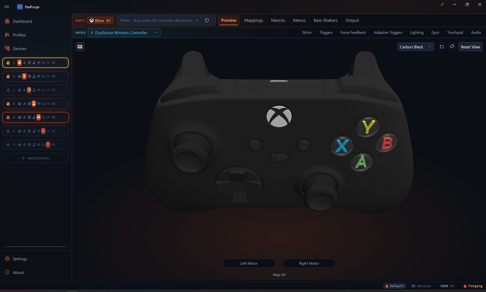
Interactive 3D model per profile. Rotate, zoom, pan. Buttons, sticks, and triggers highlight while you press them. Xbox Series profiles add a clickable Share button.

### 2D controller visualization
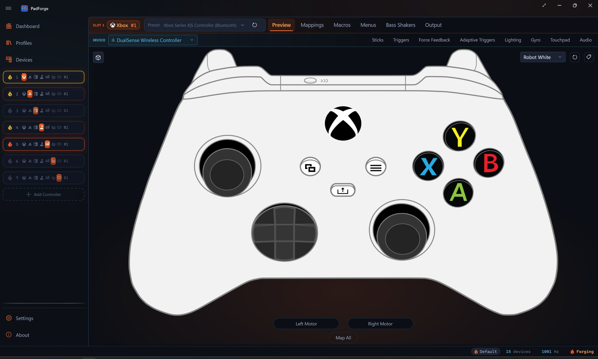
Flat schematic of the same controller, same live state. Useful on small monitors or for streaming overlays.

### Button and axis mappings

Record a binding by pressing a button. Pick from a dropdown of every available input (including raw HID buttons past the standard 11). Set Invert, Half-axis, or a per-mapping threshold for axis-to-button activation. A Primary Mode dropdown picks how the source reads: Direct, Incremental, Invert On Hold, or Ramp. Ramp turns an Up key and a Down key into a smooth axis, tuned by Attack, Release, Reverse, and Autocenter.

PadForge reads the four Xbox Elite paddles as buttons of their own, beside the XInput state that carries the rest of the pad. Detected paddles use the same mappings, macros, and shift layers as other button sources. Over Bluetooth they come from the controller's own Bluetooth LE service. Over USB and the Xbox Wireless Adapter they come from the Windows GameInput service, which takes Windows 11 24H2 or 25H2 at build 26100.8973 or 26200.8973 (July 28, 2026) or later. The GameInput redistributable is not required. On Windows 10 and older Windows 11, paddles are read over Bluetooth only.

### Stick deadzones
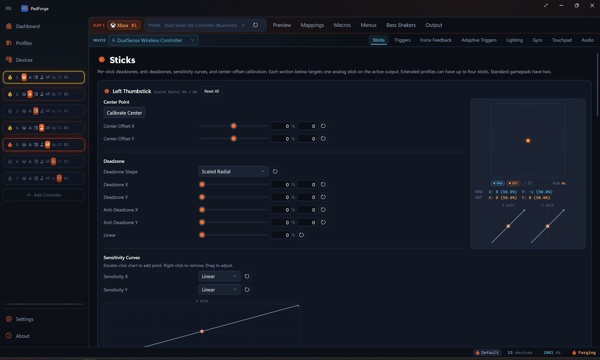
Six deadzone shapes (Scaled Radial, Radial, Axial, Hybrid, Sloped Scaled Axial, Sloped Axial). Per-axis deadzone, anti-deadzone, linear response, center calibration, and a custom sensitivity-curve editor with unlimited draggable points.

### Trigger deadzones
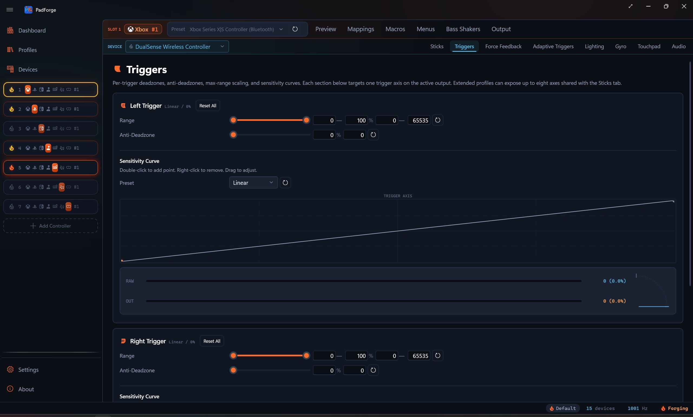
Floor and ceiling per trigger. Anti-deadzone. Sensitivity curves. Live value bars at 0.1% precision.

### Force feedback and rumble
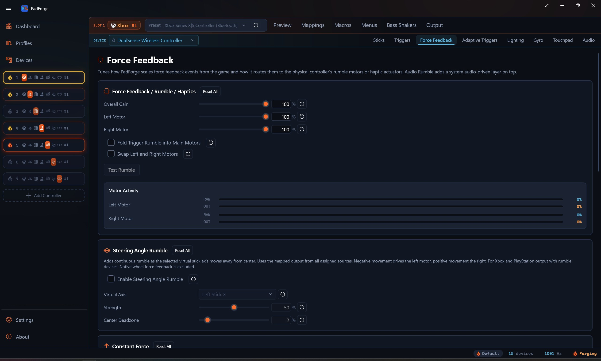
Per-motor strength, overall gain, motor swap. Live motor activity bars. Audio Bass Rumble captures system audio, isolates bass through a 48 dB/octave filter, and pushes it to the rumble motors. Music feels physical even when the game is silent.

### Trigger routing
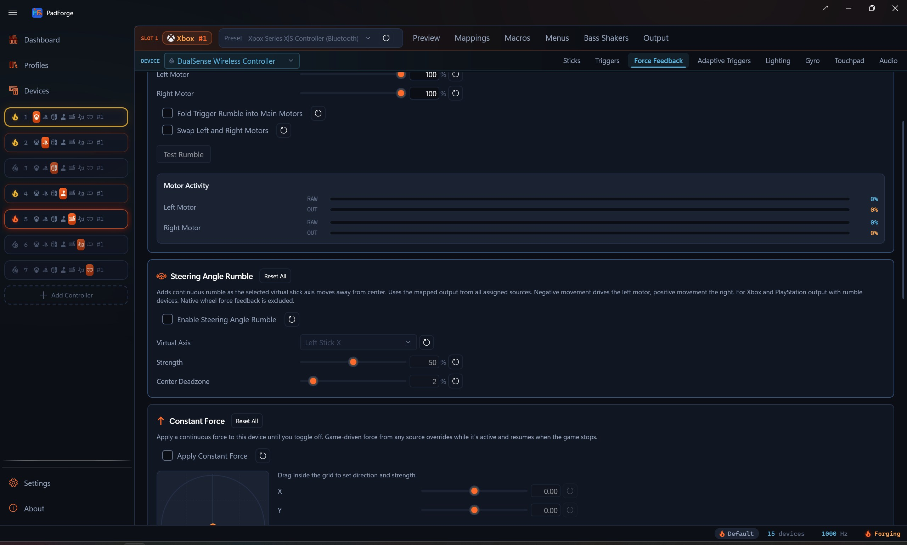
Send the main rumble motors into the trigger motors, one trigger at a time. Duplicate keeps the main motor running, Redirect silences it. Each trigger has its own Source, a 0-200% Scale, and an optional button Activator. Reaches Xbox impulse triggers and DualSense Adaptive Trigger Vibration.

### Wheel

Native force feedback for Logitech, Fanatec, and Thrustmaster wheels: constant force plus spring, damper, and friction from the game. Set rotation range in degrees, auto-center strength, and the RPM shift LEDs. Other force-feedback wheels still work through the generic path.

### DualSense Adaptive Triggers

Seven trigger effect modes. Off, Feedback, Weapon, Vibration, Multiple-Position Feedback, Slope Feedback, Multiple-Position Vibration. A live preview draws the resistance and amplitude curve while you drag Range, Strength, and Frequency. One-click GameCube preset loads parameters that mimic the click of a real GameCube trigger.

### DualSense lightbar

Fourteen lightbar modes including three Audio Pulse variants and three Audio Bands variants that react to system audio in real time. A separate Input Reactive overlay flashes on button presses in three variants (Random Color per Press, Cycle Through Palette, Base Color per Press). Strobe is a square-wave flash at the period you set. Battery paints the bar by charge level (red at low, yellow at mid, green at full). Plus the indicator-LED card for player pattern, mute LED, and brightness.

### Guide button LED

Xbox Guide button LED brightness on an Xbox One, Elite, or Series pad over USB, the 2015 Steam Controller's home LED, and the HOME button LED on Switch Pro and right Joy-Con over any connection. Set a fixed level or let it follow the battery.

### Audio

Controller speaker output for the DualSense and DualShock 4. Pick a Windows audio output to mirror, route a slot's macro sounds to the pad, and set a master volume. DualSense over USB or Bluetooth, DualShock 4 over Bluetooth.

### Touchpad

Per-slot touchpad tuning on any source with a touchpad surface (DualSense, DualSense Edge, DS4, Steam Controller, Steam Deck, Steam Controller 2026, Web Controller, on-screen Touchpad Overlay, Windows Precision Touchpad). Eight cards: Stick / D-Pad Output (anchor-relative virtual stick + wedge D-pad), Mouse Output (per-axis sensitivity, invert, and a Simple or Trackpad pointer response with acceleration), Absolute Pointer (the screen region the pointer sources map onto), Synthetic Pressure (a set pressure for pads that report every touch at full pressure), Gesture Detection (master enable + cooldown), In-Box Gestures (swipes, taps, longpress, pinch, rotate, two- to five-finger, shape templates), Custom Gestures (recorded shape templates per profile), and Swipe Haptics (travel ticks with intensity).

### Wii pointer modes

The Wii Remote's IR camera as an on-screen pointer. FPS-mouse mode, aspect-corrected border modes, and an off-screen freeze that holds position instead of snapping to a corner.

### Wii Remote grip
<!-- pending capture: 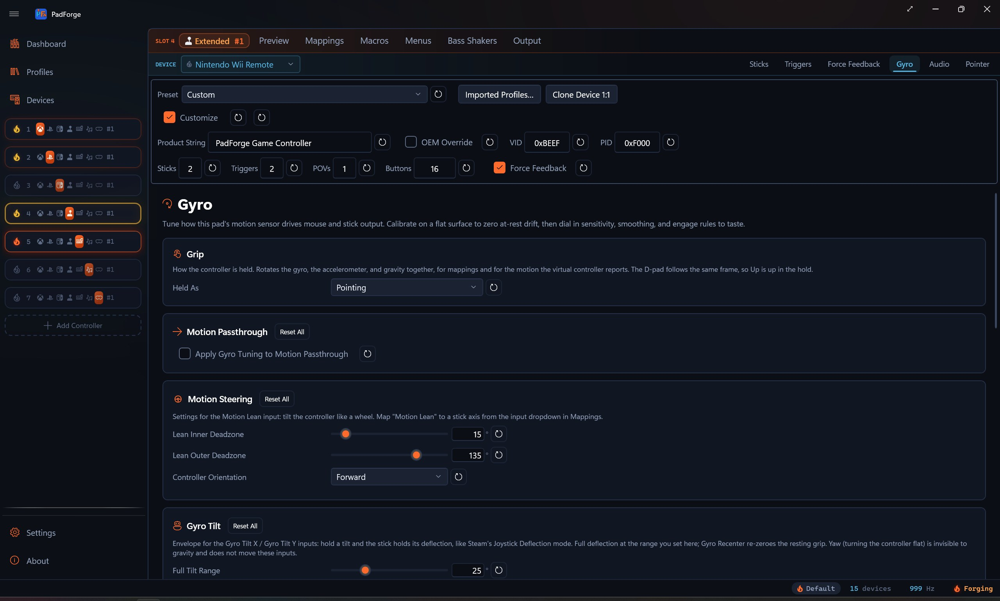 -->
How the controller is held: Pointing, Sideways (Face Up), Wii Wheel (Face Toward You), or Upright. The gyro, the accelerometer, gravity, and the D-pad all rotate into the game's frame together.

### Macros

Combo triggers from buttons, axes, and POV directions. Action sequences with key presses, mouse moves, scroll, delays, system volume, app volume, lightbar overrides, rumble overrides, and axis actions that latch, release, and scale virtual axes. Twelve fire modes: On Press, On Single / Double / Triple Press, On Long Press, On Short Press, On Release, While Held, Toggle, Turbo, Always, and a custom formula. A Switch Layer action jumps the slot to Base or any authored layer, and a per-macro layer scope limits a macro to chosen shift layers. A macro toolbar duplicates a macro, copies and pastes it into another virtual controller, and pulls every macro from another controller in one step. Mouse-cursor actions snap the pointer to center (Recenter Mouse), pin it at a coordinate (Fix Mouse Position), or fence it inside a rectangle (Limit Mouse Region).

### Menu macro cells
<!-- pending capture: 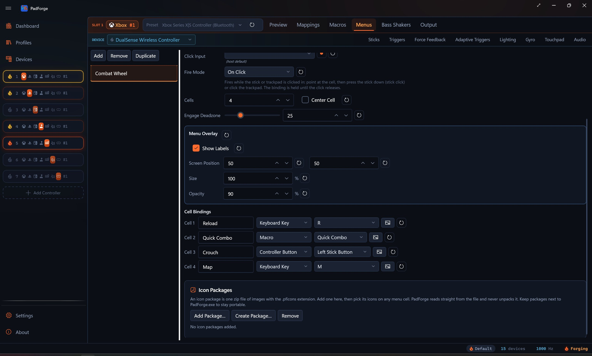 -->
A cell in a radial or grid menu can run a macro instead of pressing a button.

### Menu icon packages
<!-- pending capture: 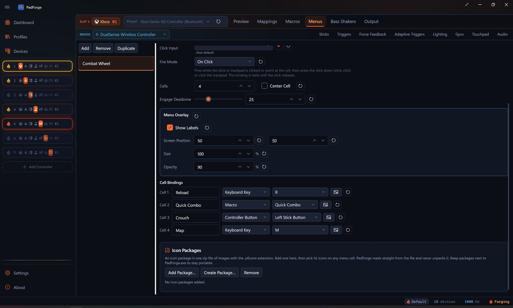 -->
An icon package is one zip of images with a .pficons extension. Add one and its icons are available on any menu cell. PadForge reads straight from the file and never unpacks it.

### Per-app profiles
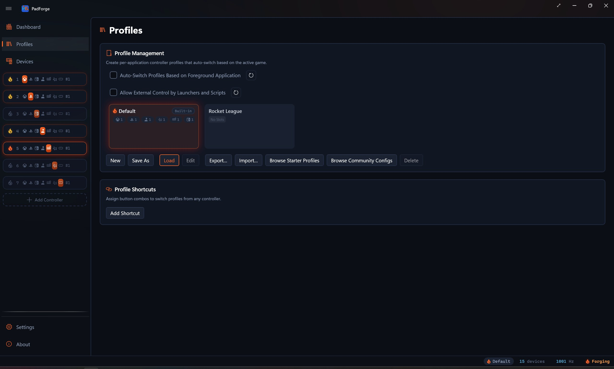
Each profile holds its own mappings, deadzones, force feedback, lighting, and macros. PadForge watches the foreground window and switches profiles automatically when a matching app gains focus. Controller-shortcut combos cycle profiles without touching the keyboard.

### External profile control

A local named pipe lets Playnite, LaunchBox, or a script activate a profile and hold it until the script releases it or you switch profiles yourself. Off until you turn it on.

### Per-profile polling rate
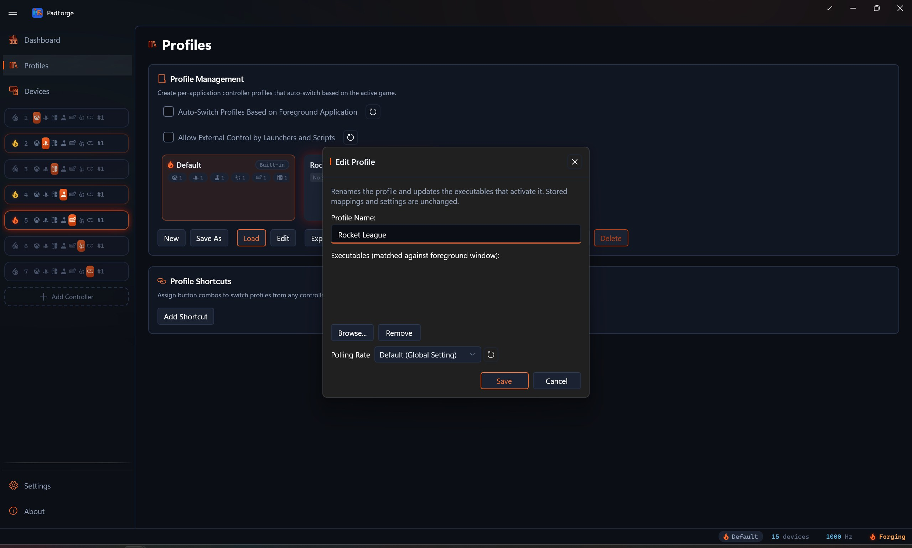
A profile can override the Settings polling interval: 1000, 500, 250, 125, or 62.5 Hz, or Default (Global Setting) to follow Settings.

### Steam Workshop config import
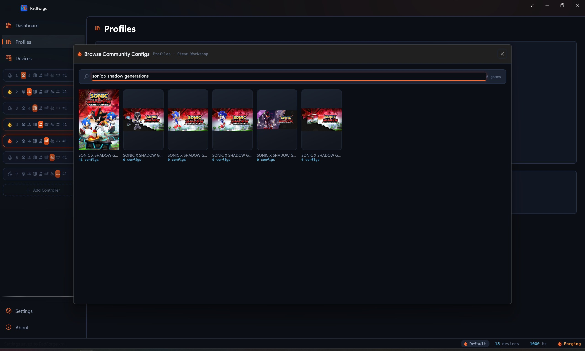
Browse community controller configs from the Steam Workshop over an anonymous Steam connection with no account, and translate the one you pick into a PadForge profile. A per-import report lists what came across clean, what was approximated, and what was skipped. Off by default until you enable community config lookup in Settings.

### Keyboard + Mouse virtual controller

Map a controller stick to mouse movement. Map face buttons to WASD. Cursor and scroll speeds are time-based rates (1200 px/s at full deflection), so they feel the same at every polling rate. The preview lights up every mapped key and mouse button in real time.

### SOCD cleaning

Resolve opposite key presses on the Keyboard & Mouse controller. Last-wins (Snap Tap), first-wins, or neutral, across every mapped key.

### Mouse gestures

Hold a mouse button and flick up, down, left, or right. Each direction, plus a click while held, fires its own action.

### Extended virtual controller

Flight sticks, racing wheels, HOTAS, third-party gamepads. HIDMaestro ships 231 profiles, and PadForge offers the 133 that carry a captured HID descriptor, across the Xbox, PlayStation, Nintendo and Extended types, plus a Custom mode that builds a HID descriptor from scratch. Up to 8 axes, 128 buttons, 4 POV hats. Configurable VID, PID, and product string.

### Steam Deck virtual controller
<!-- pending capture: 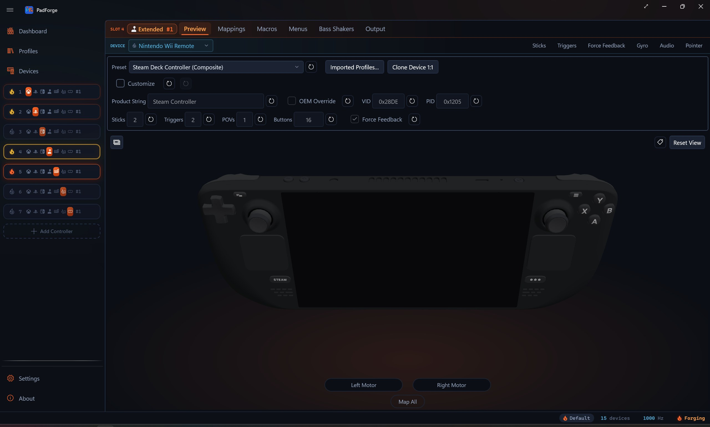 -->
An Extended slot on a Steam Deck profile: Valve's own vendor and product IDs, both trackpads, and the rear buttons, with a one-to-one automap from a real Deck.

### Steam Controller virtual controller
<!-- pending capture: 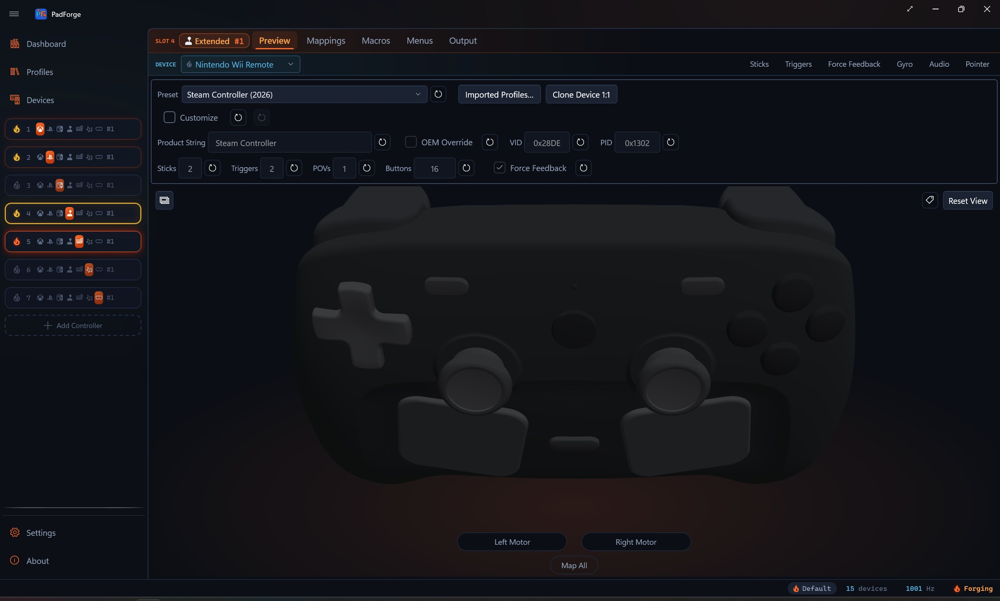 -->
The Steam Controller (Wired) and the Steam Controller (2026) present the same way, each with its own input frame, its own automap, and a 3D body meshed from Valve's published CAD.

### PlayStation virtual controller
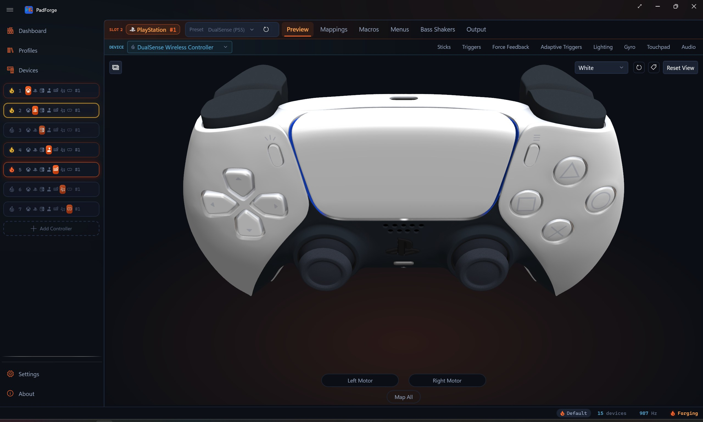
DualShock 4, DualSense, and DualSense Edge through HIDMaestro. Source gyro, accelerometer, touchpad, and battery passed through to the game.

### MIDI virtual controller

Channel 1-16. Configurable CC mapping, note mapping, and velocity. Axes send Control Change. Buttons send Note On / Off. No loopMIDI required. PadForge creates its own system endpoint via Windows MIDI Services.

### MIDI input

A MIDI keyboard or pad controller as a mapping source. Notes, Control Change, pitch bend, and encoder dials bind like buttons and axes. Same Windows MIDI Services stack as the virtual output.

### Add controller
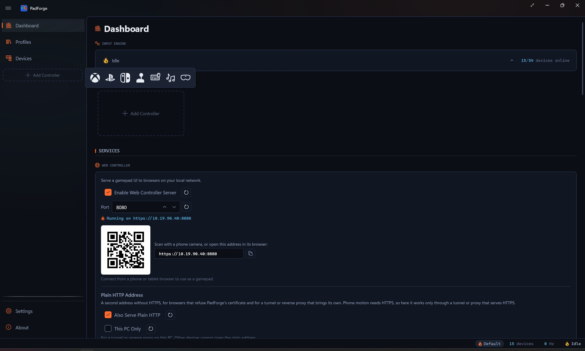
Pick the virtual controller type. Buttons dim when you hit the per-type limit.

### Devices

Every detected gamepad, joystick, keyboard, mouse, and touchpad as a card. Live raw axes, buttons, POV compass, gyro / accelerometer values, and touchpad finger positions for the selected device. Per-device HidHide toggle and Force Raw Joystick mode for when SDL3 guesses the gamepad layout wrong.

### Quick Charge
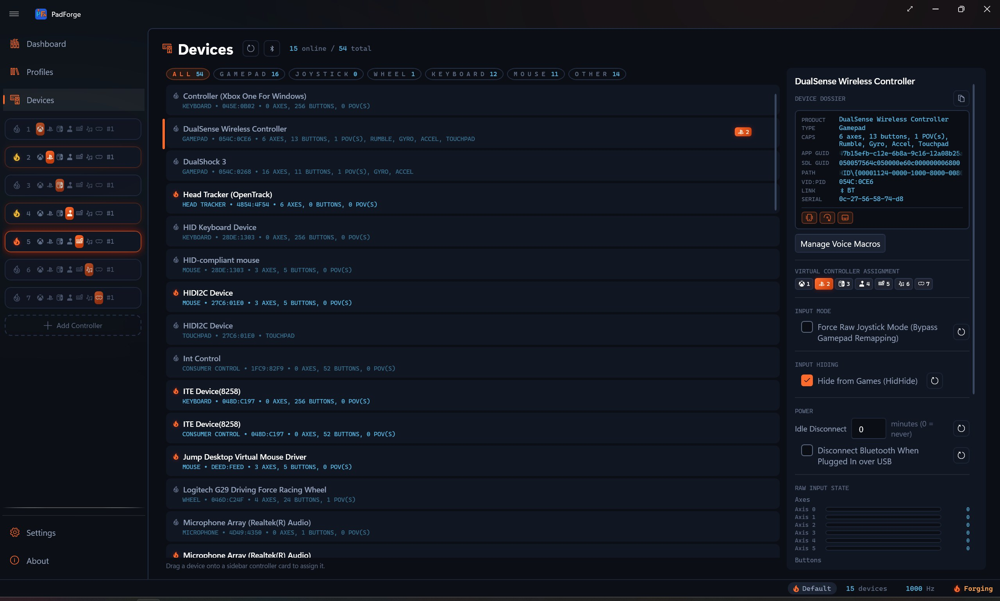
Disconnect Bluetooth When Plugged In over USB drops the radio link when the pad reports it is charging, so it charges without powering the radio. Any USB power source counts.

### DualShock 3
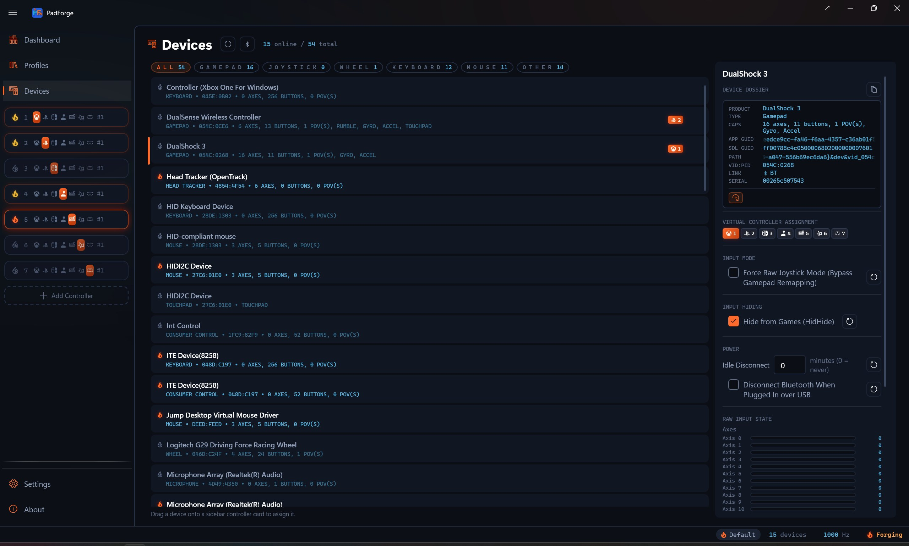
A PlayStation 3 pad over USB (WinUSB) or Bluetooth. Sixaxis motion, ten pressure axes, rumble, player LED, and battery all report.

### Pair a DualShock 3

Pair over Bluetooth from the Devices page. PadForge installs a signed BthPS3 driver on demand and cleans the pairing up when the pad is removed.

### DualShock 3 motion
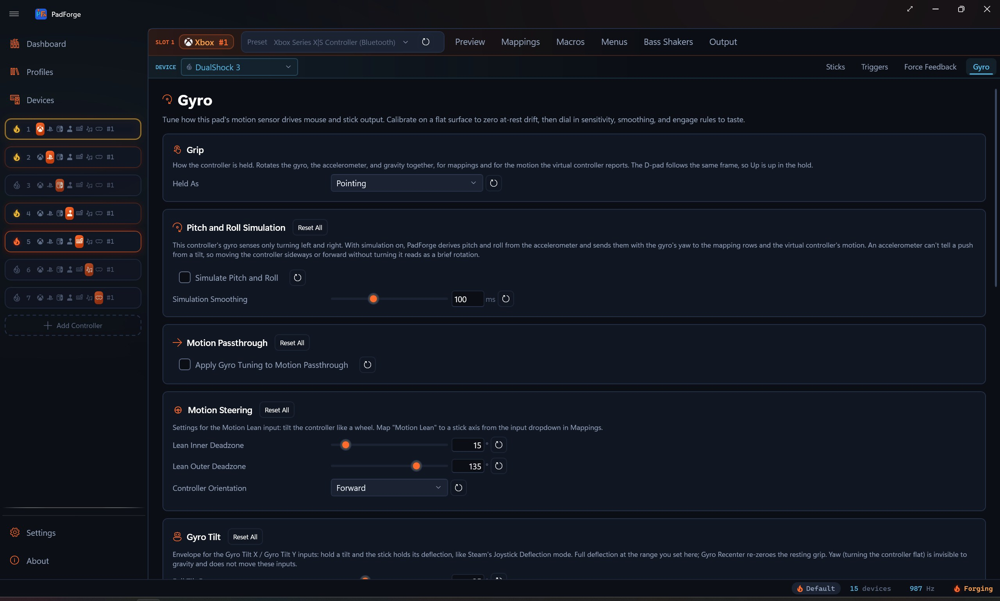
Sixaxis accelerometer and gyro through the gyro pipeline: gyro-to-mouse, gyro-to-stick, and the DSU motion server.

### Web controller

Connect a phone or tablet over Wi-Fi or scan the Dashboard QR code. Ten controller layouts, a multi-touch touchpad, and a blank-surface builder, with virtual sticks, D-pad, analog trigger sliders, and rumble. Touch the sticks to push them. Tap to click. Served over HTTPS so the browser will hand over the handset's motion sensors.

### Remote Link

Pair your PCs and share their controllers every way. A wheel on one drives a game on another, with rumble, force feedback, adaptive triggers, lightbar, player LEDs, and speaker audio returning to the physical pad. Pair each pair once with a six-digit code. Trusted PCs reconnect on their own.

### Head tracking
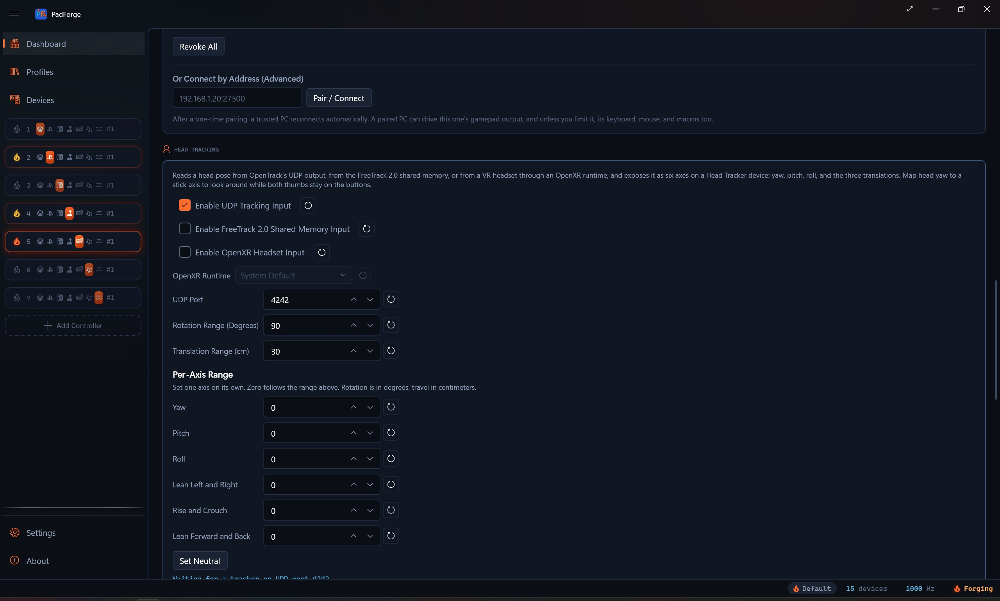
OpenTrack over UDP, the FreeTrack 2.0 shared memory, and a VR headset through an OpenXR runtime, as one six-axis Head Tracker device. Set the UDP port, the rotation range in degrees, and the translation range in centimeters, and pin any single axis to its own range.

### VR controller input
With OpenXR headset input on, each hand controller is its own device row: six pose axes in the same order as the head's, named Controller rather than Head, plus the thumbstick, trigger, grip, and four buttons. PadForge suggests bindings for Oculus Touch, Valve Index, and the Khronos simple profile, and the runtime picks the match. Not to be confused with a VR virtual controller slot, which is the opposite direction.

### Logitech G-keys
Read the G-keys on a Logitech keyboard, and a Logitech mouse's buttons 6 through 20, straight through the G-key SDK as their own device row. 29 keys in each of M1, M2 and M3. Needs Logitech Gaming Software 8.55 or later with the PadForge profile set to Persistent.

### Lightbar mirrors
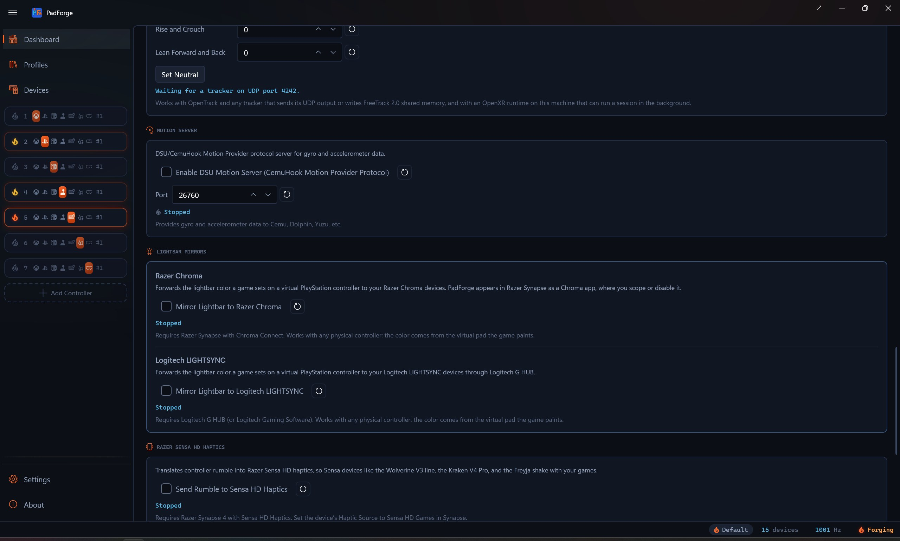
Razer Chroma and Logitech LIGHTSYNC take the virtual pad's lightbar color, and Razer Sensa HD hardware plays its rumble. A profile can carry each toggle or leave it alone.

### Assignment prompts
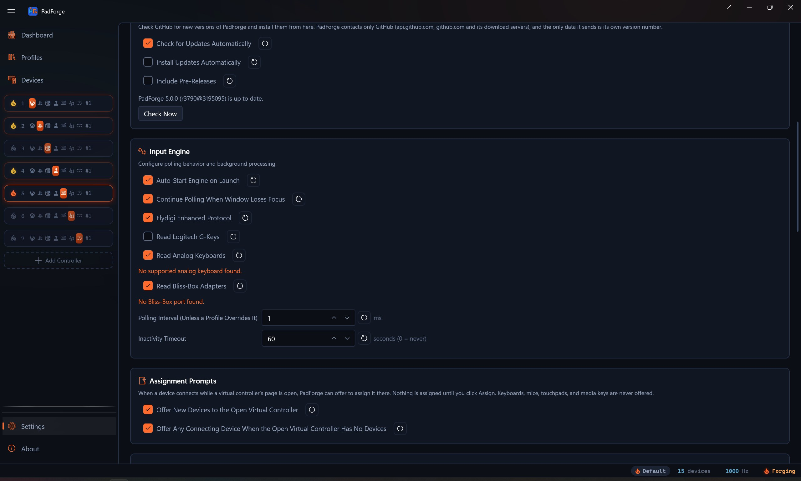
When a device connects while a virtual controller's page is open, PadForge offers to assign it there. Two opt-outs, both on. Keyboards, mice, touchpads, and media keys are never offered.

### Handheld PC buttons
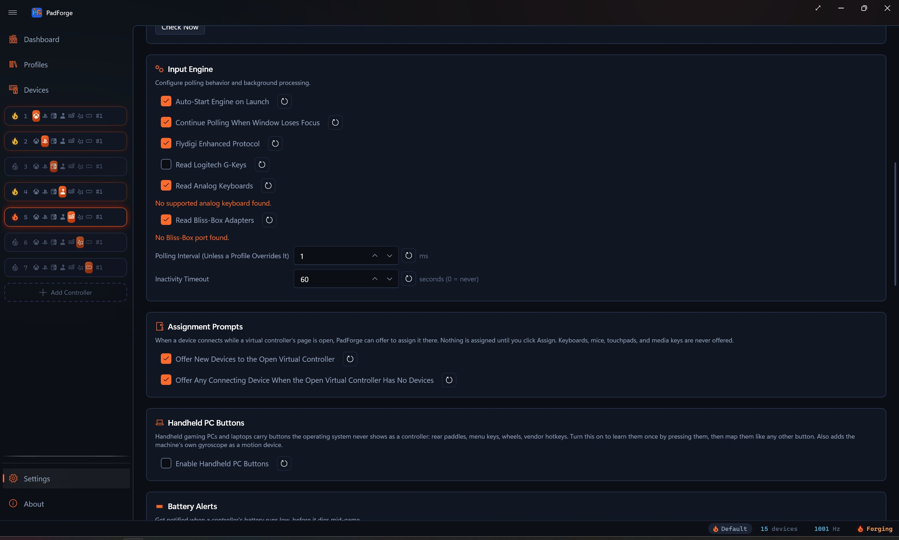
Learn a handheld's rear paddles, menu keys, and vendor hotkeys by pressing each one. Learned key combinations are swallowed before the shell sees them.

### Settings
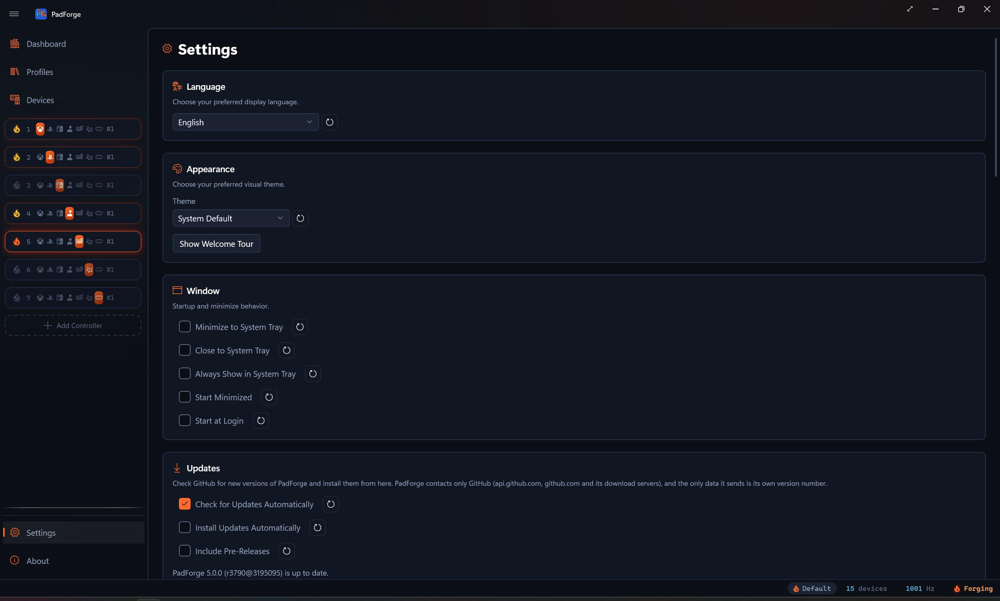
Language (10 locales, live-switch with no restart). Theme (System Default / Light / Dark). Updates. Polling interval (1-16 ms). Auto-start at login, minimize to tray, master input-hiding toggle. Driver status for HidHide, HIDMaestro, Windows MIDI Services, and SteamVR.

### Updates
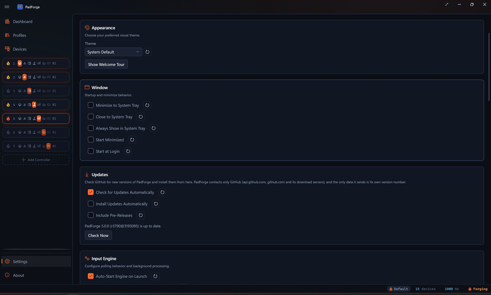
Checks GitHub 20 seconds after launch and every 12 hours. Install and Restart replaces PadForge.exe in place, or Install Updates Automatically installs at the next launch. Include Pre-Releases adds the latest dev build.

</details>

---

## Known limits

- PadForge runs elevated so it can install and manage the HIDMaestro driver. Non-elevated games still read the virtual controllers normally.
- HidHide's device hiding is machine-wide, not per-game.
- MIDI input and the MIDI virtual controller both need Windows MIDI Services (Windows 11 24H2 / build 26100 or later). On older systems neither is available.

---

## Requirements

Windows 10 or 11 on x64, or Windows 11 on ARM64 ([preliminary](#windows-on-arm-preliminary)). Each has its own download: `win-x64` and `win-arm64`. The [.NET 10 Desktop Runtime](https://dotnet.microsoft.com/download/dotnet/10.0) is bundled in the single-file release, so there is nothing else to install.

### Windows on ARM (preliminary)

The `win-arm64` download is a native build for Windows 11 on ARM64. It works as the x64 build does: virtual controllers, HidHide, the DualShock 3 Bluetooth driver, Vosk voice recognition and Xbox Elite paddles all run there, and each driver installs its ARM64 version.

A few features wait on their vendors, because an ARM64 program can load ARM64 libraries only:

| Feature | In the ARM64 build |
|---|---|
| Razer Sensa HD haptics | Not available. Razer ships no ARM64 engine, and lists Synapse for x86-64 Windows only |
| Logitech G-keys | Not available. Logitech Gaming Software installs x64 and x86 libraries only |
| VR headset and controllers through SteamVR | Not available. PadForge loads SteamVR's win64 library |
| Logitech LIGHTSYNC, OpenXR headset input | Only if the vendor's software installs an ARM64 engine or runtime |

The ARM64 build has not run on ARM64 hardware yet.

### Drivers

PadForge installs **HIDMaestro** the first time it starts an Xbox, PlayStation, Nintendo, or Extended virtual controller. HIDMaestro is the engine that creates virtual controllers. Assign a device to a slot and HIDMaestro spins up a HID device matching the controller "shape" you picked. The first composite USB controller it creates also installs usbip-win2, which HIDMaestro carries inside itself.

Three more drivers are optional. PadForge offers to install each one only when you need its feature:

| Driver | Install when |
|---|---|
| [BthPS3](https://github.com/nefarius/BthPS3) | You pair a DualShock 3, PlayStation Move, or Navigation controller over Bluetooth |
| [HidHide](https://github.com/nefarius/HidHide) | A game sees both your physical and virtual controller at once |
| [Windows MIDI Services](https://github.com/microsoft/MIDI) | You want MIDI input or the MIDI virtual controller |

**OpenXInput** is bundled inside `PadForge.exe`. No separate install. It filters PadForge's own virtual controllers out of its own XInput view so device enumeration stays clean.

---

## Build from source

```bash
dotnet publish PadForge.App/PadForge.App.csproj -c Release
```

Output: `PadForge.App/bin/Release/net10.0-windows10.0.26100.0/win-x64/publish/PadForge.exe`

Add `-r win-arm64` for the ARM64 build. [BUILD.md](BUILD.md#arm64-preliminary-451) lists what that build needs.

See [BUILD.md](BUILD.md) for project structure, architecture notes, and developer reference. See the [Technical Reference](https://padforge.org/docs/reference/) for deeper dives into the input pipeline, virtual controller backends, settings file format, and visualization renderer.

---

## Don't see your controller in the picker?

PadForge's controller picker is the set of HIDMaestro profiles that ship with a captured HID descriptor. Of HIDMaestro's 231 profiles, 98 are missing their captures, so they don't appear yet. If you own one of those controllers, you can capture it yourself from inside PadForge. No extra tools, no admin.

To capture and use a profile locally:

1. Create or open any **Extended**-type slot.
2. On the Controller page, click **Imported Profiles…** on the Extended config bar.
3. Under **Connected Devices Available to Import**, pick your plugged-in device and click **Import**.
4. The new profile appears in the slot's dropdown with a "(User Generated)" suffix and stays available across every Extended slot from then on.

Profiles live inside `PadForge.xml` and travel with your settings.

To share a captured profile upstream:

1. In the same dialog, select your imported profile under **Your imported profiles**.
2. Click **Export…** and save the JSON.
3. Open a [profile contribution issue on HIDMaestro](https://github.com/hifihedgehog/HIDMaestro/issues/new?template=profile-contribution.yml) and attach the file. Once merged, the profile ships in the next HIDMaestro release for everyone.

To import a profile someone else captured:

1. Click **Import from File…** in the same dialog and pick the `.json` they sent you.

PadForge reads only the HID descriptor during capture. It does not record or forward your controller's input.

---

## Community

The [PadForge Discord](https://discord.gg/qawTZHVhNH) is where users help each other: setup questions, profile sharing, and general chat. Bug reports and feature requests belong on GitHub, in [Discussions](https://github.com/hifihedgehog/PadForge/discussions), where they are tracked and nothing gets lost.

---

## Built on the work of these projects

PadForge stands on these projects. Please consider supporting them directly.

| Project | Role | License |
|---|---|---|
| Analog keyboard references | The reports, requests and key tables behind the rest of analog keyboard input, read from the [AnalogSense JavaScript SDK](https://github.com/AnalogSense/JavaScript-SDK) and [Soup](https://github.com/calamity-inc/Soup) by Calamity, Inc., the Soup forks of [DenkiSuki](https://github.com/DenkiSuki/Soup), [LeiterConsulting](https://github.com/LeiterConsulting/Soup) and [paysdelest](https://github.com/paysdelest/Soup), the [Wooting Analog SDK](https://github.com/WootingKb/wooting-analog-sdk), [AnalogKeys](https://github.com/nisayera/AnalogKeys), [KeyAxis](https://github.com/RigZeeel/KeyAxis), [HallEffectAnalogMapper](https://github.com/Richard121292/HallEffectAnalogMapper), [libhmk](https://github.com/peppapighs/libhmk) and [hmkconf](https://github.com/peppapighs/hmkconf), [TinyUSB](https://github.com/hathach/tinyusb), [OpenRazer](https://github.com/openrazer/openrazer), [razer-analog-keyboard](https://github.com/Abbytech/razer-analog-keyboard) and Sainan's capture gists, with Razer's Synapse Web and NuPhy's NuPhyIO configurators | MIT, MPL-2.0, GPL-3.0 (libhmk, hmkconf), GPL-2.0 (OpenRazer) |
| [AntiMicroX](https://github.com/AntiMicroX/antimicrox) | Strategy and desktop layouts behind the starter profiles, and the turbo behavior the pressure-scaled turbo avoids. Documentation only, no GPL code ships | GPL-3.0 |
| Arcade I/O references | The protocols behind the SDL fork's drivers for Namco and Konami arcade I/O boards and JVS boards, read from [arcade-docs](https://github.com/shizmob/arcade-docs), [bemanitools](https://github.com/djhackersdev/bemanitools), [Dolphin](https://github.com/dolphin-emu/dolphin), [ITAIKO-firmware](https://github.com/itaiko-project/ITAIKO-firmware), [JoypadOS](https://github.com/joypad-ai/joypad-os), [jvsio](https://github.com/toyoshim/jvsio), [MAME](https://github.com/mamedev/mame), [OpenITG](https://github.com/openitg/openitg), [p4io-mdxfdrv](https://github.com/KokoseiJ/p4io-mdxfdrv), [RPCS3](https://github.com/RPCS3/rpcs3) and [TaikoZucchini](https://github.com/LucaSilva-r/TaikoZucchini). Documentation only, no code ships | Apache-2.0, BSD-3-Clause, GPL-2.0, GPL-2.0-or-later, GPL-3.0, MIT, StepMania license, Unlicense, WTFPL |
| [AudioEndPointLibrary](https://github.com/Belphemur/AudioEndPointLibrary) | Layout of Windows' undocumented IPolicyConfig interface, which PadForge uses to re-enable a controller's audio endpoint, by Antoine Aflalo. Documentation only, no code ships | MIT |
| [Aurora](https://github.com/Aurora-RGB/Aurora) and friends | Logitech LED SDK engine entry points and calling convention behind the LIGHTSYNC lightbar mirror, with [Artemis.Plugins](https://github.com/Artemis-RGB/Artemis.Plugins), [LogiLed2Corsair](https://github.com/VRocker/LogiLed2Corsair), [Logitech-LED](https://github.com/sidewinder94/Logitech-LED), [logitech-led-sdk-rs](https://github.com/nathaniel-daniel/logitech-led-sdk-rs) and [RGB.NET](https://github.com/DarthAffe/RGB.NET). PadForge loads G HUB's own engine and ships no Logitech code | MIT, PolyForm Noncommercial, GPL-2.0, MIT OR Apache-2.0, LGPL-2.1 |
| [AutoEq](https://github.com/jaakkopasanen/AutoEq) | The parametric EQ profile format the Audio tab imports, by Jaakko Pasanen. Format reference only, no code ships | MIT |
| [AutoHotkey](https://github.com/AutoHotkey/AutoHotkey) | SendInput techniques behind Text Block macros and the keyboard chord hook: Unicode typing, batch limits, the Win-key mask key and tagged injected input. Documentation only, no GPL code ships | GPL-2.0 |
| Bliss-Box references | The Bliss-Box API behind Read Bliss-Box Adapters, read from Bliss-Box LLC's [API Tool](https://sourceforge.net/p/bliss-box-api/code/HEAD/tree/) and [DeviceBuddy](https://github.com/ulao/DeviceBuddy), with button names from the Bliss-Box files in SteveFox1620's [retroarch-joypad-autoconfig](https://github.com/SteveFox1620/retroarch-joypad-autoconfig) fork, Controller Pak checksums checked against [libdragon](https://github.com/DragonMinded/libdragon), and the PlayStation pad reply from [psx-spx](https://psx-spx.consoledev.net/) and Linux's [psxpad-spi](https://github.com/torvalds/linux/blob/master/drivers/input/joystick/psxpad-spi.c) driver. Documentation only, no code ships | BSD-style with redistribution free of charge (API Tool), source available (DeviceBuddy), public domain (libdragon), GPL-2.0-or-later (psxpad-spi), no license published (the autoconfig fork, psx-spx) |
| [Bluepad32](https://github.com/ricardoquesada/bluepad32) | The Bluetooth HID feature-report request PadForge sends to identify a PS Move accessory, by Ricardo Quesada. Documentation only, no code ships | Apache-2.0 |
| Bluetooth LE controller references | The protocols behind the SDL fork's Bluetooth LE drivers for the Poke Ball Plus, Daydream, Gear VR, Oculus Go, Guitar Hero Live iOS, Zwift and Myo controllers, read from [Access-GearVR-Controller-from-PC](https://github.com/gb2111/Access-GearVR-Controller-from-PC), [daydream-catcher](https://github.com/nullstalgia/daydream-catcher), [daydream-controller.js](https://github.com/mrdoob/daydream-controller.js), [daydream2hid](https://github.com/ryukoposting/daydream2hid), [dl-myo](https://github.com/iomz/dl-myo), [find-a-cig](https://github.com/jCOTINEAU/find-a-cig), [gear_vr_controller](https://github.com/Tinnci/gear_vr_controller), [gearVRC](https://github.com/uutzinger/gearVRC), [gearvr-controller](https://github.com/dennisonbertram/gearvr-controller), [gearvr-controller-webbluetooth](https://github.com/jsyang/gearvr-controller-webbluetooth), [GHLtarUtility](https://github.com/ghlre/GHLtarUtility), [ghlioscon](https://github.com/tomyun/ghlioscon), [hardfault.life](https://hardfault.life/p/daydream-controller), [jsyang.ca](http://jsyang.ca/hacks/gear-vr-rev-eng/), [makinolo.com](https://www.makinolo.com/blog/2023/10/08/connecting-to-zwift-play-controllers/), [myo-bluetooth](https://github.com/thalmiclabs/myo-bluetooth), [myo-raw](https://github.com/dzhu/myo-raw), [OculusGo-Air-Mouse-4-macOS](https://github.com/volkanger/OculusGo-Air-Mouse-4-macOS), [PlasticBand](https://github.com/TheNathannator/PlasticBand), [pokeball-plus-4-windows](https://github.com/rna0/pokeball-plus-4-windows), [pokeball-plus-mouse](https://github.com/TwinPeaksTownie/pokeball-plus-mouse), [PokeBall-Plus-Controller-Driver-App-Mac](https://github.com/bmyhny/PokeBall-Plus-Controller-Driver-App-Mac), [PokeballPlus-4-PC](https://github.com/nfsking2/PokeballPlus-4-PC), [pyomyo](https://github.com/PerlinWarp/pyomyo), [qdomyos-zwift](https://github.com/cagnulein/qdomyos-zwift), [Santroller](https://github.com/Santroller/Santroller), [SwiftControl](https://github.com/jonasbark/swiftcontrol), [Zephyr](https://github.com/zephyrproject-rtos/zephyr) and [zwiftplay](https://github.com/ajchellew/zwiftplay). Documentation only, no code ships | Apache-2.0, CC BY-SA 4.0, GPL-3.0, MIT, noncommercial, none published (daydream-catcher, hardfault.life, jsyang.ca, makinolo.com, pokeball-plus-4-windows, PokeBall-Plus-Controller-Driver-App-Mac, zwiftplay) |
| Bluetooth RFCOMM and iCade references | The protocols behind the SDL fork's drivers for the MOGA, Zeemote, BGP100 and Phonejoy pads and the ION iCade, read from [android-bluez-ime](https://github.com/kenkendk/android-bluez-ime), [flatlib.jp](https://wlog.flatlib.jp/2011/12/02/n1540/), [iCade-iOS](https://github.com/scarnie/iCade-iOS), [Linux kernel](https://github.com/torvalds/linux), [MogaSerial](https://github.com/Zel-os/MogaSerial), [moga-uinput](https://github.com/jakobend/moga-uinput), [ZeeClient](https://github.com/AlexEmashev/ZeeClient), [zeemoted](https://github.com/dafugg/zeemoted) and [zeemouse](https://github.com/bitbank2/zeemouse). Documentation only, no code ships | GPL-2.0, GPL-3.0, LGPL-2.1, MIT, none published (flatlib.jp, zeemouse) |
| [Bouncy Castle](https://github.com/bcgit/bc-csharp) | Remote Link pairing and transport cryptography: X25519, Ed25519, ChaCha20-Poly1305 | MIT |
| [bs2b](https://github.com/kcat/openal-soft/blob/master/core/bs2b.cpp) | Bauer stereophonic-to-binaural crossfeed for the controller headphone output, by Boris Mikhaylov | MIT |
| [BthPS3](https://github.com/nefarius/BthPS3) | Bundled Bluetooth profile driver + PSM filter that lets a DualShock 3 connect. PadForge installs it in-app at pairing time and the radio stays shared | BSD 3-Clause |
| [cemuhook-protocol](https://github.com/v1993/cemuhook-protocol) | DSU protocol reference behind the motion server, by v1993 | Unlicense |
| [Colore](https://github.com/chroma-sdk/Colore) | Razer Chroma REST API framing corroboration for the lightbar mirror, by Adam Hellberg and Brandon Scott. Documentation only, no code ships | MIT |
| [CommunityToolkit.Mvvm](https://github.com/CommunityToolkit/dotnet) | MVVM data binding framework | MIT |
| [Concentus](https://github.com/lostromb/concentus) | Pure C# Opus encoder for DualSense speaker audio over Bluetooth, by Logan Stromberg | BSD 3-Clause |
| DJI remote references | The DUML messages behind the SDL fork's drivers for DJI's drone remotes, read from [dji-firmware-tools](https://github.com/o-gs/dji-firmware-tools), [dji-rc-joystick](https://github.com/gregszero/dji-rc-joystick) by gregszero, [dji-rc-joystick](https://github.com/voluminor/dji-rc-joystick) by voluminor, [dji-rc-linux](https://github.com/stiad/dji-rc-linux), [dji-rc-windows](https://github.com/jdenicola/dji-rc-windows), [DJI_RC-N1_SIMULATOR_FLY_DCL](https://github.com/IvanYaky/DJI_RC-N1_SIMULATOR_FLY_DCL), [DJI_RC_Motion_Bridge](https://github.com/v1kr4m-ai/DJI_RC_Motion_Bridge), [DJI_RCN1_for_drone_simulators](https://github.com/pverhaert/DJI_RCN1_for_drone_simulators), [DJI_RCNx_for_drone_simulators](https://github.com/pverhaert/DJI_RCNx_for_drone_simulators), [DJI-RC-Emulator](https://github.com/deviverr/DJI-RC-Emulator), [DjiMini2RCasJoystick](https://github.com/usatenko/DjiMini2RCasJoystick), [mDjiController](https://github.com/Matsemann/mDjiController) by Matsemann, [mDjiController](https://github.com/mishavoloshchuk/mDjiController) by mishavoloshchuk, [mDjiController](https://github.com/slaterbbx/mDjiController) by slaterbbx and [miniDjiController](https://github.com/hjstn/miniDjiController). Documentation only, no code ships | Apache-2.0, GPL-3.0, LGPL-2.1, MIT, none published (dji-rc-windows, DJI_RCN1_for_drone_simulators, DJI_RCNx_for_drone_simulators) |
| [Dolphin](https://github.com/dolphin-emu/dolphin) | Wii controller documentation (the Bluetooth pairing ceremony's Win32 call order and the Wii Remote speaker's Yamaha ADPCM constants), the stick-gate model and its storage format, and the gyro axis convention. Documentation only, no GPL code ships | GPL-2.0 |
| [DS4AudioStreamer](https://github.com/nefarius/DS4AudioStreamer) | DualShock 4 Bluetooth audio reference by nefarius: report 0x14/0x17 framing, frame counter, and volume-enable layout for PadForge's DS4 speaker stream. PadForge's SBC encoder is an original C# implementation from the Bluetooth A2DP specification (no libsbc code) | MIT |
| [ds4drv](https://github.com/chrippa/ds4drv) | DualShock 4 Bluetooth output-report framing, by Christopher Rosell | MIT |
| [ds4mac](https://github.com/khallmark/ds4mac) | DualShock 4 audio protocol documentation: SBC parameters, packet layouts, and the finding that DS4 audio is Bluetooth-only. Documentation only, no GPL code ships | GPL-2.0 |
| [DS4MapperTest](https://github.com/Ryochan7/DS4MapperTest) | DualShock 4 battery ranges, touchpad haptic pulse timing and intensity steps for the DualShock 4 and Steam Controller (2015), and touchpad fling behavior. Documentation only, no GPL code ships | GPL-3.0 |
| [DS4Windows](https://web.archive.org/web/2023/https://github.com/Ryochan7/DS4Windows) | DualShock behavior documentation by Ryochan7: idle-disconnect slop, touchpad boundaries, battery decode, the Bluetooth disconnect IOCTL, the DualSense rumble-mode bits, the gyro jitter curve, the stick-as-mouse scale and the Bluetooth output-report CRC seed. Documentation only, no GPL code ships. The link is an archived copy, since the repository was deleted | GPL-3.0 |
| [DS4Windows (hbashton fork)](https://github.com/hbashton/DS4Windows) | DualSense audio volume ranges, signed 8-bit haptic samples and the combined Bluetooth transport layout. Documentation only, no GPL code ships | GPL-3.0 |
| [DS5_Bridge](https://github.com/SundayMoments/DS5_Bridge) | Jack-detect audio routing pattern behind Follow Headphone Jack, by SundayMoments. Documentation only, no AGPL code ships | AGPL-3.0 |
| [DS5Dongle](https://github.com/awalol/DS5Dongle) | Default and floor of the DualSense Bluetooth audio buffer length, by awalol | MIT |
| [DsHidMini](https://github.com/nefarius/DsHidMini) | DualShock 3 protocol reference: sixpair feature reports, Bluetooth output-report template, enable ordering, battery map | BSD 3-Clause |
| [duaLib](https://github.com/WujekFoliarz/duaLib) | DualSense output-report byte map and Sony scePad semantics, by WujekFoliarz | MIT |
| [dualsense-bt-haptics](https://github.com/awalol/dualsense-bt-haptics) | Bluetooth speaker recipe by awalol: Opus framing and packet layout (HeadsetPlayMusic) | MIT |
| [dualsense-tester](https://github.com/daidr/dualsense-tester) | Browser DualSense test suite by Xuezhou Dai ([ds.daidr.me](https://ds.daidr.me/)): reference for the Sony feature-report CRC framing and firmware test commands PadForge forwards from virtual to physical pads | MIT |
| [DualSenseSupport](https://github.com/Mxater/DualSenseSupport) | GameCube adaptive-trigger preset values, by Mxater. Facts only, no code copied | none published |
| [DualSenseY-v2](https://github.com/WujekFoliarz/DualSenseY-v2) | Reference implementation for USB controller audio passthrough and adaptive trigger effects, by WujekFoliarz | none published |
| [Eden](https://git.eden-emu.dev/eden-emu/eden) | DSU motion axis signs, checked against its UDP decoder. Documentation only, no GPL code ships | GPL-3.0 |
| [EDRefCard2](https://github.com/brammmers/edrefcard2) | Elite Dangerous default presets behind the Space Sim starter profile, by Richard Buckle | MIT |
| [FFmpeg](https://github.com/FFmpeg/FFmpeg) | The Wii Remote speaker's ADPCM nibble order, and the SBC decoder that checked the DualShock 4 encoder. Documentation only, no LGPL code ships | LGPL-2.1-or-later |
| [Fusion](https://github.com/xioTechnologies/Fusion) | Tilt-compensated compass heading behind compass yaw, ported to C#, and its default AHRS correction gain, by x-io Technologies | MIT |
| [Gamepad Battery Monitor](https://github.com/fruel/GamepadBatteryMonitor) | Low-battery notification rule and the Identify rumble pattern, by Lukas Frühstück | MIT |
| [Gamepad-Asset-Pack](https://github.com/AL2009man/Gamepad-Asset-Pack) | 2D controller PNG schematics (Xbox 360, Xbox One S, Xbox Series, DualShock 4, DualSense) | MIT |
| [GamepadMotionHelpers](https://github.com/JibbSmart/GamepadMotionHelpers) | Player/world-space gyro conversion and the Gyro Tilt gravity estimate, by JibbSmart | MIT |
| [GestureSign](https://github.com/TransposonY/GestureSign) | Touchpad angular-margin matcher: follows the scoring algorithm of GestureSign's PointPatternAnalyzer. Documentation only, no GPL code ships | GPL-2.0 |
| GunCon references | The GunCon 2 reports behind the SDL fork's driver and PadForge's screen scaling, read from [guncon2](https://github.com/beardypig/guncon2) by beardypig, [guncon2](https://github.com/psakhis/guncon2) by psakhis, [GunconUSB](https://github.com/sonik-br/GunconUSB), [IR-Light-Gun](https://github.com/88hcsif/IR-Light-Gun), [PCSX2](https://github.com/PCSX2/pcsx2) and [topgun-linux-driver](https://github.com/Ansa89/topgun-linux-driver). Documentation only, no code ships | GPL-2.0, GPL-3.0-or-later, LGPL-2.1-or-later, none published (guncon2 by psakhis) |
| [hado](https://www.cgtrader.com/designers/hado) | 3D models of the DualShock 4, DualSense, DualSense Edge, Xbox Series and Switch 2 Pro Controller, bought on CGTrader and split into per-part meshes | CGTrader Royalty Free License |
| [HallJoy](https://github.com/PashOK7/HallJoy) | By PashOK7. The analog keyboard routes for ATTACK SHARK, AULA, MADLIONS MAD 68 Pro R, ATK Hex80, IROK, Chilkey Slice75, the RongYuan RY5088 boards, Neo65, SteelSeries Apex Pro, MCHOSE Mix 87, SayoDevice O3C and the ASUS ROG Azoth 96 HE are ported to C# from its source, with its fixes to the DrunkDeer, Keychron and Madlions readers, its DrunkDeer and Keychron model catalogs and its Wooting split-key aliases | AGPL-3.0 |
| [Handheld Companion](https://github.com/Valkirie/HandheldCompanion) | 3D controller OBJ meshes (Xbox 360, Steam Deck) and the 3D view's model and animation code. Also the reference for the Steam Deck report and haptic decode, the Steam Controller (2015) power-off report, the handheld daemon watch list and the update check timing | CC BY-NC-SA 4.0 |
| [HelixToolkit](https://github.com/helix-toolkit/helix-toolkit) | 3D viewport rendering for WPF | MIT |
| HID device references | The reports behind the SDL fork's drivers for the Speed Force Wireless, PhoenixRC adapter, SideWinder Game Voice, P5 Glove, Dream Cheeky drum kit, OCZ NIA, Gametrak, Rift DK1, Windows Mixed Reality controllers, SteelSeries Nimbus and Prodikeys, read from [acassis.wordpress.com](https://acassis.wordpress.com/2023/05/04/khobby-phoenixrc-flight-controller-usb-adapter-clone/), [drwho.virtadpt.net](https://drwho.virtadpt.net/archive/2009-03-18/ocz-neural-impulse-actuator-notes-and-roll-up-post/), [Foculus Rift Tracker](https://github.com/michael-betz/Foculus_Rift_Tracker_STM32F3DISCOVERY), [GameTrak-Liberation](https://github.com/CreativeInquiry/GameTrak-Liberation), [libgametrak](https://github.com/casiez/libgametrak), [libp5glove](https://github.com/ezrec/libp5glove), [Linux kernel](https://github.com/torvalds/linux), [Linux VR Adventures wiki](https://vronlinux.org/docs/fossvr/envision/wmr_controllers_on_arch/), [marcusfolkesson.se](https://www.marcusfolkesson.se/blog/hid-report-descriptors/), [MFIGamepadFeeder](https://github.com/Axadiw/MFIGamepadFeeder), [ml-driver](https://github.com/mavam/ml-driver), [Monado](https://gitlab.freedesktop.org/monado/monado), [new-lg4ff](https://github.com/berarma/new-lg4ff), [nia_reaction_lab](https://github.com/zeittresor/nia_reaction_lab), [nia4linux](https://sourceforge.net/projects/nia4linux/), [Oculus SDK](https://github.com/jherico/OculusSDK), [OpenHMD](https://github.com/OpenHMD/OpenHMD), [P5 Glove USB Packet Format](https://web.archive.org/web/20051215112447/http://zzz.com.ru/zzz_original_site/roid/USB%20Packet%20Format.doc), [PCSX2](https://github.com/PCSX2/pcsx2), [pynia](https://github.com/kevinmershon/pynia), [Scratchpad wiki](https://web.archive.org/web/20210729185426/https://scratchpad.fandom.com/wiki/P5_Glove:Specs), [seewald.at](https://www.seewald.at/en/2009/07/ocz_neural_impulse_actuator__linux_driver), [VRPN](https://github.com/vrpn/vrpn), [weewx](https://github.com/weewx/weewx) and [WiiBrew](https://wiibrew.org/). Documentation only. The OpenHMD and Monado code in the fork has its own entries | BSL-1.0, CC BY-SA, GPL-2.0, GPL-2.0-or-later, GPL-3.0, GPL-3.0-or-later, LGPL-2.1-or-later, MIT, Oculus VR SDK License 2.0, none published (acassis.wordpress.com, drwho.virtadpt.net, Foculus Rift Tracker, Linux VR Adventures wiki, marcusfolkesson.se, nia_reaction_lab, P5 Glove USB Packet Format, seewald.at, WiiBrew) |
| [HIDAPI](https://github.com/libusb/hidapi) | The HID layer compiled into the bundled SDL3.dll, by Alan Ott, Signal 11 Software. PadForge's own raw HID writes follow its Windows backend | BSD-style (LICENSE-bsd.txt) |
| [HidHide](https://github.com/nefarius/HidHide) | Per-device hiding driver to prevent double input. The x64 setup, and upstream's Microsoft-signed ARM64 driver for Windows on ARM | MIT |
| [HIDMaestro](https://github.com/hifihedgehog/HIDMaestro) | User-mode UMDF2 virtual HID controller engine with 231 device profiles | MIT |
| [hitboxer](https://github.com/valignatev/hitboxer) | SOCD-cleaning semantics reference for the Keyboard & Mouse Snap Tap modes, by valignatev | MIT |
| I-Force references | The I-Force commands and reports behind the SDL fork's driver for USB and serial I-Force wheels and joysticks, read from [forcers](https://github.com/jeffintheusa/forcers), [iforce-binary-driver](https://github.com/timschumi/iforce-binary-driver), [iforce-feedback-wheel-driver-port](https://github.com/jsmolina/iforce-feedback-wheel-driver-port), [JUa9Win11Driver](https://github.com/spenc302/JUa9Win11Driver), [linuxconsole](https://sourceforge.net/p/linuxconsole/code/) and [Linux kernel](https://github.com/torvalds/linux). Documentation only, no code ships | GPL-2.0-or-later, MIT/GPL-2.0-or-later, none published (forcers, iforce-binary-driver, JUa9Win11Driver) |
| Icon sources | The flame glyph from [Material Design Icons](https://github.com/Templarian/MaterialDesign) (Pictogrammers), the generic gamepad icon from [Ionicons](https://github.com/ionic-team/ionicons) (Ionic), the Extended joystick from [Jam Icons](https://jam-icons.com/) (Michael Amprimo), and the Xbox and PlayStation icons from [SVG Repo](https://www.svgrepo.com/) | Apache-2.0 (Material Design Icons), MIT (Ionicons, Jam Icons), license per icon page (SVG Repo) |
| [InputPlumber](https://github.com/ShadowBlip/InputPlumber) | Handheld PC identity strings and vendor-report notes cross-checked for the hidden-button learner. Documentation only, no GPL code ships | GPL-3.0 |
| Instrument and Wii extension references | The protocols behind the SDL fork's drivers for Wii Remote instrument and tablet extensions, Guitar Hero Live dongles, Rock Band 3 Pro instruments and PS3 peripherals, read from [AutoCalibrationRB](https://github.com/dynamix1337/AutoCalibrationRB), [brandonw.net](https://brandonw.net/udraw/), [Dolphin](https://github.com/dolphin-emu/dolphin), [GHLtarUtility](https://github.com/ghlre/GHLtarUtility), [GHLtarUtility](https://github.com/Sera486/GHLtarUtility) by Sera486, [hid-ghlive-dkms](https://github.com/evilynux/hid-ghlive-dkms), [JoypadOS](https://github.com/joypad-ai/joypad-os), [Linux kernel](https://github.com/torvalds/linux), [NintendoExtensionCtrl](https://github.com/dmadison/NintendoExtensionCtrl), [PlasticBand](https://github.com/TheNathannator/PlasticBand), [raphnet.net](https://www.raphnet.net/divers/wii_graphics_tablets/index_en.php), [rb3_keytar](https://github.com/nthmost/rb3_keytar), [RB4InstrumentMapper](https://github.com/TheNathannator/RB4InstrumentMapper), [RPCS3](https://github.com/RPCS3/rpcs3), [Santroller](https://github.com/Santroller/Santroller), [uDrawTablet](https://github.com/brandonlw/uDrawTablet), [WiiBrew](https://wiibrew.org/), [WiitarThing](https://github.com/Meowmaritus/WiitarThing) and [xpad](https://github.com/paroj/xpad) by paroj. Documentation only, no code ships | Apache-2.0, CC BY-SA 4.0, GPL-2.0, GPL-2.0-or-later, GPL-3.0, LGPL-3.0, MIT, none published (AutoCalibrationRB, brandonw.net, raphnet.net, uDrawTablet, WiiBrew) |
| [Interhaptics](https://github.com/WyvrnOfficial/Interhaptics_Unity_CoreSDK) | Haptic engine and Razer provider behind the Razer Sensa HD haptics mirror, by Wyvrn. Ships unmodified inside the executable as `HAR.dll` and `Interhaptics.RazerProvider.dll` | Wyvrn EULA |
| [iroh](https://github.com/n0-computer/iroh) and [FlexInput](https://github.com/x-iso/FlexInput) | Remote Link's relay fallback: the iroh relay protocol, spoken to n0.computer's free public relays, as FlexInput does. Documentation only, no code ships | MIT OR Apache-2.0, MIT |
| [jc2mouse](https://github.com/coffincolors/jc2mouse), [joycon2cpp](https://github.com/TheFrano/joycon2cpp) and [joycon2mouse](https://github.com/moutella/joycon2mouse) | Joy-Con 2 optical mouse counters: report bytes, 16-bit wraparound deltas and the warm-up guard behind Mouse Motion X and Y. Documentation only, no code ships | MIT |
| [joycon-singer](https://github.com/Sergey004/joycon-singer) | Joy-Con HD-rumble wire-format documentation, cross-checked against dekuNukem's research. Facts only | none published |
| [JoyShockMapper](https://github.com/Electronicks/JoyShockMapper) | Winding-angle steering and lean math, ported to C# for the 2D-steering sources, by JibbSmart and Electronicks | MIT |
| [Kaldi](https://github.com/alphacep/kaldi), [OpenFst](https://github.com/alphacep/openfst), [OpenBLAS](https://github.com/OpenMathLib/OpenBLAS) and [CLAPACK](https://github.com/alphacep/clapack) | The speech decoder, transducer library and linear algebra libvosk is made of, linked statically into it. CLAPACK brings the f2c runtime, which carries its own notice | Apache-2.0 (Kaldi, OpenFst), BSD 3-Clause (OpenBLAS, CLAPACK) |
| [Lenovo Legion Toolkit](https://github.com/BartoszCichecki/LenovoLegionToolkit) | The Lenovo WMI utility-event class the handheld hidden-button learner subscribes to, and the elevated IPC server pattern behind external profile control. Documentation only, no GPL code ships | GPL-3.0 |
| [libinput](https://gitlab.freedesktop.org/libinput/libinput) | Trackpad pointer acceleration curve for touchpad-to-mouse output: a C# port of the touchpad accel profile in `src/filter-touchpad.c` | MIT |
| [libusb](https://github.com/libusb/libusb) | USB access library the bundled SDL3 fork uses for the Switch 2 Pro wired driver and for the controllers PadForge binds to WinUSB. Bundled unmodified as `libusb-1.0.dll` inside the single-file exe | LGPL-2.1-or-later |
| [libwdi](https://github.com/pbatard/libwdi) | The one-INF-per-device packaging and device listing behind the automatic WinUSB binding, by Pete Batard. Documentation only, no code ships | LGPL-3.0-or-later |
| [Linux kernel](https://github.com/torvalds/linux) drivers | Protocol facts for the DualShock 3, Navigation and Move controllers (hid-sony), DualSense player LEDs and output flags (hid-playstation), Steam Deck rumble (hid-steam), PID force feedback (hid-pidff) and the ACPI WMI block layout (wmi.c). Documentation only, no GPL code ships | GPL-2.0 |
| [linuxmotehook](https://github.com/v1993/linuxmotehook) and [WiimoteHook](https://github.com/epigramx/WiimoteHook) | Wii Remote hold-orientation presets the Grip setting mirrors. No code ships | Apache-2.0, closed source |
| [Microsoft GameInput](https://www.nuget.org/packages/Microsoft.GameInput/3.5.270) | Windows controller input, including Xbox Elite paddles. The SDK loader is linked into SDL | MIT (SDK loader) |
| [Microsoft Visual C++ Runtime](https://learn.microsoft.com/en-us/visualstudio/releases/2026/redistribution) | The C++ runtime SDL3.dll needs: msvcp140.dll and vcruntime140.dll, plus vcruntime140_1.dll in the x64 build (14.51.36247.0), shipped unmodified inside the executable | Microsoft Visual Studio license terms |
| [MinGW-w64 runtime](https://www.mingw-w64.org/) | `libgcc_s_seh-1.dll`, `libstdc++-6.dll` and `libwinpthread-1.dll`, the native runtime the Vosk recognizer needs, shipped inside the x64 executable. The ARM64 `libvosk.dll` is built with [llvm-mingw](https://github.com/mstorsjo/llvm-mingw) and carries its runtime inside itself: mingw-w64, winpthreads, and LLVM's libc++, libunwind and compiler-rt | GPL-3.0 with the GCC Runtime Library Exception, mingw-w64 winpthreads, Apache-2.0 with LLVM Exceptions |
| [Monado](https://gitlab.freedesktop.org/monado/monado) | The Windows Mixed Reality configuration key in the SDL fork, from Monado's `wmr_config_key.h` (Copyright 2021 Jan Schmidt). Ships inside SDL3.dll. Monado is also among the HID device references | BSL-1.0 |
| [Mumble](https://github.com/mumble-voip/mumble) | Logitech G-key SDK library search order and shutdown lifecycle, read alongside LogitechGkeyLib.h from the SDK itself. PadForge loads the library Logitech Gaming Software installs and ships no Logitech code | BSD-3-Clause |
| [NAudio.Wasapi](https://github.com/naudio/NAudio) | WASAPI loopback capture for audio-bass rumble | MIT |
| [Nefarius.Utilities.DeviceManagement](https://github.com/nefarius/Nefarius.Utilities.DeviceManagement) | Driver-store install, Bluetooth class filter registration, and USB port cycling for the in-app BthPS3 setup | MIT |
| [nefcon](https://github.com/nefarius/nefcon) | HidHide's install tool. Its ARM64 build installs and removes the HidHide driver on Windows on ARM | MIT |
| [.NET](https://github.com/dotnet/runtime) | Runtime, class libraries and [WPF](https://github.com/dotnet/wpf), shipped self-contained inside the executable | MIT |
| [Nintendo_Switch_Reverse_Engineering](https://github.com/dekuNukem/Nintendo_Switch_Reverse_Engineering) and [switch2_controller_research](https://github.com/ndeadly/switch2_controller_research) | Joy-Con and Pro Controller HID, HD rumble and home LED notes, by dekuNukem, and the Switch 2 controller commands and report notes, by ndeadly. Facts only, no code copied | none published |
| [nipplejs](https://github.com/yoannmoinet/nipplejs) | Touch joystick widget in the phone Web Controller, by Yoann Moinet | MIT |
| [OpenHMD](https://github.com/OpenHMD/OpenHMD) | The SDL fork's Rift DK1 sensor fusion, a port of OpenHMD's `fusion.c` (Copyright 2013 Fredrik Hultin and Jakob Bornecrantz). Ships inside SDL3.dll. OpenHMD is also among the HID device references | BSL-1.0 |
| [OpenRGB](https://gitlab.com/CalcProgrammer1/OpenRGB) | DualSense and DualShock 4 lightbar output-report byte usage. Documentation only, no GPL code ships | GPL-2.0 |
| [OpenTabletDriver](https://github.com/OpenTabletDriver/OpenTabletDriver) | The elevated update-verb pattern behind the in-app updater's helper. Documentation only, no LGPL code ships | LGPL-3.0 |
| [opentrack](https://github.com/opentrack/opentrack) | UDP tracker datagram and FreeTrack 2.0 shared-memory layout for head tracking. Documentation only, no code ships | ISC |
| [OpenVR](https://github.com/ValveSoftware/openvr) | VR headset pose and motion controllers as input sources (C# binding only, the native runtime comes from your SteamVR) | BSD 3-Clause |
| [OpenXInput](https://github.com/hifihedgehog/OpenXinput) | Drop-in `xinput1_4.dll` replacement that filters PadForge's own virtual controllers from its own XInput view | upstream trademark disclaimer |
| [OpenXR-SDK](https://github.com/KhronosGroup/OpenXR-SDK) and [VirtualDesktop-OpenXR](https://github.com/mbucchia/VirtualDesktop-OpenXR) | Runtime negotiation interface, structure layout, registry keys and performance-counter time conversion behind headset and motion controller input. PadForge talks to your own installed runtime and ships no Khronos code | Apache-2.0, MIT |
| [pcsc-sharp](https://github.com/danm-de/pcsc-sharp) | WinSCard signatures and the reader-monitoring call sequence behind NFC tag input, taken from its Windows interop and examples, by Daniel Mueller | BSD 2-Clause |
| [protobuf-net](https://github.com/protobuf-net/protobuf-net) | Protocol Buffers serializer SteamKit2 uses for the Steam wire protocol, by Marc Gravell | Apache-2.0 |
| [psmoveapi](https://github.com/thp/psmoveapi) | PlayStation Move report layouts, sensor calibration decode, LED pacing and the read-over-USB, cache-for-Bluetooth calibration design, plus the EXT accessory handshake behind the Sharp Shooter and Racing Wheel, by Thomas Perl, cross-checked against the [moveonpc](https://github.com/nitsch/moveonpc/wiki) wiki. PadForge's implementation is original C# | BSD 2-Clause, none published (moveonpc) |
| [$Q Recognizer](https://depts.washington.edu/acelab/proj/dollar/qdollar.html) | Touchpad shape-template matcher: re-derived C# port of the canonical JS reference by Magrofuoco / Vatavu / Anthony / Wobbrock | BSD 3-Clause |
| [QR-Code-generator](https://github.com/nayuki/QR-Code-generator) | Byte-mode QR encoder for the Dashboard's web controller card, ported from Nayuki's reference implementation | MIT |
| Racing telemetry references | Shared-memory and UDP layouts behind the wheel RPM shift LEDs, read from [assettocorsasharedmemory](https://github.com/mdjarv/assettocorsasharedmemory), [forza-data-web](https://github.com/geeooff/forza-data-web), [forza-telemetry](https://github.com/austinbaccus/forza-telemetry), [InSim.NET](https://github.com/alexmcbride/insimdotnet), [irsdkSharp](https://github.com/SlevinthHeaven/irsdkSharp), [IRSDKSharper](https://github.com/mherbold/IRSDKSharper), [out-gauge-cluster](https://github.com/fuelsoft/out-gauge-cluster), [pyirsdk](https://github.com/kutu/pyirsdk), [rF2SharedMemoryMapPlugin](https://github.com/TheIronWolfModding/rF2SharedMemoryMapPlugin), [rFactorSharedMemoryMap](https://github.com/dallongo/rFactorSharedMemoryMap), [rust_ams2_sharedmem](https://github.com/chris-ldgk/rust_ams2_sharedmem), [scs-sdk-plugin](https://github.com/RenCloud/scs-sdk-plugin) and [simapi](https://github.com/Spacefreak18/simapi). The Assetto Corsa reader reproduces assettocorsasharedmemory's static-page struct prefix. No GPL or LGPL code ships | Apache-2.0, GPL-2.0, GPL-3.0, LGPL-2.1, LGPL-3.0, MIT, none published (rust_ams2_sharedmem) |
| Ring-Con references | The Ring-Con start and stop sequences behind the SDL fork's Switch driver and the strain scale PadForge reads, read from [demo-of-ring-con-with-web-hid](https://github.com/mascii/demo-of-ring-con-with-web-hid), [Eden](https://git.eden-emu.dev/eden-emu/eden), [joy](https://github.com/Yamakaky/joy) by Yamakaky, [joy-con-webhid](https://github.com/tomayac/joy-con-webhid), [Nintendo_Switch_Reverse_Engineering](https://github.com/dekuNukem/Nintendo_Switch_Reverse_Engineering), [osc-ringcon](https://github.com/nil-vr/osc-ringcon), [Ringcon-Driver](https://github.com/ringrunnermg/Ringcon-Driver) and [RingconProtocolDebug](https://github.com/nobu-e758/RingconProtocolDebug). Documentation only, no code ships | Apache-2.0, GPL-3.0-or-later, MIT, none published (demo-of-ring-con-with-web-hid, Nintendo_Switch_Reverse_Engineering) |
| [SAxense](https://apps.sdore.me/SAxense) | DualSense Bluetooth audio research by [egormanga](https://github.com/egormanga/SAxense): the packet transport the controller speaker stream rides on | MPL-2.0 |
| [ScpToolkit](https://github.com/nefarius/ScpToolkit), [sixad](https://github.com/RetroPie/sixad) and [transbt](https://github.com/null-dev/transbt) | DualShock 3 Bluetooth pairing and report documentation. Documentation only, no GPL code ships | GPL-2.0 (sixad), GPL-3.0 (ScpToolkit, transbt) |
| [SDL3](https://github.com/libsdl-org/SDL) | Controller input: joystick, gamepad, and sensor enumeration | zlib |
| [SDL_GameControllerDB](https://github.com/mdqinc/SDL_GameControllerDB) | Community gamepad mapping database that PadForge's bundled mapping file extends | zlib |
| Serial controller references | The protocols behind the SDL fork's serial drivers for six-axis controllers, gamepads, flight sticks, RC transmitters, flight panels and ergometers, read from [Async.fi](https://past.async.fi/2012/03/kettler-ergometer-serial-protocol/), [hidsporb](https://sourceforge.net/projects/hidsporb/), [JoypadOS](https://github.com/joypad-ai/joypad-os), [KettlerBLE](https://github.com/hb9tvk/KettlerBLE), [kettlerUSB2BLE](https://github.com/bbashinskiy/kettlerUSB2BLE), [libsball](https://github.com/aughey/mpv) by John E. Stone, [linuxconsole](https://sourceforge.net/p/linuxconsole/code/), [Linux kernel](https://github.com/torvalds/linux), [spacenavd](https://github.com/FreeSpacenav/spacenavd), [vJoySerialFeeder](https://github.com/Cleric-K/vJoySerialFeeder), [VRInsight-Xplane-Interface](https://github.com/jmpEA31/VRInsight-Xplane-Interface), [vrinsight-cdu-ii-msfs-driver](https://github.com/callebstrom/vrinsight-cdu-ii-msfs-driver), [VRPN](https://github.com/vrpn/vrpn), [xf86-input-magellan](https://github.com/freedesktop-unofficial-mirror/xorg__driver__xf86-input-magellan), [xf86-input-spaceorb](https://github.com/freedesktop-unofficial-mirror/xorg__driver__xf86-input-spaceorb) and [XPComboTest](https://github.com/xprezzo-marco/XPComboTest). Documentation only, no code ships | Apache-2.0, BSD-style, BSL-1.0, GPL-2.0, GPL-2.0-or-later, GPL-3.0, GPL-3.0-or-later, MIT, MIT/X11, none published (Async.fi, hidsporb) |
| [SIPSorcery](https://github.com/sipsorcery-org/sipsorcery) | The STUN Binding message layout, magic cookie and XOR-MAPPED-ADDRESS decode behind Remote Link's NAT traversal, vendored from its C# source, by Aaron Clauson | BSD 3-Clause, plus the use restriction in section 2 of its license |
| SpaceMouse references | 3Dconnexion SpaceMouse report layout, device table and axis scale, read from [hid.spacemouse](https://github.com/microdee/hid.spacemouse), [PySpaceMouse](https://github.com/JakubAndrysek/PySpaceMouse), [spacemouse](https://github.com/AndunHH/spacemouse) by AndunHH and [spacenavd](https://github.com/FreeSpacenav/spacenavd). Documentation only, no code ships | CC BY-NC-SA 4.0, GPL-3.0, MIT |
| [Special K](https://github.com/SpecialKO/SpecialK) | The Bluetooth link drop by host IOCTL, the hidden XInput power-off and capabilities ordinals, and DualSense trigger-vibration defaults. Documentation only, no GPL code ships | GPL-3.0 |
| Specialty USB device references | The protocols behind the SDL fork's drivers for the Intel Wireless Series base station, the Xbox 360 Big Button receiver, the CH Products Multi-Function Panel, the Ergodex DX1, the TrackIR 2 and 3 and Tacx trainer head units, read from [antifier](https://github.com/john-38787364/antifier), [chmfp](https://sourceforge.net/projects/chmfp/), [dx1-studio](https://github.com/TempestTpot/dx1-studio), [ergodex-dx1-linux](https://github.com/sheppoor/ergodex-dx1-linux), [FortiusANT](https://github.com/WouterJD/FortiusANT), [intel-wings](http://intel-wings.sourceforge.net/), [JoypadOS](https://github.com/joypad-ai/joypad-os), [Linux kernel](https://github.com/torvalds/linux), [linuxtrack](https://github.com/uglyDwarf/linuxtrack), [t19xx_usb](https://github.com/switchabl/t19xx_usb) and [xbox360bb](https://github.com/micolous/xbox360bb). Documentation only, no code ships | Apache-2.0, GPL-2.0, GPL-2.0-or-later, GPL-3.0, MIT |
| Steam Controller protocol references | Swipe-haptic ticks, report 0x42 button bits, the power-off command and the dongle relay, read from [OpenPuck](https://github.com/safijari/OpenPuck), [sc2-research](https://github.com/CouchTurtle/sc2-research), [steam_controller_tools](https://github.com/mitchmikusek/steam_controller_tools) and [SteamlessController](https://github.com/ddeverill/SteamlessController). Documentation only, no GPL or AGPL code ships | AGPL-3.0, GPL-2.0, MIT |
| [SteamControllerSinger](https://github.com/Roboron3042/SteamControllerSinger) | Steam Controller (2015) haptic feature-report layout and note-period math, by Pila and Roboron3042 | BSD 3-Clause |
| [SteamHapticsSinger](https://github.com/CrazyCritic89/SteamHapticsSinger) | Steam Controller 2026 and Steam Deck LFO-tone haptic report layout and gain tables | BSD 3-Clause |
| [SteamKit2](https://github.com/SteamRE/SteamKit) | .NET Steam network client the Steam Workshop controller-config import uses. Connects over an anonymous session, no Steam account needed | LGPL-2.1-only |
| [Thumbstick Deadzones](https://github.com/Minimuino/thumbstick-deadzones) | The six deadzone shapes, by Minimuino. Documentation only, no GPL code ships | GPL-3.0 |
| [Touchmote](https://github.com/simphax/Touchmote) | Wii Remote IR pointer behavior: dot-pair midpoint, margins, sensor-bar offset, smoothing and the FPS Mouse curve, with the [Ryochan7](https://github.com/Ryochan7/Touchmote), [Suegrini](https://github.com/Suegrini/Touchmote) and [Trihy](https://github.com/Trihy/Touchmote) forks. Documentation only, no GPL code ships | GPL-3.0 |
| Train controller references | The protocols behind the SDL fork's drivers for Densha de GO!, Multi Train, Train Mascon and Master Controller train controllers, read from [amy.hi-ho.ne.jp](http://www.amy.hi-ho.ne.jp/takatani/shop/keikyu/keikyu_pwm.htm) by Takatani, [bvets.net](http://bvets.net/) by Mackoy, [ConToJREts](https://github.com/cracrayol/ConToJREts), [ddgo-pnp-controller](https://github.com/marcriera/ddgo-pnp-controller), [OpenBVE](https://github.com/leezer3/OpenBVE), [PCSX2](https://github.com/PCSX2/pcsx2), [Qiita](https://qiita.com/kazuhidet/items/849c259f57e51ab32ab6) by kazuhidet, [RPCS3](https://github.com/RPCS3/rpcs3), [Scrapbox](https://scrapbox.io/p4ken/) by p4ken and [Train Controller Database](https://github.com/marcriera/train-controller-db). Documentation only, no code ships | BSD-2-Clause, GPL-2.0, GPL-3.0, GPL-3.0-or-later, none published (amy.hi-ho.ne.jp by Takatani, bvets.net by Mackoy, ConToJREts, Qiita by kazuhidet, Scrapbox by p4ken, Train Controller Database) |
| [TriggerEffectGenerator](https://gist.github.com/Nielk1/6d54cc2c00d2201ccb8c2720ad7538db) | DualSense adaptive-trigger effect layouts and the zone bitmap packing, reproduced in C#, by John "Nielk1" Klein | MIT |
| [TritonLib](https://github.com/Pixel1011/TritonLib) | Steam Controller 2026 PCM haptics stream (reports 0x86, 0x88, 0x44), with [sc2ds](https://github.com/ga2mer/sc2ds), [steam-controller-live-haptics](https://github.com/FamBoy32-dev/steam-controller-live-haptics), [steam-controller-stuff](https://github.com/iczero/steam-controller-stuff) and [SteamHapticsPlayer](https://github.com/Pixel1011/SteamHapticsPlayer). Documentation only, no code ships | Apache-2.0, MIT, none published (sc2ds) |
| [usbip-win2](https://github.com/vadimgrn/usbip-win2) | USB transport for HIDMaestro's composite USB controllers. The 0.9.8.1 installers for x64 and ARM64, with Microsoft-signed drivers, ship unmodified inside `HIDMaestro.Core.dll`, and one installs the first time a composite controller is created | BSD 2-Clause |
| [Valve Steam Controller CAD](https://gitlab.steamos.cloud/SteamHardware/SteamController) | Steam Controller (2015) and Steam Controller (2026) 3D models, meshed from Valve's published STEP files. Not associated with or endorsed by Valve | CC BY-NC-SA 4.0 |
| [ViGEmClient](https://github.com/nefarius/ViGEmClient) | The DS4_REPORT_EX layout behind the virtual DualShock 4 input report, by Benjamin Höglinger-Stelzer | MIT |
| [VIIPER (hbashton fork)](https://github.com/hbashton/VIIPER) | The virtual DualSense microphone's 48 dB attenuation range. Documentation only, no GPL code ships | GPL-3.0 |
| [Vosk](https://alphacephei.com/vosk/) | Offline speech recognition for voice macro phrases, by Alpha Cephei. The model ships inside the executable | Apache-2.0 |
| Wheel protocol references | Native Fanatec, Thrustmaster and Logitech force feedback and RPM shift LED reports, read from [hid-fanatecff](https://github.com/gotzl/hid-fanatecff), [hid-tmff2](https://github.com/Kimplul/hid-tmff2), [new-lg4ff](https://github.com/berarma/new-lg4ff), [oversteer](https://github.com/berarma/oversteer) and [thrustmaster-led-linux](https://github.com/wKoja/thrustmaster-led-linux), and cross-checked against the [SimHub Thrustmaster Wheel LED Controller](https://gitlab.com/prodigal.knight/simhub-thrustmaster-wheel-led-controller) by prodigal.knight and [tm-bt-led](https://github.com/mplutka/tm-bt-led). Documentation only, no GPL code ships | GPL-2.0, GPL-2.0-or-later, GPL-3.0, MIT |
| [WiiBrew](https://wiibrew.org/wiki/Wiimote) | Wii Remote speaker protocol, 8-bit PCM configuration and IR calibration block. Facts only, no code copied | none published |
| [WiimoteLib](https://github.com/BrianPeek/WiimoteLib) | Wii IR camera and Balance Board behavior documentation | MIT |
| [Windows MIDI Services](https://github.com/microsoft/MIDI) | Virtual MIDI device SDK | MIT |
| [WPF UI](https://github.com/lepoco/wpfui) | Fluent 2 design system for WPF | MIT |
| [X1nput](https://github.com/araghon007/X1nput) | The Xbox impulse-trigger 9-byte report and its write path, by araghon007 | MIT |
| [x360ce](https://github.com/x360ce/x360ce) | Original codebase this fork started from | LGPL-3.0 |
| [xbledctl](https://github.com/Leclowndu93150/xbledctl) | Xbox Guide button LED brightness: the `\\.\XboxGIP` interface research and LED packet layout PadForge's writer derives from | MIT |
| Xbox controller references | The protocols behind the SDL fork's original Xbox, Steel Battalion, Xbox 360 chatpad and Xbox 360 uDraw drivers, and the Xbox 360 receivers PadForge binds to Windows' own driver, read from [brandonw.net](https://brandonw.net/udraw/), [Chatpad Super Driver](https://github.com/GAFBlizzard/chatpad-super-driver), [Cxbx-Reloaded](https://github.com/Cxbx-Reloaded/Cxbx-Reloaded), [euc.jp](http://euc.jp/periphs/xbox-controller.en.html) by ITO Takayuki, [JoypadOS](https://github.com/joypad-ai/joypad-os), [libSteelBattalion](https://github.com/faha223/libSteelBattalion), [libsteelbat](https://github.com/qdot/libsteelbat), [Linux kernel](https://github.com/torvalds/linux), [ogx360](https://github.com/Ryzee119/ogx360), [s-config.com](https://www.s-config.com/), [SBC](https://github.com/SantiagoSaldana/SBC), [Spivey's Corner](https://spivey.oriel.ox.ac.uk/corner/Notes_on_the_XBox360_chatpad), [steel-battalion-net](https://github.com/jcoutch/steel-battalion-net), [SteelBattalionController](https://github.com/faha223/SteelBattalionController), [SteelBattalionDriver](https://github.com/caosdoar/SteelBattalionDriver), [SteelBattalionMapper](https://github.com/Shopcreeper/SteelBattalionMapper), [tusb_xinput](https://github.com/Ryzee119/tusb_xinput), [uDrawTablet](https://github.com/brandonlw/uDrawTablet), [Xb2XInput](https://github.com/emoose/Xb2XInput), [xb360ChatpadToKM](https://github.com/jackdarker/xb360ChatpadToKM), [xbox360wirelesschatpad](https://github.com/Kytech/xbox360wirelesschatpad), [xboxdevwiki](https://xboxdevwiki.net/Xbox_Input_Devices), [xboxdrv](https://github.com/xboxdrv/xboxdrv) and [xemu](https://github.com/xemu-project/xemu). Documentation only, no code ships | Apache-2.0, GPL-2.0, GPL-2.0-or-later, GPL-3.0, GPL-3.0-or-later, LGPL-2.0-or-later, LGPL-3.0, MIT, none published (brandonw.net, euc.jp by ITO Takayuki, libSteelBattalion, libsteelbat, s-config.com, Spivey's Corner, uDrawTablet, xbox360wirelesschatpad, xboxdevwiki) |
| [xone](https://github.com/medusalix/xone) / [xow](https://github.com/medusalix/xow) | GIP LED command documentation corroborating xbledctl. Documentation only, no GPL code ships | GPL-2.0 |
| [Zacksly Icon Pack](https://zacksly.itch.io/) | Stick and trigger tab icon artwork PadForge's icon geometry derives from, by Zacksly | CC BY 3.0 |
| [Zergatul.Obs.InputOverlay](https://github.com/Zergatul/Zergatul.Obs.InputOverlay) | Mouse artwork in the Keyboard + Mouse visualization, by Igor Budzhak | MIT |
| [ZstdSharp](https://github.com/oleg-st/ZstdSharp) | Zstandard decompression SteamKit2 uses for Steam depot chunks. A C# port of the zstd compression library, by Oleg Stepanischev | MIT |

Special thanks to [TechAntohere](https://github.com/TechAntohere) (u/Idkiamaguy645) for sharing his DualSense Bluetooth findings and testing, and for pointing PadForge to the working speaker recipe.

---

## Donations

Knowing PadForge is useful is reward enough. If you truly insist on donating, please donate to your charity of choice and bless humanity. If you can't think of one, consider [Humanitarian Services of The Church of Jesus Christ of Latter-day Saints](https://philanthropies.churchofjesuschrist.org/humanitarian-services). Also consider donating directly to the upstream projects above. They made all of this possible.

**My promise:** PadForge will never become paid, freemium, or Patreon early-access paywalled. Free means free.

---

## License

This project is licensed under **CC BY-NC-SA 4.0** (Creative Commons Attribution-NonCommercial-ShareAlike 4.0 International).

- **2D controller assets** from [Gamepad-Asset-Pack](https://github.com/AL2009man/Gamepad-Asset-Pack) (MIT), by AL2009man.
- **3D controller models**: the Xbox 360 and Steam Deck bodies and the 3D view's model and animation code are adapted from [Handheld Companion](https://github.com/Valkirie/HandheldCompanion) (CC BY-NC-SA 4.0). Copyright (c) CasperH2O, Lesueur Benjamin, trippyone. The DualShock 4, DualSense, DualSense Edge, Xbox Series and Switch 2 Pro Controller models are by [hado](https://www.cgtrader.com/designers/hado), bought on CGTrader under its Royalty Free License. Handheld Companion also documented the Steam Deck report and haptic decode, the Steam Controller (2015) power-off report, the handheld daemon watch list and the update check timing.
- **HallJoy**: the analog keyboard routes for ATTACK SHARK, AULA, MADLIONS MAD 68 Pro R, ATK Hex80, IROK, Chilkey Slice75, the RongYuan RY5088 boards, Neo65, SteelSeries Apex Pro, MCHOSE Mix 87, SayoDevice O3C and the ASUS ROG Azoth 96 HE are ported to C# from [HallJoy](https://github.com/PashOK7/HallJoy) (AGPL-3.0, PashOK7), with its fixes to the DrunkDeer, Keychron and Madlions readers, its DrunkDeer and Keychron model catalogs and its Wooting split-key aliases.
- **Analog keyboard references**: the reports, requests and key tables behind the rest of analog keyboard input were read from the [AnalogSense JavaScript SDK](https://github.com/AnalogSense/JavaScript-SDK) (MIT, Calamity, Inc.), [Soup](https://github.com/calamity-inc/Soup) (MIT, Calamity, Inc.), the Soup forks of [DenkiSuki](https://github.com/DenkiSuki/Soup), [LeiterConsulting](https://github.com/LeiterConsulting/Soup) and [paysdelest](https://github.com/paysdelest/Soup) (MIT), the [Wooting Analog SDK](https://github.com/WootingKb/wooting-analog-sdk) (MPL-2.0), [AnalogKeys](https://github.com/nisayera/AnalogKeys) (MIT, Nisayera), [KeyAxis](https://github.com/RigZeeel/KeyAxis) (MIT, RigZeeel), [HallEffectAnalogMapper](https://github.com/Richard121292/HallEffectAnalogMapper) (MIT, Ricards Mironovs), [libhmk](https://github.com/peppapighs/libhmk) and [hmkconf](https://github.com/peppapighs/hmkconf) (GPL-3.0), [TinyUSB](https://github.com/hathach/tinyusb) (MIT), [OpenRazer](https://github.com/openrazer/openrazer) (GPL-2.0), [razer-analog-keyboard](https://github.com/Abbytech/razer-analog-keyboard) and Sainan's capture gists, with Razer's Synapse Web and NuPhy's NuPhyIO configurators.
- **AntiMicroX** (GPL-3.0) documented the strategy and desktop layouts behind the starter profiles and the turbo behavior the pressure-scaled turbo avoids. Read as documentation only, no GPL code ships.
- **Arcade I/O references**: the protocols behind the SDL fork's drivers for Namco and Konami arcade I/O boards and JVS boards were read from [arcade-docs](https://github.com/shizmob/arcade-docs) (WTFPL), [bemanitools](https://github.com/djhackersdev/bemanitools) (Unlicense), [Dolphin](https://github.com/dolphin-emu/dolphin) (GPL-2.0-or-later), [ITAIKO-firmware](https://github.com/itaiko-project/ITAIKO-firmware) (MIT), [JoypadOS](https://github.com/joypad-ai/joypad-os) (Apache-2.0), [jvsio](https://github.com/toyoshim/jvsio) (BSD-3-Clause), [MAME](https://github.com/mamedev/mame) (BSD-3-Clause), [OpenITG](https://github.com/openitg/openitg) (MIT-style StepMania license), [p4io-mdxfdrv](https://github.com/KokoseiJ/p4io-mdxfdrv) (GPL-3.0), [RPCS3](https://github.com/RPCS3/rpcs3) (GPL-2.0) and [TaikoZucchini](https://github.com/LucaSilva-r/TaikoZucchini) (MIT) as documentation. No code from them ships.
- **AudioEndPointLibrary** (MIT, by Antoine Aflalo) documented the layout of Windows' undocumented IPolicyConfig interface, which PadForge uses to re-enable a controller's audio endpoint. No code from it ships.
- **AutoEq** (MIT, by Jaakko Pasanen) defines the parametric EQ profile format the Audio tab imports. No code from it ships.
- **AutoHotkey** (GPL-2.0) documented the SendInput techniques behind Text Block macros and the keyboard chord hook: Unicode typing, batch limits, the Win-key mask key and tagged injected input. Read as documentation only, no GPL code ships.
- **Bliss-Box references**: the Bliss-Box API behind Read Bliss-Box Adapters was read from Bliss-Box LLC's [API Tool](https://sourceforge.net/p/bliss-box-api/code/HEAD/tree/) (BSD-style with redistribution free of charge, by Sean Green, with John "Nielk1" Klein's Controller Pak work) and [DeviceBuddy](https://github.com/ulao/DeviceBuddy) (source available, Bliss-Box LLC), with button names from the Bliss-Box files in SteveFox1620's [retroarch-joypad-autoconfig](https://github.com/SteveFox1620/retroarch-joypad-autoconfig) fork (no license published), Controller Pak checksums checked against [libdragon](https://github.com/DragonMinded/libdragon) (public domain), and the PlayStation pad reply from [psx-spx](https://psx-spx.consoledev.net/) (Martin Korth's specification and its contributors, no license published) and Linux's [psxpad-spi](https://github.com/torvalds/linux/blob/master/drivers/input/joystick/psxpad-spi.c) driver (GPL-2.0-or-later). Read as documentation only, no code ships.
- **Bluepad32** (Apache-2.0, by Ricardo Quesada) documented the Bluetooth HID feature-report request PadForge sends to identify a PS Move accessory. Read as documentation only, no code ships.
- **Bluetooth LE controller references**: the protocols behind the SDL fork's Bluetooth LE drivers for the Poke Ball Plus, Daydream, Gear VR, Oculus Go, Guitar Hero Live iOS, Zwift and Myo controllers were read from [Access-GearVR-Controller-from-PC](https://github.com/gb2111/Access-GearVR-Controller-from-PC) (Apache-2.0), [daydream-catcher](https://github.com/nullstalgia/daydream-catcher) (no license published), [daydream-controller.js](https://github.com/mrdoob/daydream-controller.js) (MIT), [daydream2hid](https://github.com/ryukoposting/daydream2hid) (Apache-2.0), [dl-myo](https://github.com/iomz/dl-myo) (GPL-3.0), [find-a-cig](https://github.com/jCOTINEAU/find-a-cig) (MIT per its readme), [gear_vr_controller](https://github.com/Tinnci/gear_vr_controller) (MIT), [gearVRC](https://github.com/uutzinger/gearVRC) (MIT), [gearvr-controller](https://github.com/dennisonbertram/gearvr-controller) (MIT), [gearvr-controller-webbluetooth](https://github.com/jsyang/gearvr-controller-webbluetooth) (GPL-3.0), [GHLtarUtility](https://github.com/ghlre/GHLtarUtility) (GPL-3.0), [ghlioscon](https://github.com/tomyun/ghlioscon) (MIT), [hardfault.life](https://hardfault.life/p/daydream-controller) (no license published), [jsyang.ca](http://jsyang.ca/hacks/gear-vr-rev-eng/) (no license published), [makinolo.com](https://www.makinolo.com/blog/2023/10/08/connecting-to-zwift-play-controllers/) (no license published), [myo-bluetooth](https://github.com/thalmiclabs/myo-bluetooth) (Apache-2.0), [myo-raw](https://github.com/dzhu/myo-raw) (MIT), [OculusGo-Air-Mouse-4-macOS](https://github.com/volkanger/OculusGo-Air-Mouse-4-macOS) (MIT), [PlasticBand](https://github.com/TheNathannator/PlasticBand) (CC BY-SA 4.0 documentation), [pokeball-plus-4-windows](https://github.com/rna0/pokeball-plus-4-windows) (no license file, MIT claimed in its readme), [pokeball-plus-mouse](https://github.com/TwinPeaksTownie/pokeball-plus-mouse) (Apache-2.0), [PokeBall-Plus-Controller-Driver-App-Mac](https://github.com/bmyhny/PokeBall-Plus-Controller-Driver-App-Mac) (no license published), [PokeballPlus-4-PC](https://github.com/nfsking2/PokeballPlus-4-PC) (MIT), [pyomyo](https://github.com/PerlinWarp/pyomyo) (MIT), [qdomyos-zwift](https://github.com/cagnulein/qdomyos-zwift) (GPL-3.0), [Santroller](https://github.com/Santroller/Santroller) (GPL-3.0), [SwiftControl](https://github.com/jonasbark/swiftcontrol) (noncommercial license, GPL-3.0 before its gpl3 tag), [Zephyr](https://github.com/zephyrproject-rtos/zephyr) (Apache-2.0) and [zwiftplay](https://github.com/ajchellew/zwiftplay) (no license published) as documentation. No code from them ships.
- **Bluetooth RFCOMM and iCade references**: the protocols behind the SDL fork's drivers for the MOGA, Zeemote, BGP100 and Phonejoy pads and the ION iCade were read from [android-bluez-ime](https://github.com/kenkendk/android-bluez-ime) (LGPL-2.1), [flatlib.jp](https://wlog.flatlib.jp/2011/12/02/n1540/) (no license published), [iCade-iOS](https://github.com/scarnie/iCade-iOS) (MIT), [Linux kernel](https://github.com/torvalds/linux) (GPL-2.0), [MogaSerial](https://github.com/Zel-os/MogaSerial) (MIT), [moga-uinput](https://github.com/jakobend/moga-uinput) (MIT), [ZeeClient](https://github.com/AlexEmashev/ZeeClient) (MIT), [zeemoted](https://github.com/dafugg/zeemoted) (GPL-3.0) and [zeemouse](https://github.com/bitbank2/zeemouse) (no license published) as documentation. No code from them ships.
- **Bouncy Castle** (bc-csharp) provides the Remote Link pairing and transport cryptography (X25519, Ed25519, ChaCha20-Poly1305). Licensed under the Bouncy Castle Licence, an adaptation of the MIT License.
- **bs2b** is licensed under the MIT License. By Boris Mikhaylov. PadForge ports its crossfeed filter to C# for headphone output on the controller audio path.
- **BthPS3** is licensed under the BSD 3-Clause License. Copyright (c) 2018-2026, Nefarius Software Solutions e.U. PadForge bundles the Microsoft-attestation-signed BthPS3 and BthPS3PSM driver binaries unmodified and installs them on demand for DualShock 3 Bluetooth support. Full license text in [LICENSE](LICENSE).
- **cemuhook-protocol** by v1993 is released under the Unlicense. It documents the DSU protocol the motion server speaks.
- **CommunityToolkit.Mvvm** is licensed under the MIT License.
- **Concentus** is licensed under the BSD 3-Clause License (the Opus license). By Logan Stromberg, with copyrights held by Skype Limited, Xiph.Org Foundation, and other Opus contributors.
- **DJI remote references**: the DUML messages behind the SDL fork's drivers for DJI's drone remotes were read from [dji-firmware-tools](https://github.com/o-gs/dji-firmware-tools) (GPL-3.0), [dji-rc-joystick](https://github.com/gregszero/dji-rc-joystick) by gregszero (GPL-3.0), [dji-rc-joystick](https://github.com/voluminor/dji-rc-joystick) by voluminor (LGPL-2.1), [dji-rc-linux](https://github.com/stiad/dji-rc-linux) (MIT), [dji-rc-windows](https://github.com/jdenicola/dji-rc-windows) (no license published), [DJI_RC-N1_SIMULATOR_FLY_DCL](https://github.com/IvanYaky/DJI_RC-N1_SIMULATOR_FLY_DCL) (Apache-2.0), [DJI_RC_Motion_Bridge](https://github.com/v1kr4m-ai/DJI_RC_Motion_Bridge) (MIT), [DJI_RCN1_for_drone_simulators](https://github.com/pverhaert/DJI_RCN1_for_drone_simulators) (no license published), [DJI_RCNx_for_drone_simulators](https://github.com/pverhaert/DJI_RCNx_for_drone_simulators) (no license published), [DJI-RC-Emulator](https://github.com/deviverr/DJI-RC-Emulator) (MIT), [DjiMini2RCasJoystick](https://github.com/usatenko/DjiMini2RCasJoystick) (Apache-2.0), [mDjiController](https://github.com/Matsemann/mDjiController) by Matsemann (Apache-2.0), [mDjiController](https://github.com/mishavoloshchuk/mDjiController) by mishavoloshchuk (Apache-2.0), [mDjiController](https://github.com/slaterbbx/mDjiController) by slaterbbx (Apache-2.0) and [miniDjiController](https://github.com/hjstn/miniDjiController) (Apache-2.0) as documentation. No code from them ships.
- **DS4AudioStreamer** is licensed under the MIT License. By nefarius. Reference for the DualShock 4 Bluetooth audio report framing. PadForge's SBC encoder is an original C# implementation from the public Bluetooth A2DP specification and contains no libsbc (GPL) code.
- **ds4drv** (MIT, by Christopher Rosell) documented the DualShock 4 Bluetooth output-report framing. No code from it ships.
- **ds4mac** is licensed under the GPL-2.0. By khallmark. Read as the protocol reference for DualShock 4 audio. No GPL code ships.
- **DS4MapperTest** (GPL-3.0) documented DualShock 4 battery ranges, touchpad haptic pulse timing and intensity steps for the DualShock 4 and Steam Controller (2015), and touchpad fling behavior. Read as documentation only, no GPL code ships.
- **DS4Windows (hbashton fork)** is licensed under the GPL-3.0. It documented DualSense audio volume ranges, signed 8-bit haptic samples and the combined Bluetooth transport layout. Read as documentation only, no GPL code ships.
- **DS5_Bridge** is licensed under the GNU Affero General Public License v3.0. Copyright (c) SundayMoments. Its jack-detect routing pattern informed Follow Headphone Jack. PadForge ships no code from it.
- **DsHidMini** is licensed under the BSD 3-Clause License. Copyright (c) 2020-2025, Benjamin Höglinger-Stelzer. Protocol reference for the DualShock 3 (sixpair feature reports, Bluetooth output-report template, enable ordering, battery status map). PadForge's implementation is original C#.
- **duaLib** is licensed under the MIT License. By WujekFoliarz. DualSense output-report byte map and Sony scePad semantics reference. PadForge's implementation is original C#.
- **DualSense Bluetooth speaker audio** builds on research by awalol ([dualsense-bt-haptics](https://github.com/awalol/dualsense-bt-haptics) and [DS5Dongle](https://github.com/awalol/DS5Dongle), both MIT), egormanga ([SAxense](https://apps.sdore.me/SAxense), MPL-2.0), and [TechAntohere](https://github.com/TechAntohere). DS5Dongle set the default and floor of the Bluetooth audio buffer length. PadForge's implementation is original C#.
- **dualsense-tester** is licensed under the MIT License. Copyright (c) 2023 Xuezhou Dai (daidr). Reference for the Sony Bluetooth feature-report CRC framing and vendor test commands. PadForge's implementation is original C#.
- **DualSenseSupport** by Mxater publishes no license. Its GameCube adaptive-trigger preset values were read as facts only, no code copied.
- **DualSenseY-v2** by WujekFoliarz served as the behavioral reference for USB controller audio passthrough. It publishes no license. PadForge's implementation is original C#.
- **DualShock 3 Bluetooth research** also drew on [ScpToolkit](https://github.com/nefarius/ScpToolkit), [sixad](https://github.com/RetroPie/sixad), and [transbt](https://github.com/null-dev/transbt) (all GPL) as protocol documentation only. PadForge's pairing and reader code is original C# and contains no GPL code.
- **Eden** (GPL-3.0): PadForge's DSU motion axis signs were checked against its UDP decoder. Read as documentation only, no GPL code ships.
- **EDRefCard2** (MIT, by Richard Buckle) carries the Elite Dangerous default presets behind the Space Sim starter profile. No code from it ships.
- **FFmpeg** (LGPL-2.1-or-later) documented the Wii Remote speaker's ADPCM nibble order, and its SBC decoder checked the DualShock 4 encoder in testing. Read as documentation only, no LGPL code ships.
- **Fusion** is licensed under the MIT License. Copyright (c) 2021 x-io Technologies. PadForge's tilt-compensated compass heading is a C# port of FusionCompass, and the compass yaw correction uses Fusion's default AHRS gain.
- **Gamepad Battery Monitor** (MIT, by Lukas Frühstück) is the reference for the low-battery notification rule and the Identify rumble pattern. No code from it ships.
- **GestureSign's PointPatternAnalyzer** is licensed under the GPL-2.0. By TransposonY. The angular-margin scoring in PadForge.Engine.Touchpad.AngularMarginRecognizer follows the algorithm it describes, in original C# with no GPL code.
- **GunCon references**: the GunCon 2 reports behind the SDL fork's driver and PadForge's screen scaling were read from [guncon2](https://github.com/beardypig/guncon2) by beardypig (GPL-2.0), [guncon2](https://github.com/psakhis/guncon2) by psakhis (no top-level license, GPL-2.0 in its linux folder), [GunconUSB](https://github.com/sonik-br/GunconUSB) (GPL-2.0), [IR-Light-Gun](https://github.com/88hcsif/IR-Light-Gun) (LGPL-2.1-or-later), [PCSX2](https://github.com/PCSX2/pcsx2) (GPL-3.0-or-later) and [topgun-linux-driver](https://github.com/Ansa89/topgun-linux-driver) (GPL-3.0-or-later) as documentation. No code from them ships.
- **HelixToolkit** is licensed under the MIT License.
- **HID device references**: the reports behind the SDL fork's drivers for the Speed Force Wireless, PhoenixRC adapter, SideWinder Game Voice, P5 Glove, Dream Cheeky drum kit, OCZ NIA, Gametrak, Rift DK1, Windows Mixed Reality controllers, SteelSeries Nimbus and Prodikeys were read from [acassis.wordpress.com](https://acassis.wordpress.com/2023/05/04/khobby-phoenixrc-flight-controller-usb-adapter-clone/) (no license published), [drwho.virtadpt.net](https://drwho.virtadpt.net/archive/2009-03-18/ocz-neural-impulse-actuator-notes-and-roll-up-post/) (no license published), [Foculus Rift Tracker](https://github.com/michael-betz/Foculus_Rift_Tracker_STM32F3DISCOVERY) (no license published), [GameTrak-Liberation](https://github.com/CreativeInquiry/GameTrak-Liberation) (MIT), [libgametrak](https://github.com/casiez/libgametrak) (GPL-2.0-or-later), [libp5glove](https://github.com/ezrec/libp5glove) (LGPL-2.1-or-later), [Linux kernel](https://github.com/torvalds/linux) (GPL-2.0), [Linux VR Adventures wiki](https://vronlinux.org/docs/fossvr/envision/wmr_controllers_on_arch/) (no license published), [marcusfolkesson.se](https://www.marcusfolkesson.se/blog/hid-report-descriptors/) (no license published), [MFIGamepadFeeder](https://github.com/Axadiw/MFIGamepadFeeder) (MIT), [ml-driver](https://github.com/mavam/ml-driver) (GPL-2.0), [Monado](https://gitlab.freedesktop.org/monado/monado) (BSL-1.0), [new-lg4ff](https://github.com/berarma/new-lg4ff) (GPL-2.0-or-later), [nia_reaction_lab](https://github.com/zeittresor/nia_reaction_lab) (no license published), [nia4linux](https://sourceforge.net/projects/nia4linux/) (GPL-2.0), [Oculus SDK](https://github.com/jherico/OculusSDK) (Oculus VR SDK License 2.0, read in the jherico mirror), [OpenHMD](https://github.com/OpenHMD/OpenHMD) (BSL-1.0), [P5 Glove USB Packet Format](https://web.archive.org/web/20051215112447/http://zzz.com.ru/zzz_original_site/roid/USB%20Packet%20Format.doc) (no license published), [PCSX2](https://github.com/PCSX2/pcsx2) (GPL-3.0-or-later), [pynia](https://github.com/kevinmershon/pynia) (MIT), [Scratchpad wiki](https://web.archive.org/web/20210729185426/https://scratchpad.fandom.com/wiki/P5_Glove:Specs) (CC BY-SA), [seewald.at](https://www.seewald.at/en/2009/07/ocz_neural_impulse_actuator__linux_driver) (no license published), [VRPN](https://github.com/vrpn/vrpn) (BSL-1.0), [weewx](https://github.com/weewx/weewx) (GPL-3.0) and [WiiBrew](https://wiibrew.org/) (no license published) as documentation. The OpenHMD and Monado code in the fork has its own entries.
- **HIDAPI** is compiled into the bundled SDL3.dll as SDL's HID layer and used under its BSD-style license. Copyright (c) 2010, Alan Ott, Signal 11 Software. Full license text in [LICENSE](LICENSE).
- **HidHide** is licensed under the MIT License. PadForge carries the x64 setup and, for Windows on ARM, upstream's Microsoft-signed ARM64 driver package, both unmodified.
- **HIDMaestro** is licensed under the MIT License.
- **hitboxer** is licensed under the MIT License. By valignatev. The SOCD-cleaning mode semantics reference. PadForge's state machine is original C#.
- **I-Force references**: the I-Force commands and reports behind the SDL fork's driver for USB and serial I-Force wheels and joysticks were read from [forcers](https://github.com/jeffintheusa/forcers) (no license published), [iforce-binary-driver](https://github.com/timschumi/iforce-binary-driver) (no license published), [iforce-feedback-wheel-driver-port](https://github.com/jsmolina/iforce-feedback-wheel-driver-port) (MIT license file, GPL-2.0-or-later source headers), [JUa9Win11Driver](https://github.com/spenc302/JUa9Win11Driver) (no license published), [linuxconsole](https://sourceforge.net/p/linuxconsole/code/) (GPL-2.0-or-later) and [Linux kernel](https://github.com/torvalds/linux) (GPL-2.0-or-later) as documentation. No code from them ships.
- **Icon sources**: the flame glyph is from [Material Design Icons](https://github.com/Templarian/MaterialDesign) (Apache-2.0, by Pictogrammers), the generic gamepad icon from [Ionicons](https://github.com/ionic-team/ionicons) (MIT, Copyright (c) 2015-present Ionic), the Extended joystick from [Jam Icons](https://jam-icons.com/) (MIT, Copyright (c) 2017-Present Michael Amprimo), and the Xbox and PlayStation icons from [SVG Repo](https://www.svgrepo.com/) (license per icon page).
- **InputPlumber** (GPL-3.0) documented handheld PC identity strings and vendor-report notes cross-checked for the hidden-button learner. Read as documentation only, no GPL code ships.
- **Instrument and Wii extension references**: the protocols behind the SDL fork's drivers for Wii Remote instrument and tablet extensions, Guitar Hero Live dongles, Rock Band 3 Pro instruments and PS3 peripherals were read from [AutoCalibrationRB](https://github.com/dynamix1337/AutoCalibrationRB) (no license published), [brandonw.net](https://brandonw.net/udraw/) (no license published), [Dolphin](https://github.com/dolphin-emu/dolphin) (GPL-2.0-or-later), [GHLtarUtility](https://github.com/ghlre/GHLtarUtility) (GPL-3.0), [GHLtarUtility](https://github.com/Sera486/GHLtarUtility) by Sera486 (GPL-3.0), [hid-ghlive-dkms](https://github.com/evilynux/hid-ghlive-dkms) (GPL-3.0), [JoypadOS](https://github.com/joypad-ai/joypad-os) (Apache-2.0), [Linux kernel](https://github.com/torvalds/linux) (GPL-2.0), [NintendoExtensionCtrl](https://github.com/dmadison/NintendoExtensionCtrl) (LGPL-3.0), [PlasticBand](https://github.com/TheNathannator/PlasticBand) (CC BY-SA 4.0 documentation), [raphnet.net](https://www.raphnet.net/divers/wii_graphics_tablets/index_en.php) (no license published), [rb3_keytar](https://github.com/nthmost/rb3_keytar) (MIT), [RB4InstrumentMapper](https://github.com/TheNathannator/RB4InstrumentMapper) (MIT), [RPCS3](https://github.com/RPCS3/rpcs3) (GPL-2.0), [Santroller](https://github.com/Santroller/Santroller) (GPL-3.0), [uDrawTablet](https://github.com/brandonlw/uDrawTablet) (no license published), [WiiBrew](https://wiibrew.org/) (no license published), [WiitarThing](https://github.com/Meowmaritus/WiitarThing) (MIT) and [xpad](https://github.com/paroj/xpad) by paroj (GPL-2.0-or-later) as documentation. No code from them ships.
- **Interhaptics** is distributed under the Wyvrn End User License Agreement (https://www.wyvrn.com/eula/). Copyright (c) 2025 Wyvrn. All rights reserved. The Interhaptics haptic engine and its Razer provider turn controller rumble into Razer Sensa HD effects and ship unmodified inside the executable as `HAR.dll` and `Interhaptics.RazerProvider.dll`, the same pair every application embedding the public Core SDK redistributes.
- **iroh** (MIT OR Apache-2.0, Copyright 2025 N0, INC.) documented the relay protocol behind Remote Link's fallback lane, and **FlexInput** (MIT, Copyright (c) 2025 kvkuls) the design of reaching n0.computer's free public relays with it. No code from them ships.
- **jc2mouse** (MIT, by coffincolors), **joycon2cpp** (MIT, by Frano) and **joycon2mouse** (MIT, by moutella) documented the Joy-Con 2 optical mouse counters behind Mouse Motion X and Y. No code from them ships.
- **JoyShockMapper** and **GamepadMotionHelpers** are licensed under the MIT License. By JibbSmart (Julian Smart) and Electronicks. PadForge's winding-angle steering and player/world-space gyro conversions are C# ports. The Gyro Tilt gravity update is adapted from GamepadMotionHelpers.
- **Kaldi** and **OpenFst** (Apache-2.0), **OpenBLAS** and **CLAPACK** (BSD 3-Clause) are the speech decoder, transducer library and linear algebra libvosk is made of, linked statically into it. CLAPACK is Fortran translated to C and links the f2c runtime (libf2c, Copyright 1990 - 1997 by AT&T, Lucent Technologies and Bellcore), which carries a notice of its own. Full texts in [LICENSE](LICENSE).
- **Lenovo Legion Toolkit** (GPL-3.0) documented the Lenovo WMI utility-event class the handheld hidden-button learner subscribes to and the elevated IPC server pattern behind external profile control. Read as documentation only, no GPL code ships.
- **libinput** is licensed under the MIT License. Copyright (c) Simon Thum, Kristian Høgsberg, Intel Corporation, Benjamin Franzke, Collabora, Ltd., Jonas Ådahl, Red Hat, Inc. PadForge's trackpad pointer acceleration curve is a C# port of `touchpad_accel_profile_linear` from `src/filter-touchpad.c`.
- **libusb** is licensed under the LGPL-2.1-or-later. PadForge bundles the unmodified `libusb-1.0.dll` inside the single-file executable. The self-extractor unpacks it at runtime, and replacing it means rebuilding from source. Source: [github.com/libusb/libusb](https://github.com/libusb/libusb). Full license text in [LICENSE](LICENSE).
- **libwdi** (LGPL-3.0-or-later, by Pete Batard) documented the one-INF-per-device packaging and the device listing behind the automatic WinUSB binding. Read as documentation only, no code ships.
- **Linux kernel** drivers (GPL-2.0) documented the DualShock 3, Navigation, Move, DualSense and Steam Deck report details, the PID force-feedback conventions and the ACPI WMI block layout PadForge reads. Read as documentation only, no GPL code ships.
- **linuxmotehook** (Apache-2.0) and **WiimoteHook** (closed source, read through its documentation) documented the Wii Remote hold-orientation presets the Grip setting mirrors. No code from them ships.
- **Logitech LIGHTSYNC** engine entry points and calling convention were read from [Artemis.Plugins](https://github.com/Artemis-RGB/Artemis.Plugins) (PolyForm Noncommercial 1.0.0), [Aurora](https://github.com/Aurora-RGB/Aurora) (MIT), [LogiLed2Corsair](https://github.com/VRocker/LogiLed2Corsair) (MIT), [Logitech-LED](https://github.com/sidewinder94/Logitech-LED) (GPL-2.0), [logitech-led-sdk-rs](https://github.com/nathaniel-daniel/logitech-led-sdk-rs) (MIT OR Apache-2.0) and [RGB.NET](https://github.com/DarthAffe/RGB.NET) (LGPL-2.1) as documentation. PadForge loads G HUB's own engine at run time and ships no Logitech binary and no code from these projects.
- **Microsoft GameInput's SDK loader** is licensed under MIT. Copyright (c) Microsoft Corporation. The SDL fork links the loader from Microsoft.GameInput 3.5.270. The Microsoft runtime is installed separately. Its binaries are not bundled with PadForge. Full loader notice in [LICENSE](LICENSE).
- **Microsoft Visual C++ Runtime**: SDL3.dll needs the C++ runtime, so the x64 build carries msvcp140.dll, vcruntime140.dll and vcruntime140_1.dll and the ARM64 build msvcp140.dll and vcruntime140.dll, version 14.51.36247.0, redistributed unmodified under the Microsoft Visual Studio license terms.
- **MinGW-w64 runtime**: `libgcc_s_seh-1.dll` and `libstdc++-6.dll` are the GNU Compiler Collection runtime libraries (GPL-3.0 with the GCC Runtime Library Exception v3.1), and `libwinpthread-1.dll` is the mingw-w64 winpthreads library (MIT-style terms). They arrive with the Vosk package as the native runtime libvosk needs and ship unmodified inside the x64 executable. The ARM64 `libvosk.dll` is built with llvm-mingw and carries its runtime inside itself: the mingw-w64 runtime and winpthreads, and LLVM's libc++, libunwind and compiler-rt (Apache-2.0 with LLVM Exceptions).
- **Monado** is licensed under the Boost Software License 1.0. Copyright 2021 Jan Schmidt. The SDL fork's Windows Mixed Reality configuration key comes from Monado's `wmr_config_key.h` and ships inside `SDL3.dll`. Full license text in [LICENSE](LICENSE).
- **Mouse artwork** in the Keyboard + Mouse visualization is from Zergatul.Obs.InputOverlay, licensed under the MIT License. Copyright (c) 2021 Igor Budzhak.
- **Mumble** (BSD-3-Clause) documented the Logitech G-key SDK library search order and shutdown lifecycle, read alongside LogitechGkeyLib.h from the SDK itself, which defines the event word. PadForge loads the library Logitech Gaming Software installs at run time and ships no Logitech binary and no code from these projects.
- **NAudio** is licensed under the MIT License. By Mark Heath and contributors. WASAPI loopback capture for the controller-audio mirror and the audio-bass trigger rumble.
- **Nefarius.Utilities.DeviceManagement** is licensed under the MIT License. By nefarius. Driver-store installation, device class filters, and USB hub port cycling for the DualShock 3 driver setup.
- **nefcon** is licensed under the MIT License. Copyright (c) 2022-2025 Nefarius Software Solutions e.U. The ARM64 console build of nefcon 1.20.0 ships unmodified inside the executable and installs the HidHide driver on Windows on ARM, the way HidHide's own setup does.
- **.NET** is licensed under the MIT License. Copyright (c) .NET Foundation and Contributors. The runtime, class libraries and WPF ship self-contained inside the executable.
- **Nintendo_Switch_Reverse_Engineering** by dekuNukem and **switch2_controller_research** by ndeadly publish no license. Their Joy-Con, Pro Controller and Switch 2 controller notes were read as facts only, no code copied.
- **nipplejs** is licensed under the MIT License. Copyright (c) 2014 Yoann Moinet. The Web Controller's touch joystick.
- **OpenHMD** is licensed under the Boost Software License 1.0. Copyright 2013 Fredrik Hultin, Copyright 2013 Jakob Bornecrantz. The SDL fork's Rift DK1 sensor fusion is a port of OpenHMD's `fusion.c` and ships inside `SDL3.dll`. Full license text in [LICENSE](LICENSE).
- **OpenRGB** (GPL-2.0) documented the DualSense and DualShock 4 lightbar output-report byte usage. Read as documentation only, no GPL code ships.
- **OpenTabletDriver** (LGPL-3.0) documented the elevated update-verb pattern behind the in-app updater's helper. Read as documentation only, no LGPL code ships.
- **opentrack** (ISC) documented the UDP tracker datagram and the FreeTrack 2.0 shared-memory layout behind head tracking. No code from it ships.
- **OpenVR** is licensed under the BSD 3-Clause License. Copyright (c) 2015, Valve Corporation. PadForge compiles the C# client binding (openvr_api.cs) for reading VR headsets and motion controllers as input sources. The native openvr_api.dll is not distributed and loads from your own SteamVR install. Full license text in [LICENSE](LICENSE).
- **OpenXInput** ships only an upstream Microsoft-trademark disclaimer (no OSS license grant). Redistributed as-is under the same terms.
- **OpenXR-SDK** (Apache-2.0) and **VirtualDesktop-OpenXR** (MIT) documented the runtime negotiation interface, structure layout, registry keys and performance-counter time conversion behind headset and motion controller input. PadForge talks to the runtime installed on your own machine and ships no Khronos binary and no code from these projects.
- **Original codebase** forked from [x360ce](https://github.com/x360ce/x360ce) (LGPL-3.0). Copyright (C) 2002-2010 Racer_S, Copyright (C) 2010-2013 Robert Krawczyk, Copyright (c) 2018 TocaEdit, Copyright (c) 2021 Jocys.com. Full license text in [LICENSE](LICENSE).
- **pcsc-sharp** is licensed under the BSD 2-Clause License. Copyright (c) 2007-2024 Daniel Mueller. PadForge's WinSCard signatures and the reader-monitoring call sequence behind NFC tag input are taken from it. Full license text in [LICENSE](LICENSE).
- **protobuf-net** is licensed under the Apache License 2.0. Copyright 2008 onwards Marc Gravell. Protocol Buffers serializer SteamKit2 uses for the Steam wire protocol. Full license text in [LICENSE](LICENSE).
- **psmoveapi** is licensed under the BSD 2-Clause License. Copyright (c) 2011, 2012 Thomas Perl. Reference for the PlayStation Move report layouts, sensor calibration decode, LED pacing, calibration caching and the EXT accessory handshake behind the Sharp Shooter and Racing Wheel, cross-checked against the [moveonpc](https://github.com/nitsch/moveonpc/wiki) wiki, which publishes no license. PadForge's implementation is original C#.
- **$Q Recognizer** is licensed under the BSD 3-Clause License. Copyright (c) 2018-2019, Nathan Magrofuoco, Jacob O. Wobbrock, Radu-Daniel Vatavu, and Lisa Anthony. The touchpad shape-matcher in PadForge.Engine.Touchpad.ShapeRecognizer is a C# re-derivation of the canonical JavaScript reference at depts.washington.edu/acelab/proj/dollar/qdollar.js.
- **QR-Code-generator** is licensed under the MIT License. Copyright (c) Project Nayuki. The Dashboard web controller card's QR encoder is a C# port of its reference implementation.
- **Racing telemetry references**: the shared-memory and UDP layouts behind the wheel RPM shift LEDs were read from assettocorsasharedmemory (MIT, Copyright (c) 2016 Mathias Djärv, whose static-page struct prefix PadForge's Assetto Corsa reader reproduces), forza-data-web (Apache-2.0), forza-telemetry (MIT), InSim.NET (LGPL-2.1), irsdkSharp (MIT), IRSDKSharper (GPL-3.0), out-gauge-cluster (Apache-2.0), pyirsdk (MIT), rF2SharedMemoryMapPlugin (GPL-3.0), rFactorSharedMemoryMap (GPL-2.0), rust_ams2_sharedmem (no license published), scs-sdk-plugin (MIT) and simapi (LGPL-3.0). Apart from that struct prefix, the readers are original C#, and no GPL or LGPL code ships.
- **Razer Chroma** framing was corroborated against [Colore](https://github.com/chroma-sdk/Colore) (MIT, by Adam Hellberg and Brandon Scott) as documentation. No code from it ships.
- **Ring-Con references**: the Ring-Con start and stop sequences behind the SDL fork's Switch driver and the strain scale PadForge reads were read from [demo-of-ring-con-with-web-hid](https://github.com/mascii/demo-of-ring-con-with-web-hid) (no license published), [Eden](https://git.eden-emu.dev/eden-emu/eden) (GPL-3.0-or-later), [joy](https://github.com/Yamakaky/joy) by Yamakaky (MIT), [joy-con-webhid](https://github.com/tomayac/joy-con-webhid) (Apache-2.0), [Nintendo_Switch_Reverse_Engineering](https://github.com/dekuNukem/Nintendo_Switch_Reverse_Engineering) (no license published), [osc-ringcon](https://github.com/nil-vr/osc-ringcon) (MIT), [Ringcon-Driver](https://github.com/ringrunnermg/Ringcon-Driver) (MIT) and [RingconProtocolDebug](https://github.com/nobu-e758/RingconProtocolDebug) (Apache-2.0) as documentation. No code from them ships.
- **SDL3** is licensed under the [zlib License](https://github.com/libsdl-org/SDL/blob/main/LICENSE.txt).
- **SDL_GameControllerDB** is licensed under the zlib License. PadForge's bundled `gamecontrollerdb_padforge.txt` extends it and keeps the source citation in its header.
- **Serial controller references**: the protocols behind the SDL fork's serial drivers for six-axis controllers, gamepads, flight sticks, RC transmitters, flight panels and ergometers were read from [Async.fi](https://past.async.fi/2012/03/kettler-ergometer-serial-protocol/) (no license published), [hidsporb](https://sourceforge.net/projects/hidsporb/) (no license published), [JoypadOS](https://github.com/joypad-ai/joypad-os) (Apache-2.0), [KettlerBLE](https://github.com/hb9tvk/KettlerBLE) (MIT per its readme, no license file), [kettlerUSB2BLE](https://github.com/bbashinskiy/kettlerUSB2BLE) (MIT), [libsball](https://github.com/aughey/mpv) by John E. Stone (4-clause BSD-style license, read in the copy aughey/mpv carries), [linuxconsole](https://sourceforge.net/p/linuxconsole/code/) (GPL-2.0-or-later), [Linux kernel](https://github.com/torvalds/linux) (GPL-2.0), [spacenavd](https://github.com/FreeSpacenav/spacenavd) (GPL-3.0-or-later), [vJoySerialFeeder](https://github.com/Cleric-K/vJoySerialFeeder) (GPL-3.0), [VRInsight-Xplane-Interface](https://github.com/jmpEA31/VRInsight-Xplane-Interface) (MIT), [vrinsight-cdu-ii-msfs-driver](https://github.com/callebstrom/vrinsight-cdu-ii-msfs-driver) (MIT), [VRPN](https://github.com/vrpn/vrpn) (BSL-1.0), [xf86-input-magellan](https://github.com/freedesktop-unofficial-mirror/xorg__driver__xf86-input-magellan) (MIT/X11), [xf86-input-spaceorb](https://github.com/freedesktop-unofficial-mirror/xorg__driver__xf86-input-spaceorb) (MIT/X11) and [XPComboTest](https://github.com/xprezzo-marco/XPComboTest) (MIT) as documentation. No code from them ships.
- **SIPSorcery** is licensed under the BSD 3-Clause License with the additional use restriction in section 2 of its license. Copyright (c) 2006–2026 Aaron Clauson. PadForge's STUN client vendors its message layout, magic cookie and XOR-MAPPED-ADDRESS decode (STUNHeader.cs, STUNMessage.cs, STUNXORAddressAttribute.cs). Full license text, with section 2, in [LICENSE](LICENSE).
- **SpaceMouse references**: the 3Dconnexion report layout, device table and axis scale were read from [hid.spacemouse](https://github.com/microdee/hid.spacemouse) (MIT, by David Mórász), [PySpaceMouse](https://github.com/JakubAndrysek/PySpaceMouse) (MIT, by johnhw and Kuba Andrýsek), [spacemouse](https://github.com/AndunHH/spacemouse) by AndunHH (CC BY-NC-SA 4.0) and [spacenavd](https://github.com/FreeSpacenav/spacenavd) (GPL-3.0) as documentation. No code from them ships.
- **Special K** (GPL-3.0) documented the Bluetooth link drop by host IOCTL, the hidden XInput power-off and capabilities ordinals, and DualSense trigger-vibration defaults. Read as documentation only, no GPL code ships.
- **Specialty USB device references**: the protocols behind the SDL fork's drivers for the Intel Wireless Series base station, the Xbox 360 Big Button receiver, the CH Products Multi-Function Panel, the Ergodex DX1, the TrackIR 2 and 3 and Tacx trainer head units were read from [antifier](https://github.com/john-38787364/antifier) (MIT), [chmfp](https://sourceforge.net/projects/chmfp/) (GPL-3.0), [dx1-studio](https://github.com/TempestTpot/dx1-studio) (GPL-3.0), [ergodex-dx1-linux](https://github.com/sheppoor/ergodex-dx1-linux) (GPL-3.0), [FortiusANT](https://github.com/WouterJD/FortiusANT) (GPL-3.0), [intel-wings](http://intel-wings.sourceforge.net/) (GPL-2.0), [JoypadOS](https://github.com/joypad-ai/joypad-os) (Apache-2.0), [Linux kernel](https://github.com/torvalds/linux) (GPL-2.0), [linuxtrack](https://github.com/uglyDwarf/linuxtrack) (MIT), [t19xx_usb](https://github.com/switchabl/t19xx_usb) (GPL-3.0) and [xbox360bb](https://github.com/micolous/xbox360bb) (GPL-2.0-or-later) as documentation. No code from them ships.
- **Steam Controller 2026 PCM haptics** drew on [sc2ds](https://github.com/ga2mer/sc2ds) (no license published), [steam-controller-live-haptics](https://github.com/FamBoy32-dev/steam-controller-live-haptics) (MIT), [steam-controller-stuff](https://github.com/iczero/steam-controller-stuff) (MIT), [SteamHapticsPlayer](https://github.com/Pixel1011/SteamHapticsPlayer) and [TritonLib](https://github.com/Pixel1011/TritonLib) (both Apache-2.0, by Pixel1011) as documentation. No code from them ships.
- **Steam Controller protocol references**: swipe-haptic ticks, report 0x42 button bits, the power-off command and the dongle relay were read from [OpenPuck](https://github.com/safijari/OpenPuck) (AGPL-3.0), [sc2-research](https://github.com/CouchTurtle/sc2-research) (MIT), [steam_controller_tools](https://github.com/mitchmikusek/steam_controller_tools) (GPL-2.0) and [SteamlessController](https://github.com/ddeverill/SteamlessController) (MIT, by Dylan Deverill) as documentation. No code from them ships.
- **SteamControllerSinger** (by Pila, Roboron3042) and **SteamHapticsSinger** (by Pila, Crazy, AAGaming) are licensed under the BSD 3-Clause License. PadForge's Steam Controller haptic tone encoder reproduces their report layouts and timing math in original C#.
- **SteamKit2** is licensed under the LGPL-2.1-only. Copyright (C) 2018 Ryan Stecker & SteamRE Team. .NET Steam network client for the Steam Workshop controller-config import, shipped unmodified inside the executable. Source: [github.com/SteamRE/SteamKit](https://github.com/SteamRE/SteamKit). Full license text in [LICENSE](LICENSE).
- **Thumbstick Deadzones** (GPL-3.0, by Minimuino) documented the six deadzone shapes. Read as documentation only, no GPL code ships.
- **Touchmote** (GPL-3.0) and its [Ryochan7](https://github.com/Ryochan7/Touchmote), [Suegrini](https://github.com/Suegrini/Touchmote) and [Trihy](https://github.com/Trihy/Touchmote) forks documented the Wii Remote IR pointer behavior: dot-pair midpoint, margins, sensor-bar offset, smoothing and the FPS Mouse curve. Read as documentation only, no GPL code ships.
- **Train controller references**: the protocols behind the SDL fork's drivers for Densha de GO!, Multi Train, Train Mascon and Master Controller train controllers were read from [amy.hi-ho.ne.jp](http://www.amy.hi-ho.ne.jp/takatani/shop/keikyu/keikyu_pwm.htm) by Takatani (no license published), [bvets.net](http://bvets.net/) by Mackoy (no license published), [ConToJREts](https://github.com/cracrayol/ConToJREts) (no license published), [ddgo-pnp-controller](https://github.com/marcriera/ddgo-pnp-controller) (GPL-3.0), [OpenBVE](https://github.com/leezer3/OpenBVE) (BSD-2-Clause, MIT for SanYingInput), [PCSX2](https://github.com/PCSX2/pcsx2) (GPL-3.0-or-later), [Qiita](https://qiita.com/kazuhidet/items/849c259f57e51ab32ab6) by kazuhidet (no license published), [RPCS3](https://github.com/RPCS3/rpcs3) (GPL-2.0), [Scrapbox](https://scrapbox.io/p4ken/) by p4ken (no license published) and [Train Controller Database](https://github.com/marcriera/train-controller-db) (no license published) as documentation. No code from them ships.
- **TriggerEffectGenerator** is licensed under the MIT License. Copyright (c) 2021-2022 John "Nielk1" Klein. PadForge's DualSense adaptive-trigger effect layouts and zone bitmap packing reproduce it in C#.
- **usbip-win2** is licensed under the BSD 2-Clause License. Copyright (c) 2021-2026, Vadym Hrynchyshyn. HIDMaestro carries the unmodified 0.9.8.1 installers, whose drivers Microsoft signed, and runs one only when a composite USB controller is first created. Full license text in [LICENSE](LICENSE).
- **Valve Steam Controller CAD** is licensed under CC BY-NC-SA 4.0. Copyright 2016 and 2026 Valve Corporation. The Steam Controller (2015) and Steam Controller (2026) 3D models are meshed from Valve's published STEP files. PadForge is not associated with or endorsed by Valve.
- **ViGEmClient** (MIT, by Benjamin Höglinger-Stelzer) documented the DS4_REPORT_EX layout behind the virtual DualShock 4 input report. No code from it ships.
- **VIIPER (hbashton fork)** is licensed under the GPL-3.0. It documented the virtual DualSense microphone's 48 dB attenuation range. Read as documentation only, no GPL code ships.
- **Vosk** is licensed under the Apache License 2.0. By Alpha Cephei Inc. Offline speech recognition for voice macros, shipped as the native libvosk library. The recognition model (Apache-2.0, Alpha Cephei) ships inside the executable and is unpacked to a cache under the TEMP folder on first use. The x64 library is the one the Vosk package carries. No ARM64 one is published, so the ARM64 library is built from Vosk 0.3.38 by [tools/build-libvosk-arm64.sh](tools/build-libvosk-arm64.sh), which is Alpha Cephei's own Windows ARM64 recipe with every source pinned.
- **Wheel protocol references**: native force feedback and RPM shift LED reports were read from hid-fanatecff (GPL-2.0), hid-tmff2 (GPL-2.0-or-later), new-lg4ff (GPL-2.0), oversteer (GPL-3.0) and thrustmaster-led-linux (GPL-3.0), and cross-checked against the SimHub Thrustmaster Wheel LED Controller (MIT, Copyright (c) 2023 Prodigal.Knight) and tm-bt-led (MIT, Copyright 2020 Markus Plutka). PadForge's writers are original C# and contain no GPL code.
- **Wii and Xbox protocol documentation** also drew on [Dolphin](https://github.com/dolphin-emu/dolphin) (GPL-2.0), [DS4Windows](https://web.archive.org/web/2023/https://github.com/Ryochan7/DS4Windows) (GPL-3.0, an archived copy, since the repository was deleted), [xone](https://github.com/medusalix/xone) and [xow](https://github.com/medusalix/xow) (GPL-2.0) as documentation only. PadForge's implementations are original C# and contain no GPL code.
- **WiiBrew** publishes no license. Its Wii Remote speaker protocol, 8-bit PCM configuration and IR calibration pages were read as facts only, no code copied.
- **WiimoteLib** (MIT, by Brian Peek) and **joycon-singer** (no license published, by Sergey004) served as behavior documentation for the Wii IR camera, Balance Board, and Joy-Con HD rumble. Facts only, no code copied.
- **Windows MIDI Services** is licensed under the MIT License.
- **WPF UI** is licensed under the MIT License.
- **X1nput** (MIT, by araghon007) documented the Xbox impulse-trigger 9-byte report and its write path. No code from it ships.
- **xbledctl** is licensed under the MIT License. By Leclowndu93150. PadForge's Xbox Guide LED writer derives its `\\.\XboxGIP` packet layout and device-discovery sequence from it.
- **Xbox controller references**: the protocols behind the SDL fork's original Xbox, Steel Battalion, Xbox 360 chatpad and Xbox 360 uDraw drivers, and the Xbox 360 receivers PadForge binds to Windows' own driver were read from [brandonw.net](https://brandonw.net/udraw/) (no license published), [Chatpad Super Driver](https://github.com/GAFBlizzard/chatpad-super-driver) (MIT), [Cxbx-Reloaded](https://github.com/Cxbx-Reloaded/Cxbx-Reloaded) (GPL-2.0-or-later), [euc.jp](http://euc.jp/periphs/xbox-controller.en.html) by ITO Takayuki (all rights reserved, read through the Wayback Machine), [JoypadOS](https://github.com/joypad-ai/joypad-os) (Apache-2.0), [libSteelBattalion](https://github.com/faha223/libSteelBattalion) (no license published), [libsteelbat](https://github.com/qdot/libsteelbat) (no license published), [Linux kernel](https://github.com/torvalds/linux) (GPL-2.0), [ogx360](https://github.com/Ryzee119/ogx360) (GPL-3.0-or-later), [s-config.com](https://www.s-config.com/) (no license published), [SBC](https://github.com/SantiagoSaldana/SBC) (MIT in its license file and headers, LGPL-2.1-or-later in its readme), [Spivey's Corner](https://spivey.oriel.ox.ac.uk/corner/Notes_on_the_XBox360_chatpad) (no license published), [steel-battalion-net](https://github.com/jcoutch/steel-battalion-net) (LGPL-3.0 text, GPL-3.0-or-later file headers), [SteelBattalionController](https://github.com/faha223/SteelBattalionController) (Apache-2.0), [SteelBattalionDriver](https://github.com/caosdoar/SteelBattalionDriver) (GPL-3.0), [SteelBattalionMapper](https://github.com/Shopcreeper/SteelBattalionMapper) (GPL-3.0-or-later), [tusb_xinput](https://github.com/Ryzee119/tusb_xinput) (MIT, with its JoypadOS fork at https://github.com/joypad-ai/tusb_xinput, MIT), [uDrawTablet](https://github.com/brandonlw/uDrawTablet) (no license published), [Xb2XInput](https://github.com/emoose/Xb2XInput) (GPL-3.0), [xb360ChatpadToKM](https://github.com/jackdarker/xb360ChatpadToKM) (GPL-3.0), [xbox360wirelesschatpad](https://github.com/Kytech/xbox360wirelesschatpad) (a warranty disclaimer, no license grant), [xboxdevwiki](https://xboxdevwiki.net/Xbox_Input_Devices) (no license published), [xboxdrv](https://github.com/xboxdrv/xboxdrv) (GPL-3.0-or-later) and [xemu](https://github.com/xemu-project/xemu) (LGPL-2.0-or-later) as documentation. No code from them ships.
- **Zacksly Icon Pack** is licensed under CC BY 3.0. By Zacksly ([zacksly.itch.io](https://zacksly.itch.io/)). PadForge's stick and trigger tab icon geometry derives from it.
- **ZstdSharp** is licensed under the MIT License. Copyright (c) 2021 Oleg Stepanischev. Zstandard decompression SteamKit2 uses for Steam depot chunks, a C# port of the zstd compression library.
See [LICENSE](LICENSE) for the full license text.
